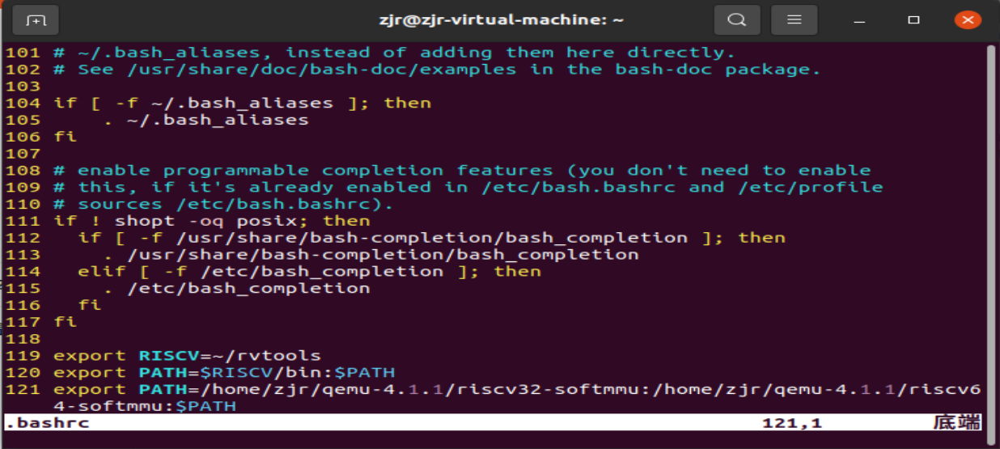
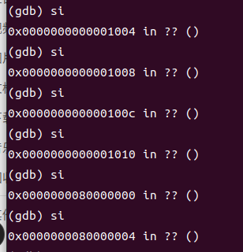
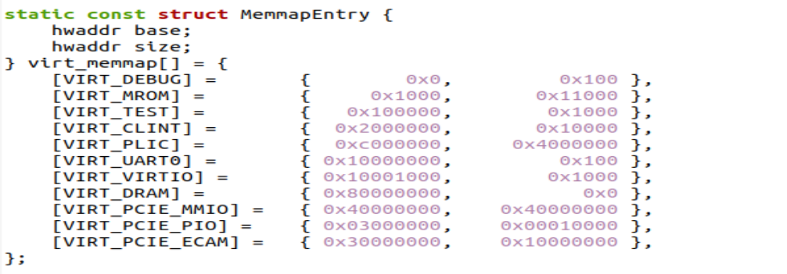
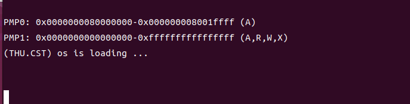
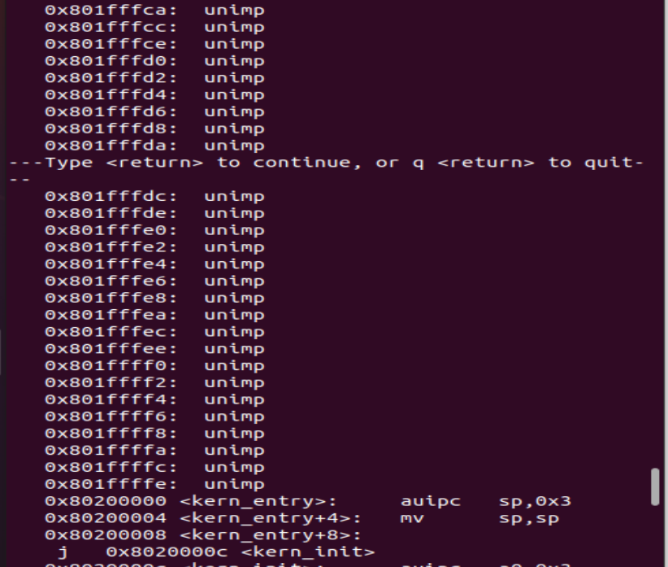
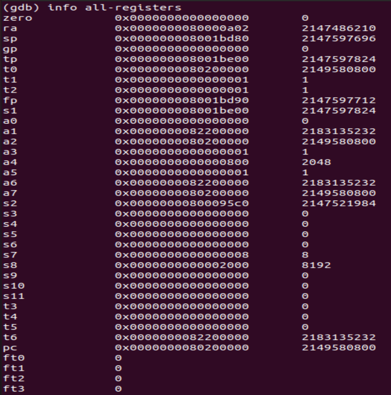
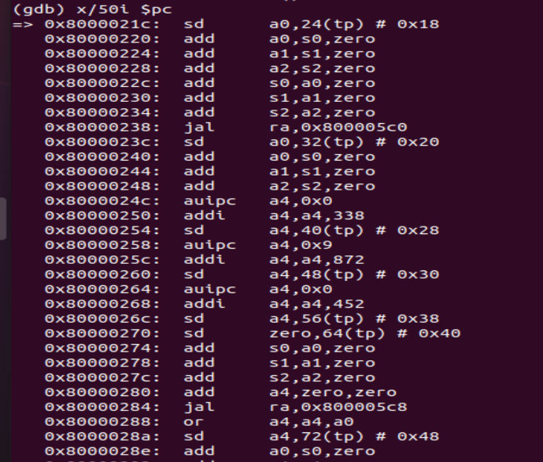

# lab0.5 report

## 一 . 环境的前提准备

`qemu`模拟器版本选择4.1.1，在下载安装之后，为了避免后面的模拟过程中每次的shell打开都需要导入路径操作，决定将其路径配置成全局环境变量。

如下，我们把其路径写入了`.bashrc`文件中，==最终便可以每次打开shell后不再导入路径==。




## 二 . 具体的启动流程

最小可执行内核的执行流为：

> ==加电== -> 加载opensbi到0x80000000，ucore内核到0x80200000 -> 跳转至0x80000000执行opensbi的`bootloader`程序 -> opensbi的bootloader程序完成硬件初始化，并将pc跳转至0x80200000 (`kern/init/entry.S`）->进入kern_init()函数（`kern/init/init.c`) ->调用==cprintf()==输出一行信息->结束


## 三 . 使用GDB验证启动流程

根据上述启动流程的描述，我们对其进行gdb调试，在调试时我们打开两个shell窗口，先在一个窗口中输入`make debug`命令，再在一个窗口中输入`make gdb`命令即可展开调试。


### 相关代码及分析

---


#### 加电后的指令      —— 跳转至0x8000执行bootloader程序

```assembly
(gdb) x/10i $pc
=> 0x1000:	auipc	t0,0x0
   0x1004:	addi	a1,t0,32
   0x1008:	csrr	a0,mhartid
   0x100c:	ld	t0,24(t0)
   0x1010:	jr	t0
   0x1014:	unimp
   0x1016:	unimp
   0x1018:	unimp
   0x101a:	0x8000
   0x101c:	unimp

```



经过si单步执行汇编指令，发现执行完0x1010:	jr	t0后，pc跳转至0x80000000。

所以便可以判断加电后的指令便为0x1000到0x1010这段指令。

> 原理分析：0x1010处执行的命令是==将pc跳向t0寄存器所指向的地址==，所以也就说明t0所指向的地址变为了0x8000。接下来将具体分析这一过程:
>
> 0x1000处执行的指令是将当前pc所指向的地址加载到t0，也就是t0在执行完这条指令后指向了0x1000。在0x100c处，24(t0)指向的地址就变为了0x1000 + 24也就是0x1018，其将0x1018处的数加载到t0。
>
> 可是，我们发现0x1018处是unimp指令，并不存在数，反而是0x101a处有0x8000这个数，刚好是我们所希望的数。那0x101a中的数为啥会被加载到t0中呢？
>
> 我们发现ld指令是要加载数到指定寄存器的，所以==当0x1018处无法找到数时，系统便会访问高地址寻找==，而在其紧邻的高地址恰好找到了数，所以0x8000最终便到达了t0，pc最终也实现了跳转到执行bootloader的任务。

跳转至0x8000后，开始运行`bootloader`，负责开机并加载操作系统至内存中，最终将pc跳转至0x80200000。

#### 中间调试过程     ——opensbi的具体功能

> opensbi的具体流程概括的说主要是四个方面：
>
> - qemu的加载执行；
> - opensbi底层初始化；
> - opensbi设备初始化；
> - 二级boot的跳转
>
> 在这四个流程中，实现代码在**`qemu-4.1.1`**中有一部分，详见**`/hw/riscv`**中的**`sifive_e.c`**、**`sifive_u.c`**、**`spike.c`**、**`virt.c`**；然后在opensbi源代码中也有一部分。通过这些代码opensbi分别完成了不同的功能，下面具体来介绍这些功能：

**首先**qemu的加载执行可以将bootloader程序加载至0x8000，如下我们查看`qemu 4.1.1/hw/riscv/virt.c`中的源代码：



可以看到VIRT_DRAM的地址空间是从0x80000000开始的，也就是说qemu最终会加载bootloader程序到0x80000000。

---

具体的加载执行过程中，注册了与riscv中断处理相关的设备与系统内存，同时还创建了设备树。该设备树用于opensbi的bootloader程序和os的加载，被放在qemu分配的内存的尾部，且会将参数传递。如下图所示：


如上图所示，a1寄存器有参数，可见其传递了设备树参数。


**然后**便是opensbi的底层初始化，主要实现以下功能：

> - **`hart id`**判断。
>
> - 清除寄存器的值。除了保存设备树地址的**`a1`**不会清除，其他的都会清除重置为0x0。
>
> - 为后续c语言执行sbi正式程序做准备。sbi正式程序是用c语言编写的，为了此正式程序能够执行，在这里必须完成两个步骤：
>   - 清除bss段。
>   - 设置sp栈指针，预留栈空间。
> - 读取设备树重要信息，实施fdt重定位。在读取设备树的重要信息后，由于设备树的位置存放在参数寄存器中，而参数寄存器每次执行c语言后就会被清除，所以需要重定位。
> - 跳转至`sbi_init`(==sbi的正式程序==)。


上图中的两个函数便会打印一些基本信息，比如说opensbi的图标以及一些总体信息。

**再**便完成opensbi的设备初始化，而这便是为==二级boot的跳转==做准备。设备初始化的最后便是准备下一级boot的跳转地址(其实也便是==操作系统内核加载==的==最终地址==)。例如opensbi在qemu-riscv-64和qemu-riscv-32的两种环境下最终的跳转地址都是`0x80000000 + 0x200000`，即`0x80200000`。

**最后**经过二级boot的跳转便进入了操作系统内核加载的地址，完成了到达内核加载入口的任务。紧接着便可以实现操作系统内核的加载过程。

#### ucore内核入口

```
(gdb) b *0x80200000
Breakpoint 1 at 0x80200000: file kern/init/entry.S, line 7.
(gdb) c
Continuing.

Breakpoint 1, kern_entry () at kern/init/entry.S:7
7	    la sp, bootstacktop

```


可以发现当运行至0x80200000处时，内核镜像`os.bin`开始被加载运行，操作系统得到启动。

```
(gdb) b *0x80200000
Breakpoint 1 at 0x80200000: file kern/init/entry.S, line 7.
(gdb) c
Continuing.

Breakpoint 1, kern_entry () at kern/init/entry.S:7
7	    la sp, bootstacktop
(gdb) x/100i $pc
=> 0x80200000 <kern_entry>:	auipc	sp,0x3
   0x80200004 <kern_entry+4>:	mv	sp,sp
   0x80200008 <kern_entry+8>:	j	0x8020000c <kern_init>
   0x8020000c <kern_init>:	auipc	a0,0x3
   0x80200010 <kern_init+4>:	addi	a0,a0,-4
   0x80200014 <kern_init+8>:	auipc	a2,0x3
   0x80200018 <kern_init+12>:	addi	a2,a2,-12
   0x8020001c <kern_init+16>:	addi	sp,sp,-16
   0x8020001e <kern_init+18>:	li	a1,0
   0x80200020 <kern_init+20>:	sub	a2,a2,a0
   0x80200022 <kern_init+22>:	sd	ra,8(sp)
   0x80200024 <kern_init+24>:	jal	ra,0x802004ce <memset>
   0x80200028 <kern_init+28>:	auipc	a1,0x0
   0x8020002c <kern_init+32>:	addi	a1,a1,1208
   0x80200030 <kern_init+36>:	auipc	a0,0x0
   0x80200034 <kern_init+40>:	addi	a0,a0,1232
   0x80200038 <kern_init+44>:	jal	ra,0x80200058 <cprintf>
   0x8020003c <kern_init+48>:	j	0x8020003c <kern_init+48>
   0x8020003e <cputch>:	addi	sp,sp,-16
   0x80200040 <cputch+2>:	sd	s0,0(sp)
   0x80200042 <cputch+4>:	sd	ra,8(sp)
   0x80200044 <cputch+6>:	mv	s0,a1
   0x80200046 <cputch+8>:	jal	ra,0x8020008c <cons_putc>

```

在上面的汇编代码中，先是进入**kern_entry**(`kern/init/entry.s`),然后跳转至`<kern_init>`函数内部，在其中调用<cprintf>函数。

可以发现  0x80200038 <kern_init+44>:	jal	ra,0x80200058 <cprintf> 调用了cprintf函数，在输出行打印了字符串**(THU.CST) os is loading ...**



即计算机在操作系统内核被成功加载后，完成了对一个字符串的打印过程

### 对opensbi跳转pc到0x8020的一些猜想过程

在本次lab 0.5中重点关注的是==0x8020处的内核函数执行过程==，我们通过在0x8020处打断点的方式，到达了操作系统的入口处，并且进入到了内核真正的入口，还调用我们自己对opensbi单字符输入输出接口层层封装的`cprintf`函数来成功实现了字符串的打印。但是本次实验好像对==opensbi如何将pc跳转到0x8020==并没有进行深入探究，我们小组进行了深入探究，并提出来了一些猜想。

#### 1. 0x8000到0x8020处的汇编代码结构

本小组从0x8000开始通过`x/2100000 $pc`指令查看了所有汇编代码，发现从0x80009a68开始一直到0x801ffffe全部都是`unimp`指令。也就反映出bootloader最终==将pc跳到0x8020不是顺序执行汇编代码的结果，而是跳转的结果。==




#### 2. 0x8020唯一出现的地方

我们类比pc跳转到0x8000的方式，猜想其也是将0x8020加载到某一个寄存器，然后通过jr指令实现此操作的，于是我们仔细注意有0x8020的地方，结果果然发现0x8020唯一出现的地方就是0x800005d2。

如下代码所示：

```
   0x8000059c:	ret
   0x8000059e:	nop
   0x800005a0:	addiw	a0,zero,1041
   0x800005a4:	slli	a0,a0,0x15
   0x800005a8:	ret
   0x800005aa:	nop
   0x800005ac:	nop
   0x800005b0:	auipc	a0,0x0
   0x800005b4:	addi	a0,a0,32
   0x800005b8:	ld	a0,0(a0)
   0x800005ba:	ret
   0x800005bc:	nop
   0x800005c0:	li	a0,1
   0x800005c2:	ret
   0x800005c4:	nop
   0x800005c8:	add	a0,zero,zero
   0x800005cc:	ret
   0x800005ce:	nop
   0x800005d0:	unimp
   0x800005d2:	0x8020

```

上面 0x800005d2:	0x8020 与我们最后内核镜像启动地址0x8020一致。

注意0x800005b0到0x800005b8这段指令，可以发现在0x800005b0处a0指向了0x800005b0，==在0x800005b4处其指向的地址加上32后刚好是0x800005d0==，通过0x800005b8处的ld指令后又会发现==a0最终指向了0x8020==。

于是我们猜想，opensbi最终是通过`jr a0`操作跳转到0x8020的。

可是，我们的猜想很快被打破，我们通过在0x8020处打断点，并且continue运行至此，然后我们通过`info all-registers`指令查看所有寄存器时，发现如下：



发现a0竟然变为0了，==只有t0，a2，a7三个寄存器里面存储的是0x8020==。然后我们很自然地想到寻找有关跳转这三个寄存器指向地址的指令，但是最终都没有找到。

#### 3.  a0中的0x8020去哪了

我们仔细查看了相关汇编代码，发现a0总是被进行立即数赋值操作，经常是0和1，而在a0被赋值为0x8020之后，如下可以看到：



a0的0x8020去向很多就是赋值给了一些地址和s0寄存器，而s0寄存器最终的值为0x0，于是我们大概率最终得出来的猜想就是pc跳转到0x8020应该是先提取某一个地址处存放的地址，然后跳转到此地址。


