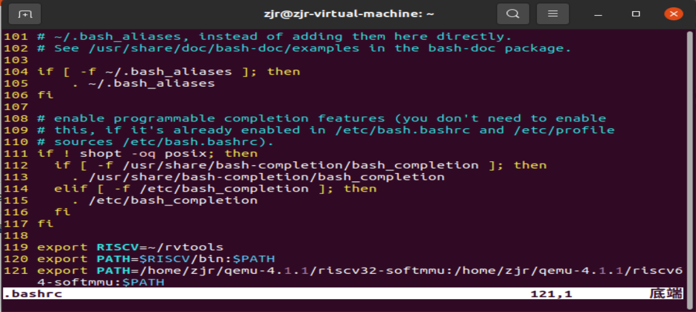
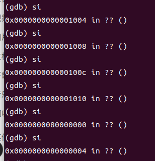
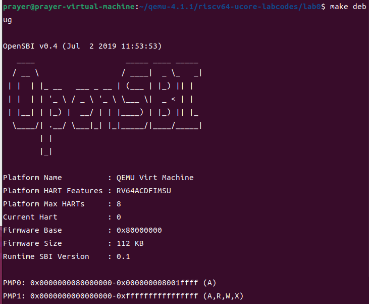
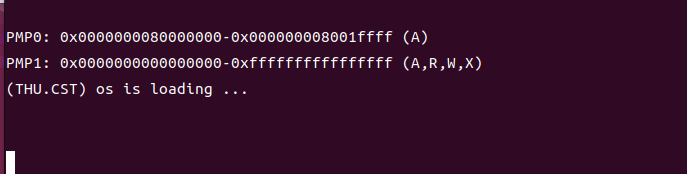
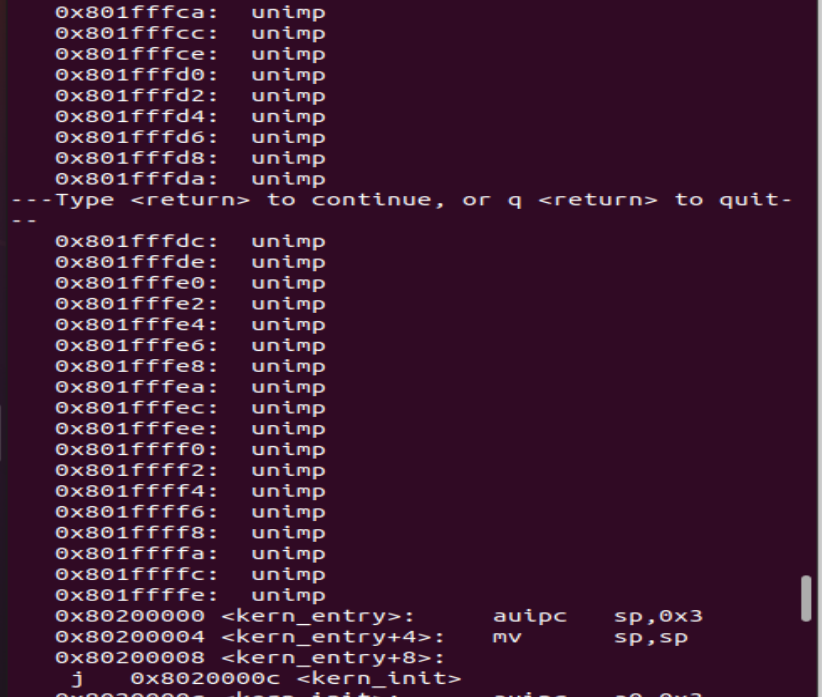
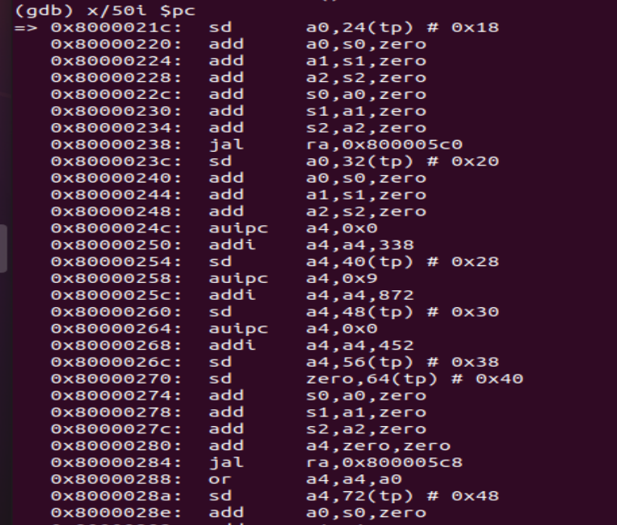

# lab0.5 And lab1 report

## Part lab0.5

### 一 . 环境的前提准备

`qemu`模拟器版本选择4.1.1，在下载安装之后，为了避免后面的模拟过程中每次的shell打开都需要导入路径操作，决定将其路径配置成全局环境变量。

如下，我们把其路径写入了`.bashrc`文件中，最终便可以每次打开shell后不再导入路径。




### 二 . 具体的启动流程

最小可执行内核的执行流为：

> 加电 -> qemu加载opensbi到0x80000000  -> opensbi完成硬件初始化，加载os.bin至内存中，并将pc跳转至0x80200000 (`kern/init/entry.S`）->进入`kern_init()`函数（`kern/init/init.c`) ->调用cprintf()输出一行信息->结束


### 三 . 使用GDB验证启动流程

> 为了熟悉使用qemu和gdb进行调试工作,使用gdb调试QEMU模拟的RISC-V计算机加电开始运行到执行应用程序的第一条指令（即跳转到0x80200000）这个阶段的执行过程，说明RISC-V硬件加电后的几条指令在哪里？完成了哪些功能？要求在报告中简要写出练习过程和回答。

根据上述启动流程的描述，我们对其进行gdb调试，在调试时我们打开两个shell窗口，先在一个窗口中输入`make debug`命令，再在一个窗口中输入`make gdb`命令即可展开调试。

#### 1.RISC-V加电后的几条指令

---

**加电后的指令      —— 从复位地址跳转至0x8000执行bootloader程序**

```assembly
(gdb) x/10i $pc
=> 0x1000:	auipc	t0,0x0
   0x1004:	addi	a1,t0,32
   0x1008:	csrr	a0,mhartid
   0x100c:	ld	t0,24(t0)
   0x1010:	jr	t0
   0x1014:	unimp
   0x1016:	unimp
   0x1018:	unimp
   0x101a:	0x8000
   0x101c:	unimp
   0x101e:	unimp
   0x1020:  addi	a2,sp,724
```



经过si单步执行汇编指令，发现执行完0x1010:	`jr	t0`后，pc跳转至0x8000。

所以便可以判断加电后的指令便为0x1000到0x1010这段指令。下面对每条指令进行分析：

1. auipc t0, 0x0 将 t0 寄存器设置为当前指令地址 0x1000的高20位加上偏移量 0x0，因此 t0 中的值是 0x1000。
2. addi a1, t0, 32 将 t0 寄存器的值 0x1000 加上 32，结果存储在 a1 寄存器中，即 0x1020。
3. csrr a0, mhartid 加载当前 Hart 的 ID（假设这是一个特定 Hart 的 ID）到 a0 寄存器中。
4. ld t0, 24(t0) 从地址 0x1000 + 24（即 0x1018）加载一个字，存储到 t0 寄存器中。
5. jr t0  跳转至t0的地址处，即0x80000000。

​        从上面的分析来看，在第四条指令处，也就是0x100c处的指令`ld	t0,24(t0)`是将24(t0)处的64位数加载到64位寄存器t0。而t0由于执行第一条指令auipc t0, 0x0后，t0所指向的地址为0x1000。于是24(t0)指向的地址为0x1018，最终需要从0x1018提取64位数加载到64位寄存器t0。

> 因为数据为0时会***反汇编为0***，那么其实***unimp指令就是代表的数据0***。而t0寄存器最后指向的是0x80000000，这与0x1018到0x101e的三条***unimp***语句和0x101a中的***0x8000***有着密不可分的联系。

---

​        接下来为了分析0x1018处的64位数为何加载到64位寄存器t0是0x80000000，我们将从内存分布入手：

​        Risc-v是***小端编址***，结合unimp指令其实代表的就是数据0，我们作出了以下内存分布图：

|   0x1018   | 00     |
| :--------: | ------ |
| **0x1019** | **00** |
| **0x101a** | **00** |
| **0x101b** | **80** |
| **0x101c** | **00** |
| **0x101d** | **00** |
| **0x101e** | **00** |
| **0x101f** | **00** |

***注意***：0x101a处存储的0x8000由于是***小端编址***，***高位80***这一个字节便会存储在***高地址0x101b***，***低位00***便会存储在***低地址0x101a***。即低地址 - 存储（传输）- 数据的最低位（Byte）。

结合上述所画的内存分布图，结合***小端编址***，最后加载到t0的64位数便为0x0000000080000000，即0x80000000，其中最高位的00这一个字节是从0x101f加载的。

综上，t0最终指向了0x80000000。


于是加电后的几条指令目的是让pc从复位地址0x1000跳转至bootloader所在地址0x80000000，加载opensbi，执行后续操作。

跳转至0x80000000后，开始运行`bootloader`，负责***开机并加载操作系统至内存中***，最终将pc跳转至0x80200000。

---

#### 2.opensbi的具体功能

opensbi的具体流程概括的说主要是3个方面：

1. **OpenSBI 底层初始化**：OpenSBI 需要在执行之前进行一些底层初始化工作，以确保它可以正确地运行在目标硬件上。这个过程包括了设置异常处理、全局变量初始化等。
2. **OpenSBI 设备初始化**：在进一步引导操作系统之前，OpenSBI 需要对系统中的设备进行初始化。这个过程可能涉及到处理器核心的初始化、内存管理单元（MMU）的配置、中断控制器的初始化等。
3. **二级引导的跳转**：在 OpenSBI 执行的最后阶段，它会负责引导操作系统的加载。这通常包括在特定地址上加载操作系统的启动程序（例如 ucore、linux等），并跳转到这个启动程序的入口点，从而引导操作系统的加载和执行。

从0x8000—0x8020即进行上述事务的执行

---

#### 3.ucore内核入口

```
(gdb) b *0x80200000
Breakpoint 1 at 0x80200000: file kern/init/entry.S, line 7.
(gdb) c
Continuing.

Breakpoint 1, kern_entry () at kern/init/entry.S:7
7	    la sp, bootstacktop
```



可以发现当运行至0x80200000处时，内核镜像`os.bin`开始被加载运行，操作系统得到启动。

```
(gdb) b *0x80200000
Breakpoint 1 at 0x80200000: file kern/init/entry.S, line 7.
(gdb) c
Continuing.

Breakpoint 1, kern_entry () at kern/init/entry.S:7
7	    la sp, bootstacktop
(gdb) x/100i $pc
=> 0x80200000 <kern_entry>:	auipc	sp,0x3
   0x80200004 <kern_entry+4>:	mv	sp,sp
   0x80200008 <kern_entry+8>:	j	0x8020000c <kern_init>
   0x8020000c <kern_init>:	auipc	a0,0x3
   0x80200010 <kern_init+4>:	addi	a0,a0,-4
   0x80200014 <kern_init+8>:	auipc	a2,0x3
   0x80200018 <kern_init+12>:	addi	a2,a2,-12
   0x8020001c <kern_init+16>:	addi	sp,sp,-16
   0x8020001e <kern_init+18>:	li	a1,0
   0x80200020 <kern_init+20>:	sub	a2,a2,a0
   0x80200022 <kern_init+22>:	sd	ra,8(sp)
   0x80200024 <kern_init+24>:	jal	ra,0x802004ce <memset>
   0x80200028 <kern_init+28>:	auipc	a1,0x0
   0x8020002c <kern_init+32>:	addi	a1,a1,1208
   0x80200030 <kern_init+36>:	auipc	a0,0x0
   0x80200034 <kern_init+40>:	addi	a0,a0,1232
   0x80200038 <kern_init+44>:	jal	ra,0x80200058 <cprintf>
   0x8020003c <kern_init+48>:	j	0x8020003c <kern_init+48>
   0x8020003e <cputch>:	addi	sp,sp,-16
   0x80200040 <cputch+2>:	sd	s0,0(sp)
   0x80200042 <cputch+4>:	sd	ra,8(sp)
   0x80200044 <cputch+6>:	mv	s0,a1
   0x80200046 <cputch+8>:	jal	ra,0x8020008c <cons_putc>

```

在上面的汇编代码中，先是进入**kern_entry**(`kern/init/entry.s`),然后跳转至`<kern_init>`函数内部，在其中调用<cprintf>函数。

可以发现  0x80200038 <kern_init+44>:	jal	ra,0x80200058 <cprintf> 调用了cprintf函数，在输出行打印了字符串**(THU.CST) os is loading ...**



即计算机在操作系统内核被成功加载后，完成了对一个字符串的打印过程。

---

#### 4.从0x80000000至0x80200000的调试过程

在本次lab 0.5中重点关注的是RISC-V加点后的几条指令，即从复位地址0x1000到0x80000000的跳转过程，随后我们通过在0x80200000处打断点的方式，到达了操作系统的入口处，并且进入到了内核真正的入口，还调用我们自己对opensbi单字符输入输出接口层层封装的`cprintf`函数来成功实现了字符串的打印。

在这里我们对0x80000000至0x80200000的调试做一些总结。

##### 1. 0x80000000到0x80200000处的汇编代码结构

本小组从0x8000开始通过`x/2100000 $pc`指令查看了所有汇编代码，发现从0x80009a68开始一直到0x801ffffe全部都是`unimp`指令。也就反映出bootloader最终将pc跳到0x8020不是顺序执行汇编代码的结果，而是跳转的结果。




##### 2. 0x8020唯一出现的地方

我们类比pc跳转到0x80000000的方式，猜想其也是将0x80200000加载到某一个寄存器，然后通过jr指令实现此操作的，于是我们仔细注意有0x8020的地方，结果果然发现0x8020唯一出现的地方就是0x800005d2。

如下代码所示：

```
   0x8000059c:	ret
   0x8000059e:	nop
   0x800005a0:	addiw	a0,zero,1041
   0x800005a4:	slli	a0,a0,0x15
   0x800005a8:	ret
   0x800005aa:	nop
   0x800005ac:	nop
   0x800005b0:	auipc	a0,0x0
   0x800005b4:	addi	a0,a0,32
   0x800005b8:	ld	a0,0(a0)
   0x800005ba:	ret
   0x800005bc:	nop
   0x800005c0:	li	a0,1
   0x800005c2:	ret
   0x800005c4:	nop
   0x800005c8:	add	a0,zero,zero
   0x800005cc:	ret
   0x800005ce:	nop
   0x800005d0:	unimp
   0x800005d2:	0x8020
   0x800005d4:	unimp
   0x800005d6:	unimp
   0x800005d8:	unimp
```

上面 0x800005d2:	0x8020 与我们最后内核镜像启动地址0x80200000似乎有着联系。

注意0x800005b0到0x800005b8这段指令，可以发现在0x800005b0处a0指向了0x800005b0，***在0x800005b4处其指向的地址加上32后刚好是0x800005d0***，通过0x800005b8处的ld指令后又会发现***a0最终指向了0x80200000***。

于是我们猜想，opensbi最终是通过`jr a0`操作跳转到0x80200000的。

可是，我们的猜想很快被打破，我们通过在0x80200000处打断点，并且continue运行至此，然后我们通过`info all-registers`指令查看所有寄存器时，发现如下：


发现a0竟然变为0了，只有t0，a2，a7三个寄存器里面存储的是0x80200000。然后我们很自然地想到寻找有关跳转这三个寄存器指向地址的指令，但是最终都没有找到。

##### 3.  a0中的0x80200000去哪了

我们仔细查看了相关汇编代码，发现a0总是被进行立即数赋值操作，经常是0和1，而在a0被赋值为0x80200000之后，如下可以看到：



a0的0x80200000去向很多就是赋值给了一些地址和s0寄存器，而s0寄存器最终的值为0x0，于是我们大概率最终得出来的猜想就是pc跳转到0x80200000应该是先提取某一个地址处存放的地址，然后跳转到此地址。

---

### 四 . Part lab0.5重要知识点：

#### 1 本实验中重要的知识点，以及与对应的OS原理中的知识点

在本次实验中，我们进行了从加电到开始加载os这个过程的调试，有如下知识点对应：

1. Qemu模拟的riscv处理器的复位地址为0x1000，复位地址是CPU上电时,PC被赋予的值。
2. 实验中的bootloader是opensbi，即负责开机并加载操作系统至内存中。在此次调试中，我们的opensbi从0x80000000至0x80200000负责一些基础性工作，而之后0x80200000时，操作系统启动并获得CPU控制权。
3. RISCV中有四种特权级：U态(用户级)、S态(操作系统内核的特权级)、M态(固件的特权级)。Opensbi在M态(machine)运行，需要直接访问硬件。
4. Opensbi是固件。固件的意思是为设备的特定硬件提供低级控制，也可以为更复杂的软件(操作系统)提供标准化的操作环境。
5. 链接器的作用是把输入文件(.o文件)链接成输出文件(.elf)，这样就得到了elf文件。实验中kernel.ld是一个链接脚本。
6. opensbi在**qemu-riscv-64**和**qemu-riscv-32**的两种环境下最终的跳转地址都是`0x80000000 + 0x200000`，即`0x80200000`，在其他的环境下可能为`0x80000000 + 0x80400000`，即`0x80400000`。
7. opensbi固件的具体执行功能分为3步：

   - opensbi底层初始化。

   - opensbi设备初始化。
   - 二级boot的跳转。       
8. opensbi提供了一些接口以供我们编写内核使用，如sbi_console_putchar()输出字符，最后输出字符串的函数是一层一层封装此接口实现的。

#### 2 OS原理中很重要，但在实验中没有对应上的知识点

1. 我们有两种不同的可执行文件格式：elf、bin。
  - elf文件比较复杂，包含一个文件头(ELF header), 包含冗余的调试信息，指定程序每个section的内存布局（.text  .rodata  .data  .bss等）
  - bin文件比较简单，简单地在文件头之后解释自己应该被加载到什么起始位置。
  - 而Opensbi处理的是os.bin。因为elf文件过于复杂。我们只需得到内存布局合适的elf文件，然后把它转化成bin文件（这一步通过objcopy实现），然后加载到QEMU里运行。
  - os.bin会指定它自己应该被加载到内存的哪个地址，这样最后实验中才会成功加载操作系统，打印出字符串。
2. elf文件可以转化为bin文件，而bin文件会把elf文件指定的每段的内存布局都映射到一块线性的数据里，这块线性的数据(程序)加载至内存中，符合elf之前指定的布局。
3. Risc-v架构是小端编址的，所以数在内存中的存储是高位存储在低地址，低位存储在高地址。
4. unimp指令其实代表的就是数据0，那是因为数据0在***反汇编***时会变为unimp指令。

## Part lab1

### [练习1]

**练习1：理解内核启动中的程序入口操作**

> 阅读 `kern/init/entry.S`内容代码，结合操作系统内核启动流程，说明指令 `la sp, bootstacktop` 完成了什么操作，目的是什么？ `tail kern_init` 完成了什么操作，目的是什么？

---

`kern/init/entry.S`的源代码为:

```assembly
# kern/init/entry.S
#include <mmu.h>
#include <memlayout.h>

# 从这里开始.text 这个section, "ax" 和 %progbits描述这个section的特征

    .section .text,"ax",%progbits   #标记下面的代码为可执行代码段
    .globl kern_entry    #定义全局标识符，内核入口点
kern_entry: 
    la sp, bootstacktop  #la,load address，即将返回地址保存在sp寄存器中
    tail kern_init   #tail是tail call的缩写是RISC-V的一条伪指令，相当于函数调用

.section .data
    # .align 2^12
    .align PGSHIFT #按照2^PGSHIFT进行地址对齐
    .global bootstack #内核栈
bootstack:
    .space KSTACKSIZE #留出KSTACKSIZE这么多个字节的内存
    .global bootstacktop #之后内核栈将要从高地址向低地址增长, 初始时的内核栈为空
bootstacktop:
```

-  la sp, bootstacktop

bootstacktop指向的是分配的内核栈bootstack的栈顶，执行`la sp, bootstacktop`后sp指向了内核栈的栈顶。

这个指令的作用是将**栈指针sp**(stack pointer 即'sp'寄存器)设置为'**bookstacktop**'的地址。

栈指针用于管理函数调用时的栈帧，设置栈指针的目的是为了初始化内核的栈，便于后续的代码可以在内核栈上执行

- tail kern_init

`tail kern_init`是将pc跳转到`kern_init`函数的位置，将控制权转移给'kern_init'函数，并且以尾调用的方式执行该函数。使用尾调用的目的是保证函数调用结束后，不需要返回到原来函数的调用点。

同时kern_init函数为操作系统内核的初始化函数，负责初始化操作系统。

这样做**一方面**可以简化过程，*避免了栈帧的保存*，优化了函数的调用方式；**另一方面**还可以使程序*真正进入操作系统内核*，进一步地逐步执行程序，完成内核初始化的一系列操作。

---

### [练习2]

**练习2：完善中断处理（需要编程）**

> 请编程完善`trap.c`中的中断处理函数trap，在对时钟中断进行处理的部分填写`kern/trap/trap.c`函数中处理时钟中断的部分，使操作系统每遇到100次时钟中断后，调用`print_ticks`子程序，向屏幕上打印一行文字”**100 ticks**”，在打印完10行后调用sbi.h中的`shut_down()`函数关机。简要说明实现过程和定时器中断处理的流程。

---

#### 1 . 关于clock.c的分析

```c
volatile size_t ticks;
static uint64_t timebase = 100000;
void clock_init(void) {
    // sie这个CSR可以单独使能/禁用某个来源的中断。默认时钟中断是关闭的
    //所以调用下面的函数使得时钟中断
    set_csr(sie, MIP_STIP);
    // divided by 500 when using Spike(2MHz)
    // divided by 100 when using QEMU(10MHz)
    // timebase = sbi_timebase() / 500;
    clock_set_next_event();

    // initialize time counter 'ticks' to zero
    ticks = 0;

    cprintf("++ setup timer interrupts\n");
}
//设置时钟中断：timer的数值变为当前时间 + timebase 后，触发一次时钟中断
//对于QEMU, timer增加1，过去了10^-7 s， 也就是100ns
//这里的timebase是指的时钟周期数。 timebase个时钟周期是10ms 也就是过10ms再触发一次
void clock_set_next_event(void) { sbi_set_timer(get_cycles() + timebase); }
```

1. 针对`clock_set_next_event`函数，有:

   - `sbi_set_timer()`是OpenSBI提供的接口，可以传入一个时刻。

   - `get_cycles()` 函数用于获取当前的 CPU 时钟周期数，这个值表示了从某一起始点到当前时刻的时钟周期数。这个值通常被用来度量程序的执行时间或者进行时间管理。

   - `timebase` 是一个常量，表示了一个时间单位内的时钟周期数。当前cpu一个时钟周期是10^-7s，然后timebase个时钟周期是10ms，也就是10^-2s，那么下次触发时间是当前时间后10ms。
2. 针对`clock_init`函数，有:

   - set_csr(sie,MIP_STIP)，set_csr 是一个用于设置 Control and Status Registers (CSR) 的宏，sie 是其中一个 CSR 的名称，它代表 "Supervisor Interrupt Enable"，用于控制处理器是否允许特定类型的中断，MIP_STIP 是一个宏，代表着 "Machine Timer Interrupt Pending"，它用于指示时钟中断是否待处理。因此，set_csr 用于将 MIP_STIP 对应的位设置为 1，即允许处理器在发生定时器中断时触发中断处理程序。
   - clock_set_next_event()，在函数其中调用此函数，设置10ms后的下一次中断。
   - 初始化ticks为0，此计数器的作用是记录中断的次数
   -  在屏幕上打印一行字符串.
   - 10ms后开始时钟中断。

---

#### 2 . 关于中断处理的内部逻辑梳理

```c
trap.c:
struct trapframe {
    struct pushregs gpr;
    uintptr_t status;
    uintptr_t epc;
    uintptr_t badvaddr;
    uintptr_t cause;
};

trapentry.S:
    csrr s4, scause

    STORE s0, 2*REGBYTES(sp)
    STORE s1, 32*REGBYTES(sp)
    STORE s2, 33*REGBYTES(sp)
    STORE s3, 34*REGBYTES(sp)
    STORE s4, 35*REGBYTES(sp)
        
trap.c:
static inline void trap_dispatch(struct trapframe *tf) {
    if ((intptr_t)tf->cause < 0) {
        // interrupts
        interrupt_handler(tf);
    } else {
        // exceptions
        exception_handler(tf); 
    }
}
#define IRQ_S_TIMER  5
void interrupt_handler(struct trapframe *tf) {
    intptr_t cause = (tf->cause << 1) >> 1;
    switch (cause) {
        ...
        case IRQ_S_TIMER:
            ...
    }
}
```

在上面我截取了部分代码分析。

在触发中断后，首先会跳转至trapentry.S，开始保存当前执行流的上下文（即32个通用寄存器，加上4个特殊寄存器），在这里重点提出一个寄存器`scause`，它是CSR中的一个寄存器，作用是记录中断发生的原因。

之后通过函数调用，转换为trap.c的中断处理函数trap()的上下文，而之前上下文的寄存器值都会赋值给结构体trapframe，所以trapframe->cause的值，等于CSR中scause的值。由于中断时，scause寄存器会记录中断发生的原因，因此进入trap.c时会根据中断类型跳入interrupt_handler与exception_handler两个不同的函数处理中断。

在此练习中，我们是处理时钟中断，因此根据cause值会进入interrupt_handler函数中。

而最后在interrupt_handler函数中，我们可以发现，这里switch的条件式的值同样是cause，最后会进入IRQ_S_TIMER下的语句进行运行。

---

#### 3 . 实现trap.c的编写

```c
#define TICK_NUM 100
volatile size_t num=0;//计数器的定义
void interrupt_handler(struct trapframe *tf) {
    intptr_t cause = (tf->cause << 1) >> 1;
    switch (cause) {
        ...
        case IRQ_S_TIMER:
            //处理计时器的相关中断
            // "All bits besides SSIP and USIP in the sip register are
            // read-only." -- privileged spec1.9.1, 4.1.4, p59
            // In fact, Call sbi_set_timer will clear STIP, or you can clear it
            // directly.
            // cprintf("Supervisor timer interrupt\n");
             /* LAB1 EXERCISE2   2113665+2113663:  */
            /*(1)设置下次时钟中断- clock_set_next_event()
             *(2)计数器（ticks）加一
             *(3)当计数器加到100的时候，我们会输出一个`100ticks`表示我们触发了100次时钟中断，同时打印次数（num）加一
            * (4)判断打印次数，当打印次数为10时，调用<sbi.h>中的关机函数关机
            */
            clock_set_next_event();
            ticks++;
            if(ticks%TICK_NUM==0){
                print_ticks();
                num++; //记录打印的次数
            }
            if(num==10){
                sbi_shutdown();//采用关机函数
            }
            break;
        ...
        default:
            print_trapframe(tf);
            break;
    }
}
```

在1、2的基础上，我们对时钟中断的内部逻辑十分清楚了，下面介绍trap.c的编写思路。

`IRQ_S_TIMER`用于表示 RISC-V 架构中的时钟中断。因此，本段补充代码的核心部分便是在`case IRQ_S_TIMER`部分，我们的实现思路主要如下：

- 设置下一次时钟中断(由`clock_set_next_event`函数实现），这样首先保证了下一次时钟中断在指定的10ms后触发。在这里必须要设置下一次时钟中断：因为在一次时间中断结束后会恢复上下文，返回原来中断的位置，而我们要触发有规律的时间中断，因此要在这里设置下一次触发。
- 计数器加1，获取现在的计数总次数；
- 进行条件判断，`ticks`是否已达到100，由**ticks%TICK_NUM==0**判断。如果条件成立，则将打印次数(`num`)加1；
- 对num条件判断，如果`num==10`成立，则调用`sbi.h`中的`sbi_shutdown`函数进行关机。

---


#### 4 . 对init.c的分析

定时器中断处理流程：`kern/init/init.c`中的`kern_init`函数源代码如下：

```c
int kern_init(void) {
    extern char edata[], end[];
    memset(edata, 0, end - edata);

    cons_init();  // init the console

    const char *message = "(THU.CST) os is loading ...\n";
    cprintf("%s\n\n", message);

    print_kerninfo();

    // grade_backtrace();

    idt_init();  // init interrupt descriptor table
    // rdtime in mbare mode crashes
    clock_init();  // init clock interrupt
    intr_enable();  // enable irq interrupt
    while (1)
        ;
}
```

在进行定时器时钟中断处理时，上述函数主要分为了以下步骤：

1. 初始化中断，此步骤由`idt_init`实现。

   ```c
   void idt_init(void) {
       extern void __alltraps(void);
       /* Set sscratch register to 0, indicating to exception vector that we are
        * presently executing in the kernel */
       write_csr(sscratch, 0);
       /* Set the exception vector address */
       write_csr(stvec, &__alltraps);
   }
   ```

   此函数的作用是初始化中断描述符表，让cpu知道中断处理程序的位置。

   - extern void alltraps(void)：声明了一个名为alltraps 的外部函数，它是一个包含所有中断和异常处理程序的汇编代码文件的入口点，在里面将设置中断描述符表的地址。
   - write_csr(sscratch, 0) ：将 sscratch 寄存器的值设置为 0。sscratch 寄存器通常用于指示当前是否在内核模式下执行。设置为 0 表示在内核模式下执行。
   - write_csr(stvec, &alltraps) ：将 stvec 寄存器的值设置为 &alltraps，即中断描述符表的地址。stvec 寄存器是一个控制寄存器，用于指定异常处理程序的地址。设置为 &alltraps 后，当系统发生异常或中断时，处理程序将跳转到trapentry.S中的alltraps 函数的入口点，进而进入中断处理流程。

2. 初始化时钟中断，此步骤由`clock_init`实现。

```c
void clock_init(void) {
    // enable timer interrupt in sie
    set_csr(sie, MIP_STIP);
    // divided by 500 when using Spike(2MHz)
    // divided by 100 when using QEMU(10MHz)
    // timebase = sbi_timebase() / 500;
    clock_set_next_event();

    // initialize time counter 'ticks' to zero
    ticks = 0;

    cprintf("++ setup timer interrupts\n");
}

void clock_set_next_event(void) { sbi_set_timer(get_cycles() + timebase); }
```

> 此函数设置了下一次的时钟中断产生时间，并且初始化了计数器`ticks`（ticks置0），最终打印启动时钟中断的提示信息。

3. 设置中断使能位，此步骤由`intr_enable`实现。

   ```c
   #include <intr.h>
   #include <riscv.h>
   
   /* intr_enable - enable irq interrupt */
   void intr_enable(void) { set_csr(sstatus, SSTATUS_SIE); }
   
   /* intr_disable - disable irq interrupt */
   void intr_disable(void) { clear_csr(sstatus, SSTATUS_SIE); }
   ```

   - sstatus 表示 RISC-V 处理器状态寄存器，其中包含了多个控制处理器状态的位。
   - SSTATUS_SIE 是 sstatus 中用于表示全局中断使能的位。设置为 1 表示允许中断，清零表示禁用中断。

   调用`intr_enable`函数设置了sstatus的SIE位，使其能够接受中断并进行处理。这也就保证了处理器能够接受用户模式的中断请求并进行处理，时钟中断的处理有了保障。

4. 进入`while`循环，保证每次的定时器时钟中断稳定触发。

   每次在`while`循环中一旦触发时钟中断便进入中断处理程序，在中断处理程序中进入到对时钟中断的处理部分。即`interrupt_handler`函数中的`case IRQ_S_TIMER` 部分。

   紧接着结合我们对此部分的代码设计，先设置下一次时钟中断，再引入条件判断，最终便可以在打印完**10**行**“100 ticks”**后调用`sbi_shutdown`函数关机。

**综上，便是完整的定时器时钟中断处理流程。**

---

#### 5 . 程序的正确性验证


如上图所示，成功完成要求。在打印10次`100 ticks`后关机。

---

### 扩展练习 Challenge1：描述与理解中断流程

> 描述`ucore`中处理中断异常的流程（从异常的产生开始），其中`mov a0，sp`的目的是什么？`SAVE_ALL`中寄存器保存在栈中的位置是什么确定的？对于任何中断，`__alltraps` 中都需要保存所有寄存器吗？请说明理由。

---

#### 1 . 描述处理中断的流程

> 中断分类为：异常、陷入、外部中断(时钟、I/O设备等）

其中异常与陷入都是CPU在执行指令中遇到的，而外部中断是CPU的执行过程被外设发来的信号所打断。

**处理中断异常的流程：**

```assembly
__alltraps:
    SAVE_ALL

    move  a0, sp
    jal trap
    # sp should be the same as before "jal trap"

    .globl __trapret
__trapret:
    RESTORE_ALL
    # return from supervisor call
    sret
```

- 当触发中断进入`S`态进行处理时，硬件自动将异常信息自动设置给与`CSR`相关的寄存器(`sepc`、`scause`等)。其中`sepc`记录了触发中断的那条指令的地址，而`scause`会记录中断产生的原因，还会记录此中断是否为一个外部中断。
- 触发中断后，处理程序将跳转到`trapentry.S`中的`alltraps `函数的入口点，进而进入中断处理流程。

1. 执行定义的`SAVE_ALL`代码，即开始保存上下文。在这里保存的方式是将32个普通寄存器与4个特殊的CSR寄存器(`sstatus`，`sepc`， `sbadaddr`，`scause`），保存到一个栈中。

2. 进入`trap`函数。首先，在上面保存的寄存器将作为参数，赋值给trap里面的一个结构体trapframe。在这里根据`tf->cause`，把中断处理和异常处理的工作分发给`interrupt_handler()`，`exception_handler()`。`interrupt_handler`处理外部的中断，而`exception_handler`处理异常或陷入。这两个函数再根据中断或异常的原因的不同类型(`scause`的数值)来进行不同的处理，具体的由switch语句跳转至不同的处理函数。

   - 其中异常处理函数中，必须会将保存的sepc寄存器的值进行更新，使其指向下一条指令的地址。否则会使**程序一直进行异常处理，陷入死循环**。
   - 而对于外部的中断，不用更新sepc寄存器的值，在中断处理程序执行完后，CPU会自动返回到中断点之后的指令继续执行。

   总结：处理中断的情况下不需要手动更新 epc，因为中断返回后会自动回到原来的程序。而处理异常的情况下，手动更新 epc 是为了将程序跳转到下一条指令，以便继续执行或者跳过引起异常的指令。

3. 执行定义的`RESTORE_ALL`代码恢复上下文。这里主要是将sp栈的各个值，恢复至特殊寄存器CSR与普通寄存器中，这样就让各个寄存器恢复至中断之前的值。不过对于异常来说，sepc与中断之前的值不一样，在异常的过程中sepc会指向下一条指令，避免程序继续异常处理。

4. sret     把pc赋值为sepc，用于S态返回U态。

#### 2 . mov a0,sp的目的

`mov a0，sp`是将`sp`栈指针的值赋值给`a0`。而最终`a0`的值是赋值给了`trap`函数的参数，所以其最终是将`sp`栈指针的指向地址赋值给了`trap`参数结构体指针。

观察保存上下文的代码与`trapframe`结构体的代码：

```c
    csrw sscratch, sp      
    addi sp, sp, -36 * REGBYTES    
    STORE x0, 0*REGBYTES(sp)
    STORE x1, 1*REGBYTES(sp)
    STORE x3, 3*REGBYTES(sp)
    STORE x4, 4*REGBYTES(sp)
    STORE x5, 5*REGBYTES(sp)
    STORE x6, 6*REGBYTES(sp)
    STORE x7, 7*REGBYTES(sp)
    STORE x8, 8*REGBYTES(sp)
    STORE x9, 9*REGBYTES(sp)
    STORE x10, 10*REGBYTES(sp)
    STORE x11, 11*REGBYTES(sp)
    STORE x12, 12*REGBYTES(sp)
    STORE x13, 13*REGBYTES(sp)
    STORE x14, 14*REGBYTES(sp)
    STORE x15, 15*REGBYTES(sp)
    STORE x16, 16*REGBYTES(sp)
    STORE x17, 17*REGBYTES(sp)
    STORE x18, 18*REGBYTES(sp)
    STORE x19, 19*REGBYTES(sp)
    STORE x20, 20*REGBYTES(sp)
    STORE x21, 21*REGBYTES(sp)
    STORE x22, 22*REGBYTES(sp)
    STORE x23, 23*REGBYTES(sp)
    STORE x24, 24*REGBYTES(sp)
    STORE x25, 25*REGBYTES(sp)
    STORE x26, 26*REGBYTES(sp)
    STORE x27, 27*REGBYTES(sp)
    STORE x28, 28*REGBYTES(sp)
    STORE x29, 29*REGBYTES(sp)
    STORE x30, 30*REGBYTES(sp)
    STORE x31, 31*REGBYTES(sp)

    csrrw s0, sscratch, x0
    csrr s1, sstatus
    csrr s2, sepc
    csrr s3, sbadaddr
    csrr s4, scause

    STORE s0, 2*REGBYTES(sp)
    STORE s1, 32*REGBYTES(sp)
    STORE s2, 33*REGBYTES(sp)
    STORE s3, 34*REGBYTES(sp)
    STORE s4, 35*REGBYTES(sp)
```


```c
struct pushregs {        //32个通用寄存器
    uintptr_t zero;  // Hard-wired zero
    uintptr_t ra;    // Return address
    uintptr_t sp;    // Stack pointer
    uintptr_t gp;    // Global pointer
    uintptr_t tp;    // Thread pointer
    uintptr_t t0;    // Temporary
    uintptr_t t1;    // Temporary
    uintptr_t t2;    // Temporary
    uintptr_t s0;    // Saved register/frame pointer
    uintptr_t s1;    // Saved register
    uintptr_t a0;    // Function argument/return value
    uintptr_t a1;    // Function argument/return value
    uintptr_t a2;    // Function argument
    uintptr_t a3;    // Function argument
    uintptr_t a4;    // Function argument
    uintptr_t a5;    // Function argument
    uintptr_t a6;    // Function argument
    uintptr_t a7;    // Function argument
    uintptr_t s2;    // Saved register
    uintptr_t s3;    // Saved register
    uintptr_t s4;    // Saved register
    uintptr_t s5;    // Saved register
    uintptr_t s6;    // Saved register
    uintptr_t s7;    // Saved register
    uintptr_t s8;    // Saved register
    uintptr_t s9;    // Saved register
    uintptr_t s10;   // Saved register
    uintptr_t s11;   // Saved register
    uintptr_t t3;    // Temporary
    uintptr_t t4;    // Temporary
    uintptr_t t5;    // Temporary
    uintptr_t t6;    // Temporary
};

struct trapframe {
    struct pushregs gpr;
	// 4个和中断相关的csr
    uintptr_t status;
    uintptr_t epc;
    uintptr_t badvaddr;
    uintptr_t cause;
};

```

可见`sp`所指向的栈空间大小为36个寄存器大小，且里面保存的寄存器内存布局方式和`trapframe`相关寄存器的布局方式完全一样。这说明此语句的作用是让保存上下文的栈***sp***的值赋给***a0***，而a0又是`trap()`的参数，它让被保存的寄存器的值，赋给trapframe结构体

这样便可以使中断异常处理时得到之前保存上下文的寄存器的值，可以在其中处理进行操作，比如需要***scause***的值来判断中断的类型。最终可以简化恢复上下文过程，还保证了与CSR相关寄存器的信息的及时更新，比如异常的***sepc***要进行更新。

#### 3 . save_all中寄存器保存在栈中的位置

`SAVE_ALL`中寄存器保存在栈中的位置是`trapframe`的结构确定的。trapframe中的寄存器的内存布局是什么样的，就应该保证`SAVE_ALL`中寄存器保存在栈中的位置与其一样。

因此寄存器保存在一个***sp***为栈指针的栈时，相关寄存器的顺序是固定的，而这些寄存器所占字节数也是固定的，因此偏移量也是固定的，所以***save_all***中寄存器保存在栈中的位置是由***trapframe***的结构确定的。这样才能使后续调用`trap`函数时直接对保存上下文的栈空间正确操作。

#### 4 . 关于__alltraps

- `sbadaddr`（Supervisor Bad Address）：在某些异常中保存了引发异常的内存地址。它在异常处理中可能用于记录异常相关的地址信息，而在外部中断中没有被使用到

1. 相应的对于外部中断而言，`__alltraps` 中不需要保存sbadaddr寄存器的值。
2. 在`__alltraps` 中只需要保存32个通用的寄存器，与4个与中断机制有关的CSRs(sstatus、sepc、sbadaddr、scause)，其余的一些CSRs不会被保存

---

### 扩展练习 Challenge2：理解上下文切换机制

> 在`trapentry.S`中汇编代码 `csrw sscratch, sp`和`csrrw s0, sscratch,  x0`实现了什么操作，目的是什么？`save all`里面保存了`stval` ，`scause`这些`csr`，而在`restore  all`里面却不还原它们？那这样`store`的意义何在呢？

---

```assembly
csrw sscratch, sp
csrrw s0, sscratch, x0
STORE s0, 2*REGBYTES(sp) #将旧的sp指针的值储存进栈中
```

- `csrw sscratch, sp`是将`sp`的指向地址赋值给`sscratch`寄存器

- `csrrw s0, sscratch, x0`将`sscratch`寄存器的值赋值给`s0`并将`sscratch`寄存器置0。目的是保存旧的栈指针至`s0`，通过`s0`来将旧的栈指针的值加载到保存上下文的区域，最终实现旧的栈指针的保存。

**保存旧的sp值，是为了恢复上下文的时候，可以恢复sp的值至原来的位置，释放栈的空间**

`sava all`里面保存的四个与`csr`相关的寄存器，最终只恢复了`sstatus`和`sepc`寄存器，而`stval、scause`这两个寄存器并没有恢复。因为：

- `sret`指令涉及到`u`态和`s`态的转变，以及将`sepc`的值赋值给`pc`，且与中断异常的产生原因等方面无关；

- `scause`的存储内容与`u`态和`s`态的转变有关，`sepc`的值在异常处理过程中涉及更新。这两个寄存器的值都要恢复，否则`sret`指令执行会出现问题，因为sret的作用是将sepc赋值给pc。

- `stval`、`scause`中存储的是中断异常产生的原因，与`sret`的执行无关，仅仅在中断异常产生时起作用。并且每次异常中断产生之后硬件会自动更新，没有恢复的必要；

- 减少恢复的寄存器可以优化恢复上下文过程，节省资源与时间；

  

这样`store`的意义是优化恢复上下文的过程，在不影响程序运行的前提恢复了必要的上下文，节省了资源与时间。

---

### 扩展练习 Challenge3：完善异常中断

> 编程完善在触发一条非法指令异常 `mret`和`ebreak`，在  `kern/trap/trap.c`的异常处理函数中捕获，并对其进行处理，简单输出异常类型和异常指令触发地址，即“***lllegal  instruction caught at 0x(地址)***”，“***ebreak caught at 0x（地址）”***与“***Exception  type:Illegal instruction***"，“***Exception type: breakpoint***”。

---

#### 1 . 补充异常指令位置：

```c
int kern_init(void) {
    extern char edata[], end[];
    memset(edata, 0, end - edata);
    cons_init();  // init the console
    const char *message = "(THU.CST) os is loading ...\n";
    cprintf("%s\n\n", message);
    print_kerninfo();
    // grade_backtrace();
    idt_init();  // init interrupt descriptor table
    asm volatile("mret");
    asm volatile("ebreak");
    // rdtime in mbare mode crashes
    clock_init();  // init clock interrupt
    intr_enable();  // enable irq interrupt
    while (1)
        ;
}
```

在上面的`kern_init`函数中以内联汇编的方式加入`mret`和`ebreak`两条指令。

- mret 是 RISC-V 架构中的一条指令，用于从机器模式返回到先前的特权级别。在 RISC-V 中，特权级别有不同的名称，通常包括机器模式（Machine Mode）、超级用户模式（Supervisor Mode）、用户模式（User Mode）等。mret 用于从机器模式切换回之前的特权级别。
- ebreak 指令主要用于软件调试。开发人员可以在程序中插入 ebreak 指令来中断程序执行，以检查程序状态和执行路径，以便查找错误或进行调试。


- __asm__ 是内联汇编的开始标记，表示接下来的内容是汇编指令。


- volatile 关键字告诉编译器不要对这个内联汇编做任何优化，确保它按照指定的顺序执行。

idt_init 通常用于初始化中断描述符表，而 intr_enable 用于启用中断。这两个操作通常在操作系统启动的早期进行，以确保中断机制正常工作。在这里采取先初始化中断描述表，然后触发mret与ebreak异常，触发时钟中断的顺序，最后启用中断。

---

#### 2 . 补充异常处理源代码：

- 在 RISC-V 架构中，**ebreak 指令的大小通常是 2 字节（16 位）**。ebreak 指令用于生成一个断点异常，通常用于调试或异常处理。由于 RISC-V 支持指令集压缩，ebreak 是压缩指令之一，它的编码长度比标准的 32 位指令要短。这有助于节省存储空间和指令缓存的大小。
- 在 RISC-V 架构中，**mret 指令的大小通常是 4 字节（32 位）**。mret 指令用于从机器模式返回到先前的特权级别，通常是用户态或超级用户态。

```c
void exception_handler(struct trapframe *tf) {
    switch (tf->cause) {
        case CAUSE_MISALIGNED_FETCH:
            break;
        case CAUSE_FAULT_FETCH:
            break;
        case CAUSE_ILLEGAL_INSTRUCTION:
             // 非法指令异常处理
             /* LAB1 CHALLENGE3   2113663+2113665 :  */
            /*(1)输出指令异常类型（ Illegal instruction）
             *(2)输出异常指令地址
             *(3)更新 tf->epc寄存器
            */
            cprintf("Exception type:Illegal instruction\n");
            cprintf("Illegal instruction caught at 0x%08x\n",tf->epc);
            tf->epc+=4;
            break;
        case CAUSE_BREAKPOINT:
            //断点异常处理
            /* LAB1 CHALLLENGE3   2113663+2113665 :  */
            /*(1)输出指令异常类型（ breakpoint）
             *(2)输出异常指令地址
             *(3)更新 tf->epc寄存器
            */
            cprintf("Exception type:breakpoint\n");
            cprintf("ebreak caught at 0x%08x\n",tf->epc);
            tf->epc+=2;
            break;
        ...
        default:
            print_trapframe(tf);
            break;
    }
}
```

我们由之前的总结分析可以知道，对于异常而言，我们需要手动的更新`sepc`的值，在这里我们会对tf的epc进行更新，指向下一条指令，这样在恢复上下文的时候sepc的值也会得到更新，那么`pc`的值也会得到更新，因此程序就可以继续运行，而不是在异常指令处卡死。

​		由上面的分析可得，`mret`的指令大小为4个字节，`ebreak`的指令大小为2个字节，那么相应的对于`mret`而言，tf->epc+=4；而对于`ebreak`而言，tf->epc+=2。

​		而这里%08x 是一个格式说明符，它告诉 `cprintf` 在这个位置插入一个无符号整数，并以十六进制格式显示，使用至少8个字符宽度，不足的地方用零填充。那么最后这条语句打印一条消息，指示 "`ebreak`" 异常发生的位置，其地址由 `tf->epc` 提供，并以十六进制格式显示。

---

#### 3 . 成功性验证：


说明：

- `mret`指令的大小为4个字节，`ebreak`指令由于`Risc-v`指令集压缩大小变为2个字节，所以两者在更新`tf->epc`时一个是向后偏移四个字节，一个是偏移2个字节；
- 最后输出结果中首先处理了非法指令异常，然后又处理了断点异常，最后还处理了时钟中断。在输出10次`100 ticks`后关机成功。

---


### Part lab1重要知识点：

本实验基于练习，重点探讨了中断处理流程。以时钟中断处理和异常处理为例，编写程序探讨了定时器时钟中断处理和异常处理的流程。并且通过调试展现了两者处理的不同和结果的不同。

#### 1 本实验中重要的知识点，以及与对应的OS原理中的知识点

本实验重要的知识点：

- `stvec`存储中断向量表，而本实验中断处理程序只有一个，于是便将中断处理程序的入口存储进stvec寄存器；
- 中断处理流程可分为以下步骤：
  - 触发中断进入`S`态进行处理时，硬件自动将异常信息自动设置给与`CSR`相关的寄存器(`sepc`、`scause`等)；
  - 触发中断后，处理程序将跳转到`trapentry.S`中的`alltraps `函数的入口点，进而进入中断处理流程；
  - 执行定义的`SAVE_ALL`代码，即开始保存上下文。将32个通用寄存器与4个特殊的CSR寄存器(`sstatus`，`sepc`， `sbadaddr`，`scause`），保存到一个栈；
  - 进入`trap`函数。以上面保存寄存器的***栈指针***作为参数赋值给trap里面的一个结构体trapframe。根据`tf->cause`，把中断处理和异常处理的工作分发给`interrupt_handler()`，`exception_handler()`。`interrupt_handler`处理外部的中断，而`exception_handler`处理异常或陷入。这两个函数内部根据`scause`的数值由`switch`语句进行分类处理；
  - 执行定义的`RESTORE_ALL`代码恢复上下文。
  - sret 用于从S态返回至U态，并且将pc赋值为sepc的值。
- 外部中断处理过程中没有更新`sepc`的值，而异常处理在处理完后需要将`sepc`指向下一条指令。其原因是：
  - 外部中断而言，其指令本身并不产生错误与异常。于是在进行外部中断处理后，不用更新sepc寄存器的值，CPU会自动返回到中断点之后的指令继续执行；
  - 异常处理而言，其指令本身会引发异常。如果不对`sepc`的值进行更新使其指向下一条指令的地址，***程序会一直进行异常处理，陷入死循环***；
- 恢复上下文过程中不会恢复完所有的寄存器。比如本实验中对于CSR寄存器只恢复了`sret`和`scause`两个寄存器的内容。***减少非必要寄存器的恢复可以优化恢复上下文过程，节省资源与时间***。
- **sret**，用于 S 态中断返回到 U 态，实际作用为pc←sepc。于是在中断处理完后，此指令***负责返回sepc指向的地址***。这也从另外一个方面说明了***恢复上下文时需要恢复sepc寄存器的值***；
- csrw、csrr、csrrw
  - csrw 指令用于将一个通用寄存器中的值写入一个特定的控制寄存器。语法：csrw csr, x，其中 csr 是目标控制寄存器的名称或编码，x 是通用寄存器中的值。
  - csrr 指令用于将一个特定的控制寄存器的值读取到一个通用寄存器中。语法：csrr x, csr，其中 csr 是源控制寄存器的名称或编码，x 是目标通用寄存器。
  - csrrw 指令用于读取一个特定的控制寄存器的值，并将其保存到一个通用寄存器中，然后将一个新值写回控制寄存器。语法：csrrw x, csr, y，其中 csr 是源控制寄存器的名称或编码，x 是目标通用寄存器，y 是要写入控制寄存器的新值。

os原理相关的知识点：

- 中断向量表中存储的是中断处理程序的入口。本实验中只有一个中断处理程序，于是将本程序的入口`alltraps`写入了`stvec`寄存器；
- 中断处理涉及到s态和u态的转变，并且硬件会自动完成与CSR相关寄存器信息的更新。这些寄存器与中断处理有着紧密的联系；
- 在加载os时，会将中断处理部分也进行初始化。包括中断处理程序的入口存储进入中断向量表，在将其放入寄存器；
- 中断的处理需要“放下当前的事情但之后还能回来接着之前往下做”，对于CPU来说，实际上只需要把原先的寄存器保存下来，做完其他事情把寄存器恢复回来即可。这便是保存上下文和恢复上下文的目的；


#### 2 OS原理中很重要，但在实验中没有对应上的知识点

- mret指令的大小为4个字节，可是ebreak指令的大小只有2个字节。这主要是与RISC-V支持指令集压缩有关，***ebreak是压缩指令之一***。压缩指令有助于节省存储空间和指令缓存的大小；
- 在异常处理时，需要更新sepc寄存器的值。而每次更新需要考虑到当前指令的大小，比如说如果当前指令的大小是4个字节就得tf->epc+=4来实现sepc寄存器值的更新。

