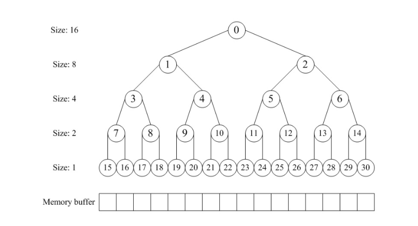
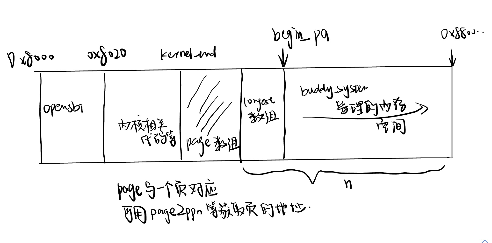
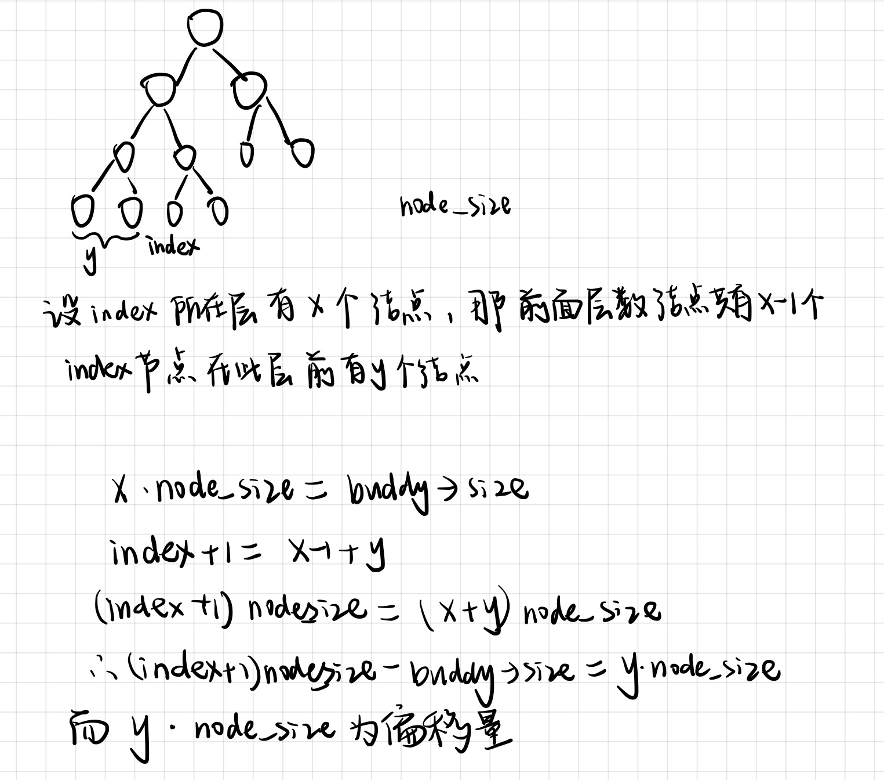
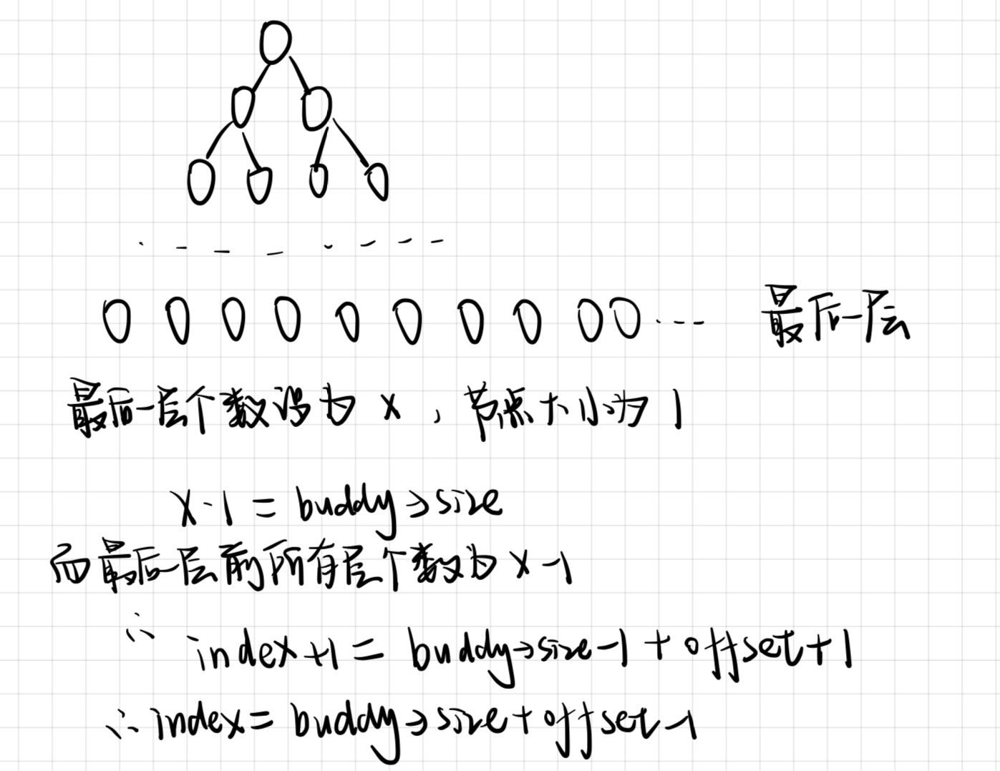

# Challenge:buddy system(伙伴系统)分配算法

## 1.设计要求

 在ucore中实现buddy system分配算法，要求有比较充分的测试用例说明实现的正确性，需要有设计文档。



- buddy system算法主要是将内存按2的幂进行划分。当有一个内存分配请求时，空闲空间被递归地一分为二，直至刚好可用满足请求的大小，这时请求的块被返回给用户。

  根据上面的图以及伙伴系统分配的递归特性，我们决定用完全二叉树的一维数组形式去实现伙伴系统分配算法，具体核心思路参考[伙伴系统的极简设计](https://coolshell.cn/articles/10427.html)。

## 2.设计思路

### 2.1 定义相关数据结构

```c
struct buddy {
    size_t size;  //二叉树初始管理的内存大小
    uintptr_t *longest; //完全二叉树数组
    size_t longest_num_page; //longest数组占用的页大小
    size_t free_size;  //实际可以管理的大小
    size_t total_num_page; //总共可用的页数量
    struct Page *begin_page;//可用的空间的第一个页对应page结构体的虚拟地址
};
struct buddy mem_buddy[MAX_NUM_BUDDY_ZONE];
int num_buddy_zone = 0;
```



如上，我们在这里定义了一个buddy结构体，可以管理一个连续的内存空间大小，

- 其中size是对应页数量的下一个2的幂次数。也就是n的下一个2的幂次数
- longest数组是完全二叉树的一维形式，其中数组元素的值代表对应的页的数量（为2的幂次方)。
- free_size是实际可以管理的大小，其中可能空闲的页数n不是2的幂次方，那么可用buddy system管理的内存空间显然会少一些，那么就是free_size的大小。
- total_num_page是我们总共可用的页数量，需要减去longest_num_page数组占用的页。
- begin_page     我们管理内存空间的初始虚拟地址映射到对应页后，这个页的对应page结构体的虚拟地址，也就是上图begin_pa对应的page的地址。
- 在这里设置了一个buddy数组，因为可能要管理多个内存空间(虽然在本次实验中只有一个空间)。

### 2.2 初始化管理

​		在这里主要是对Buddy进行初始化，Longest数组进行完全二叉树的参数设置，将节点值设置为页的数量(node_size)，同时还有一些细致的处理。

```c
static void
buddy_system_init_memmap(struct Page *base, size_t n) { //注意这里base传的为页结构体的虚拟地址
   ....
}
```

​		关于上面的代码，主要是三个部分

1. ```c
   	struct buddy *buddy = &mem_buddy[num_buddy_zone++];
       size_t v_size = next_power_of_2(n);//n的下一个2的幂次数
       size_t excess = v_size - n; //多出来的部分
       size_t v_alloced_size = next_power_of_2(excess); //将多出来的部分化为2的幂次数
   
       buddy->size = v_size;
       buddy->free_size = v_size - v_alloced_size; //实际可用的大小 有一些不是2的幂次方不能管理
       buddy->longest = page2kva(base); //将base页的地址转为页结构体映射的物理地址再转为虚拟地址
       //longest起始位置在base处
       //paddr 将虚拟变为物理地址 roundup按照页大小向上取整 最后将address成功转为对应页的存储地址(也是虚拟地址)
       buddy->begin_page = pa2page(PADDR(ROUNDUP(buddy->longest + 2 * v_size * sizeof(uintptr_t), PGSIZE)));
       //去除buddy里面longest分配内存的页号
       buddy->longest_num_page = buddy->begin_page - base; //Longest数组大小，物理地址相减
       buddy->total_num_page = n - buddy->longest_num_page;  //减去longest数组等之后拥有的页数量大小
       cprintf("longest虚拟地址: 0x%016lx\n",buddy->longest);
   
   ```

   ​		首先是对Buddy相关数据结构初始化，在memap初始化函数中，给定参数是可用地址初始页对应Page的地址base，以及一共可用页的数量n。

   ​		首先，我们对n个页进行管理，由于Buddy_system只对2的幂次方个空间管理，因此首先找到n的下一个2的幂次数

   - excess代表多出的页数量，v_alloced_size代表excess的下一个2的幂次数，那么要对二叉树对应的大小设置为不可分配，已被占用
   - page2kva(base)，即将base对应page结构体的虚拟地址，首先转为page控制的物理地址(page2pa)，再将物理地址转为虚拟地址，便于后续访存。
   - 计算我们二叉树控制空间的起始页对应page的虚拟地址。这里要将给定base对应虚拟地址的值加上longest数组大小，因为我们设置了Longest起始地址在base处，然后得出去除掉longest数组大小后的可用page地址。
   - 最后得出total_num_page，即空闲页减去longest占用页的页数量。

2. ```c
   	size_t node_size = buddy->size * 2;
   
       for (int i = 0; i < 2 * buddy->size - 1; i++) {
           if (IS_POWER_OF_2(i + 1)) {
               node_size /= 2;
           }
           buddy->longest[i] = node_size;
       }
       int index = 0;
       while (1) {
           if (buddy->longest[index] == v_alloced_size) {
               buddy->longest[index] = 0;
               break;
           }
           index = RIGHT_LEAF(index); //实际的大小小于v_size，所以需要把右子树多的标记为不可分配
       }
       //这里只用把父节点更改，因为访问时遇到0不会访问子节点，所以子节点大小不为0没有影响
       while (index) {
           index = PARENT(index);
           buddy->longest[index] = MAX(buddy->longest[LEFT_LEAF(index)], buddy->longest[RIGHT_LEAF(index)]);
       }
   ```

   - 由于我们的二叉树根节点对应所控制的空间大小，所以首先初始化此完全二叉树
   - 由于我们定义的二叉树实际控制空间大于n，这里必须要将不能控制的空间置0，即找到节点大小等于v_alloced_size的节点，置0即可。最后这里只用将此节点的父节点进行大小的更改，不用更改子节点，因为访问的时候是从上往下判断。因此从此节点向上回溯，将父节点控制空间(页的数量)进行更新即可。

3. ```c
    assert(buddy->total_num_page>=buddy->longest[0]);
       struct Page *p = buddy->begin_page; 
       for (; p != base + buddy->free_size; p ++) { //一共可以使用的大小 free_size，其他的不归buddy管理
           assert(PageReserved(p)); //判断之前是否为内核保留
           p->flags = p->property = 0; //设置为不被内核使用，property置0
           set_page_ref(p, 0);
       }
   ```

   最后一部分首先判断一下我们实际拥有的页数，是否不小于Buddy完全二叉树根节点的大小(页数)。

   随后开始设置Page结构体的属性值。那么这里遍历的范围显然是从begin_page开始，遍历free_size个大小，free_size表示完全二叉树实际控制的页数。

### 2.3 内存分配

```c
static struct Page *
buddy_system_alloc_pages(size_t n) {
   assert(n > 0);
    if (!IS_POWER_OF_2(n))
        n = next_power_of_2(n);//n的下一个最近的2幂次数

    size_t index = 0;
    size_t node_size;
    size_t offset = 0;

    struct buddy *buddy = NULL;//找到哪一个mem_buddy满足当前大小
    for (int i = 0; i < num_buddy_zone; i++) {
        if (mem_buddy[i].longest[index] >= n) {
            buddy = &mem_buddy[i];
            break;
        }
    }

    if (!buddy) {
        return NULL;
    }

    for (node_size = buddy->size; node_size != n; node_size /= 2) { 
        if (buddy->longest[LEFT_LEAF(index)] >= n)
            index = LEFT_LEAF(index);//当前节点的子节点大于去左边，我们分配左边优先
        else
            index = RIGHT_LEAF(index);
    }

    buddy->longest[index] = 0;
    offset = (index + 1) * node_size - buddy->size;//偏移量，相对于begin_page地址的
    //更改当前分配的节点的父节点
    while (index) {
        index = PARENT(index);
        buddy->longest[index] = MAX(buddy->longest[LEFT_LEAF(index)], buddy->longest[RIGHT_LEAF(index)]);
    }

    buddy->free_size -= n;

    return buddy->begin_page + offset;//我们的节点代表的是页，这里返回的是第几个，即从哪里开始花掉内存空间大小
}
```

1. 首先，对于给定的n，我们找到它的下一个最近的2的幂次数，更新n，再根据这个值去完全二叉树找到合适节点。

2. 在buddy数组中找到合适的内存空间buddy，页数量大于要分配的值。

3. 然后在for循环中，开始找到节点大小等于n的节点。寻找方式就是完全二叉树的方式，比较子节点与n的大小。

4. 成功找到index，将longest[index]赋值为0，代表已经被分配。然后因为alloc返回的是page对应的地址，我们要获取偏移值(也就是相对于begin_page的页数量偏移)，所以我们要获取offset。

5. $$
   offset = (index + 1) * node\_size - buddy\rightarrow size
   $$

   

   如上图，我们证明了offset求解的原理。

6. 在找到要分配的节点后，我们同时要更新此节点的父节点大小，但是不必更新此节点的子节点大小，因为我们访问是从上往下的。更新父节点原理是，取左节点和右节点的最大值，作为父节点的新大小。

7. 最后将buddy->begin_page + offset返回即可，代表我们要分配的页，对应的page结构体的地址。

### 2.4 内存释放

```c
static void
buddy_system_free_pages(struct Page *base, size_t n) { //这里的n没有用，只是统一接口
    struct buddy *buddy = NULL;

    for (int i = 0; i < num_buddy_zone; i++) {
        struct buddy *t = &mem_buddy[i];
        if (base >= t->begin_page && base < t->begin_page + t->size) {
            buddy = t;
            break;
        }
    }

    if (!buddy) return;

    unsigned node_size, index = 0;
    unsigned left_longest, right_longest;
    unsigned offset = base - buddy->begin_page;

    assert(offset >= 0 && offset < buddy->size);

    node_size = 1;
    index = offset + buddy->size - 1;//找到完全二叉树最底层的同样偏移量的节点，从该节点向上溯源

    for (; buddy->longest[index]; index = PARENT(index)) {
        node_size *= 2;
        if (index == 0)
            return;
    }//找到了要释放的那个节点 ,node_size是那个完全二叉树节点的大小

    buddy->longest[index] = node_size;
    buddy->free_size += node_size;//释放空间

    while (index) {
        index = PARENT(index);
        node_size *= 2;

        left_longest = buddy->longest[LEFT_LEAF(index)];
        right_longest = buddy->longest[RIGHT_LEAF(index)];

        if (left_longest + right_longest == node_size)
            buddy->longest[index] = node_size;
        else 
            buddy->longest[index] = MAX(left_longest, right_longest);
    }
}
```

这里的思路与内存分配的一致，具体实现逻辑参考的是指导书给出的链接。

1. $$
   index = offset + buddy\rightarrow size - 1;
   $$

   

   给出offset，我们求解与之对应的二叉树最底层的节点。

2. 那么已经知道最底层的相同偏移量的节点的index，我们只需要向上溯源找到node_size为0的节点，即可找到被分配的那个节点，再对它进行恢复即可。这里采用的是一个for循环，循环完成后可以得到被分配节点的index。

3. 在这里同样要对被分配节点向上回溯。这里要观察父节点是否也可以合并，若可以合并那么就扩大node_size即可。

### 2.5 正确性验证思路

​		那么上面我们设计了相关内存分配与释放的算法，在check中自然要进行相关验证。

​		这里验证思路就是分配若干个页，对完全二叉树进行节点值的打印，观察分配与释放后完全二叉树的情况，同时也会判断free_size大小是否正常。（因为分配与释放会对free_size进行更改)

1. 打印二叉树函数

   ```c
   static void
   print_buddy_tree(int level, char *label) {
       cprintf("\nprint buddy tree: %s\n", label);
   
       int num = 1;
       int index = 0;
       int curlevel_num = 1;
       for (int i = 0; i < level; i++) {
           for(int j=0;j<curlevel_num;j++){
               cprintf("%d ", mem_buddy[0].longest[index++]);
           }
           curlevel_num*=2;
           cprintf("\n");
       }
       cprintf("print buddy tree end\n\n");
   }
   ```

   

2. 检查函数

```c
static void
buddy_check(void) {
    size_t total = buddy_system_nr_free_pages();
    cprintf("mem_budy[0].size:%d\n",mem_buddy[0].size);
    cprintf("mem_budy[0].longest_num_page: %d\n", mem_buddy[0].longest_num_page);
    cprintf("num_buddy_zone:%d\n",num_buddy_zone);
    cprintf("total_buddy_free_pages: %d\n", total);

    struct Page *p0 = alloc_page();//分配1个页
    assert(p0 != NULL);
    assert(buddy_system_nr_free_pages() == total - 1);//判断是否分配成功
    assert(p0 == mem_buddy[0].begin_page);//判断分配的页的地址是否为mem_budy管理的页开始地址

    struct Page *p1 = alloc_page();
    assert(p1 != NULL);
    assert(buddy_system_nr_free_pages() == total - 2);
    assert(p1 == mem_buddy[0].begin_page + 1);

    assert(p1 == p0 + 1);

    buddy_system_free_pages(p0, 1);
    buddy_system_free_pages(p1, 1);  //释放两个页
    assert(buddy_system_nr_free_pages() == total);//是否释放成功

    p0 = buddy_system_alloc_pages(14); //分配14个
    assert(buddy_system_nr_free_pages() == total - 16); //14最近的为16，所以少16个页

    p1 = buddy_system_alloc_pages(100); //100最近的为128
    assert(buddy_system_nr_free_pages() == total - 144);  //128+16=144

    buddy_system_free_pages(p0, -100); //释放p0开始的16个页的节点
    buddy_system_free_pages(p1, -100);//释放p1开始的128个节点
    assert(buddy_system_nr_free_pages() == total);  //判断是否成功

    p0 = buddy_system_alloc_pages(total); //把所有的都分配，显然不成功
    assert(p0 == NULL);

    print_buddy_tree(8, "buddy_system使用的完全二叉树初始化");
    p0 = buddy_system_alloc_pages(256);
    print_buddy_tree(8, "分配256个页");
    assert(buddy_system_nr_free_pages() == total - 256);

    p1 = buddy_system_alloc_pages(1024);
    print_buddy_tree(8, "分配1024个页");
    assert(buddy_system_nr_free_pages() == total - 256 - 1024);

    struct Page *p2 = buddy_system_alloc_pages(2048);
    print_buddy_tree(8, "分配2048个页");
    assert(buddy_system_nr_free_pages() == total - 256 - 1024 - 2048);

    buddy_system_free_pages(p1, -100);
    print_buddy_tree(8,"回收1024个页");

    struct Page *p3 = buddy_system_alloc_pages(4096);
    print_buddy_tree(8, "分配4096个页");
    assert(buddy_system_nr_free_pages() == total - 256 - 2048 - 4096);

    struct Page *p4 = buddy_system_alloc_pages(8192);
    print_buddy_tree(8, "分配8192个页");
    assert(buddy_system_nr_free_pages() == total - 256  - 2048 - 4096 - 8192);
  
    buddy_system_free_pages(p3, -100);
    print_buddy_tree(8,"回收4096个页后");

    struct Page *p5 = buddy_system_alloc_pages(8000);
    print_buddy_tree(8, "试图分配8000个页后");
    assert(buddy_system_nr_free_pages() == total - 256 - 2048 - 8192 - 8192);

    buddy_system_free_pages(p0, -100);
    buddy_system_free_pages(p2, -100);
    buddy_system_free_pages(p4, -100);
    buddy_system_free_pages(p5, -100);

    assert(buddy_system_nr_free_pages() == total);
}
```

### 2.6 统一接口

```c
//接口
const struct pmm_manager buddy_system_pmm_manager = {
    .name = "buddy_system_pmm_manager",
    .init = buddy_system_init,
    .init_memmap = buddy_system_init_memmap,
    .alloc_pages = buddy_system_alloc_pages,
    .free_pages = buddy_system_free_pages,
    .nr_free_pages = buddy_system_nr_free_pages,
    .check = buddy_check,
};

extern const struct pmm_manager buddy_system_pmm_manager;

pmm_manager = &buddy_system_pmm_manager;
```


## 3.正确性验证

```
print buddy tree: buddy_system使用的完全二叉树初始化
16384 
16384 8192 
8192 8192 8192 4096 
4096 4096 4096 4096 4096 4096 4096 2048 
2048 2048 2048 2048 2048 2048 2048 2048 2048 2048 2048 2048 2048 2048 2048 1024 
1024 1024 1024 1024 1024 1024 1024 1024 1024 1024 1024 1024 1024 1024 1024 1024 1024 1024 1024 1024 1024 1024 1024 1024 1024 1024 1024 1024 1024 1024 1024 0 
512 512 512 512 512 512 512 512 512 512 512 512 512 512 512 512 512 512 512 512 512 512 512 512 512 512 512 512 512 512 512 512 512 512 512 512 512 512 512 512 512 512 512 512 512 512 512 512 512 512 512 512 512 512 512 512 512 512 512 512 512 512 512 512 
256 256 256 256 256 256 256 256 256 256 256 256 256 256 256 256 256 256 256 256 256 256 256 256 256 256 256 256 256 256 256 256 256 256 256 256 256 256 256 256 256 256 256 256 256 256 256 256 256 256 256 256 256 256 256 256 256 256 256 256 256 256 256 256 256 256 256 256 256 256 256 256 256 256 256 256 256 256 256 256 256 256 256 256 256 256 256 256 256 256 256 256 256 256 256 256 256 256 256 256 256 256 256 256 256 256 256 256 256 256 256 256 256 256 256 256 256 256 256 256 256 256 256 256 256 256 256 256 
print buddy tree end

print buddy tree: 分配256个页
8192 
8192 8192 
4096 8192 8192 4096 
2048 4096 4096 4096 4096 4096 4096 2048 
1024 2048 2048 2048 2048 2048 2048 2048 2048 2048 2048 2048 2048 2048 2048 1024 
512 1024 1024 1024 1024 1024 1024 1024 1024 1024 1024 1024 1024 1024 1024 1024 1024 1024 1024 1024 1024 1024 1024 1024 1024 1024 1024 1024 1024 1024 1024 0 
256 512 512 512 512 512 512 512 512 512 512 512 512 512 512 512 512 512 512 512 512 512 512 512 512 512 512 512 512 512 512 512 512 512 512 512 512 512 512 512 512 512 512 512 512 512 512 512 512 512 512 512 512 512 512 512 512 512 512 512 512 512 512 512 
0 256 256 256 256 256 256 256 256 256 256 256 256 256 256 256 256 256 256 256 256 256 256 256 256 256 256 256 256 256 256 256 256 256 256 256 256 256 256 256 256 256 256 256 256 256 256 256 256 256 256 256 256 256 256 256 256 256 256 256 256 256 256 256 256 256 256 256 256 256 256 256 256 256 256 256 256 256 256 256 256 256 256 256 256 256 256 256 256 256 256 256 256 256 256 256 256 256 256 256 256 256 256 256 256 256 256 256 256 256 256 256 256 256 256 256 256 256 256 256 256 256 256 256 256 256 256 256 
print buddy tree end


print buddy tree: 分配1024个页
8192 
8192 8192 
4096 8192 8192 4096 
2048 4096 4096 4096 4096 4096 4096 2048 
512 2048 2048 2048 2048 2048 2048 2048 2048 2048 2048 2048 2048 2048 2048 1024 
512 0 1024 1024 1024 1024 1024 1024 1024 1024 1024 1024 1024 1024 1024 1024 1024 1024 1024 1024 1024 1024 1024 1024 1024 1024 1024 1024 1024 1024 1024 0 
256 512 512 512 512 512 512 512 512 512 512 512 512 512 512 512 512 512 512 512 512 512 512 512 512 512 512 512 512 512 512 512 512 512 512 512 512 512 512 512 512 512 512 512 512 512 512 512 512 512 512 512 512 512 512 512 512 512 512 512 512 512 512 512 
0 256 256 256 256 256 256 256 256 256 256 256 256 256 256 256 256 256 256 256 256 256 256 256 256 256 256 256 256 256 256 256 256 256 256 256 256 256 256 256 256 256 256 256 256 256 256 256 256 256 256 256 256 256 256 256 256 256 256 256 256 256 256 256 256 256 256 256 256 256 256 256 256 256 256 256 256 256 256 256 256 256 256 256 256 256 256 256 256 256 256 256 256 256 256 256 256 256 256 256 256 256 256 256 256 256 256 256 256 256 256 256 256 256 256 256 256 256 256 256 256 256 256 256 256 256 256 256 
print buddy tree end

print buddy tree: 分配2048个页
8192 
8192 8192 
4096 8192 8192 4096 
512 4096 4096 4096 4096 4096 4096 2048 
512 0 2048 2048 2048 2048 2048 2048 2048 2048 2048 2048 2048 2048 2048 1024 
512 0 1024 1024 1024 1024 1024 1024 1024 1024 1024 1024 1024 1024 1024 1024 1024 1024 1024 1024 1024 1024 1024 1024 1024 1024 1024 1024 1024 1024 1024 0 
256 512 512 512 512 512 512 512 512 512 512 512 512 512 512 512 512 512 512 512 512 512 512 512 512 512 512 512 512 512 512 512 512 512 512 512 512 512 512 512 512 512 512 512 512 512 512 512 512 512 512 512 512 512 512 512 512 512 512 512 512 512 512 512 
0 256 256 256 256 256 256 256 256 256 256 256 256 256 256 256 256 256 256 256 256 256 256 256 256 256 256 256 256 256 256 256 256 256 256 256 256 256 256 256 256 256 256 256 256 256 256 256 256 256 256 256 256 256 256 256 256 256 256 256 256 256 256 256 256 256 256 256 256 256 256 256 256 256 256 256 256 256 256 256 256 256 256 256 256 256 256 256 256 256 256 256 256 256 256 256 256 256 256 256 256 256 256 256 256 256 256 256 256 256 256 256 256 256 256 256 256 256 256 256 256 256 256 256 256 256 256 256 
print buddy tree end

print buddy tree: 回收1024个页
8192 
8192 8192 
4096 8192 8192 4096 
1024 4096 4096 4096 4096 4096 4096 2048 
1024 0 2048 2048 2048 2048 2048 2048 2048 2048 2048 2048 2048 2048 2048 1024 
512 1024 1024 1024 1024 1024 1024 1024 1024 1024 1024 1024 1024 1024 1024 1024 1024 1024 1024 1024 1024 1024 1024 1024 1024 1024 1024 1024 1024 1024 1024 0 
256 512 512 512 512 512 512 512 512 512 512 512 512 512 512 512 512 512 512 512 512 512 512 512 512 512 512 512 512 512 512 512 512 512 512 512 512 512 512 512 512 512 512 512 512 512 512 512 512 512 512 512 512 512 512 512 512 512 512 512 512 512 512 512 
0 256 256 256 256 256 256 256 256 256 256 256 256 256 256 256 256 256 256 256 256 256 256 256 256 256 256 256 256 256 256 256 256 256 256 256 256 256 256 256 256 256 256 256 256 256 256 256 256 256 256 256 256 256 256 256 256 256 256 256 256 256 256 256 256 256 256 256 256 256 256 256 256 256 256 256 256 256 256 256 256 256 256 256 256 256 256 256 256 256 256 256 256 256 256 256 256 256 256 256 256 256 256 256 256 256 256 256 256 256 256 256 256 256 256 256 256 256 256 256 256 256 256 256 256 256 256 256 
print buddy tree end


print buddy tree: 分配4096个页
8192 
8192 8192 
1024 8192 8192 4096 
1024 0 4096 4096 4096 4096 4096 2048 
1024 0 2048 2048 2048 2048 2048 2048 2048 2048 2048 2048 2048 2048 2048 1024 
512 1024 1024 1024 1024 1024 1024 1024 1024 1024 1024 1024 1024 1024 1024 1024 1024 1024 1024 1024 1024 1024 1024 1024 1024 1024 1024 1024 1024 1024 1024 0 
256 512 512 512 512 512 512 512 512 512 512 512 512 512 512 512 512 512 512 512 512 512 512 512 512 512 512 512 512 512 512 512 512 512 512 512 512 512 512 512 512 512 512 512 512 512 512 512 512 512 512 512 512 512 512 512 512 512 512 512 512 512 512 512 
0 256 256 256 256 256 256 256 256 256 256 256 256 256 256 256 256 256 256 256 256 256 256 256 256 256 256 256 256 256 256 256 256 256 256 256 256 256 256 256 256 256 256 256 256 256 256 256 256 256 256 256 256 256 256 256 256 256 256 256 256 256 256 256 256 256 256 256 256 256 256 256 256 256 256 256 256 256 256 256 256 256 256 256 256 256 256 256 256 256 256 256 256 256 256 256 256 256 256 256 256 256 256 256 256 256 256 256 256 256 256 256 256 256 256 256 256 256 256 256 256 256 256 256 256 256 256 256 
print buddy tree end


print buddy tree: 分配8192个页
8192 
1024 8192 
1024 0 8192 4096 
1024 0 4096 4096 4096 4096 4096 2048 
1024 0 2048 2048 2048 2048 2048 2048 2048 2048 2048 2048 2048 2048 2048 1024 
512 1024 1024 1024 1024 1024 1024 1024 1024 1024 1024 1024 1024 1024 1024 1024 1024 1024 1024 1024 1024 1024 1024 1024 1024 1024 1024 1024 1024 1024 1024 0 
256 512 512 512 512 512 512 512 512 512 512 512 512 512 512 512 512 512 512 512 512 512 512 512 512 512 512 512 512 512 512 512 512 512 512 512 512 512 512 512 512 512 512 512 512 512 512 512 512 512 512 512 512 512 512 512 512 512 512 512 512 512 512 512 
0 256 256 256 256 256 256 256 256 256 256 256 256 256 256 256 256 256 256 256 256 256 256 256 256 256 256 256 256 256 256 256 256 256 256 256 256 256 256 256 256 256 256 256 256 256 256 256 256 256 256 256 256 256 256 256 256 256 256 256 256 256 256 256 256 256 256 256 256 256 256 256 256 256 256 256 256 256 256 256 256 256 256 256 256 256 256 256 256 256 256 256 256 256 256 256 256 256 256 256 256 256 256 256 256 256 256 256 256 256 256 256 256 256 256 256 256 256 256 256 256 256 256 256 256 256 256 256 
print buddy tree end


print buddy tree: 回收4096个页后
8192 
4096 8192 
4096 0 8192 4096 
1024 4096 4096 4096 4096 4096 4096 2048 
1024 0 2048 2048 2048 2048 2048 2048 2048 2048 2048 2048 2048 2048 2048 1024 
512 1024 1024 1024 1024 1024 1024 1024 1024 1024 1024 1024 1024 1024 1024 1024 1024 1024 1024 1024 1024 1024 1024 1024 1024 1024 1024 1024 1024 1024 1024 0 
256 512 512 512 512 512 512 512 512 512 512 512 512 512 512 512 512 512 512 512 512 512 512 512 512 512 512 512 512 512 512 512 512 512 512 512 512 512 512 512 512 512 512 512 512 512 512 512 512 512 512 512 512 512 512 512 512 512 512 512 512 512 512 512 
0 256 256 256 256 256 256 256 256 256 256 256 256 256 256 256 256 256 256 256 256 256 256 256 256 256 256 256 256 256 256 256 256 256 256 256 256 256 256 256 256 256 256 256 256 256 256 256 256 256 256 256 256 256 256 256 256 256 256 256 256 256 256 256 256 256 256 256 256 256 256 256 256 256 256 256 256 256 256 256 256 256 256 256 256 256 256 256 256 256 256 256 256 256 256 256 256 256 256 256 256 256 256 256 256 256 256 256 256 256 256 256 256 256 256 256 256 256 256 256 256 256 256 256 256 256 256 256 
print buddy tree end

print buddy tree: 试图分配8000个页后
4096 
4096 4096 
4096 0 0 4096 
1024 4096 4096 4096 4096 4096 4096 2048 
1024 0 2048 2048 2048 2048 2048 2048 2048 2048 2048 2048 2048 2048 2048 1024 
512 1024 1024 1024 1024 1024 1024 1024 1024 1024 1024 1024 1024 1024 1024 1024 1024 1024 1024 1024 1024 1024 1024 1024 1024 1024 1024 1024 1024 1024 1024 0 
256 512 512 512 512 512 512 512 512 512 512 512 512 512 512 512 512 512 512 512 512 512 512 512 512 512 512 512 512 512 512 512 512 512 512 512 512 512 512 512 512 512 512 512 512 512 512 512 512 512 512 512 512 512 512 512 512 512 512 512 512 512 512 512 
0 256 256 256 256 256 256 256 256 256 256 256 256 256 256 256 256 256 256 256 256 256 256 256 256 256 256 256 256 256 256 256 256 256 256 256 256 256 256 256 256 256 256 256 256 256 256 256 256 256 256 256 256 256 256 256 256 256 256 256 256 256 256 256 256 256 256 256 256 256 256 256 256 256 256 256 256 256 256 256 256 256 256 256 256 256 256 256 256 256 256 256 256 256 256 256 256 256 256 256 256 256 256 256 256 256 256 256 256 256 256 256 256 256 256 256 256 256 256 256 256 256 256 256 256 256 256 256 
print buddy tree end

check_alloc_page() succeeded!
satp virtual address: 0xffffffffc0205000
satp physical address: 0x0000000080205000

```

可以知道我们的Buddy_system设计是正确的。