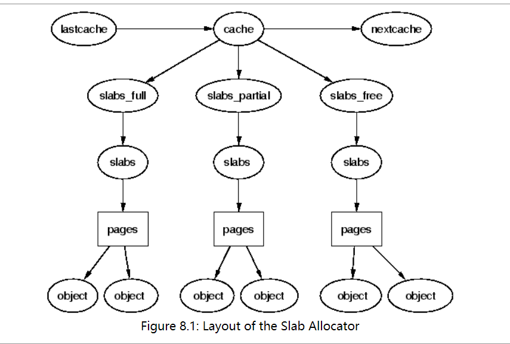
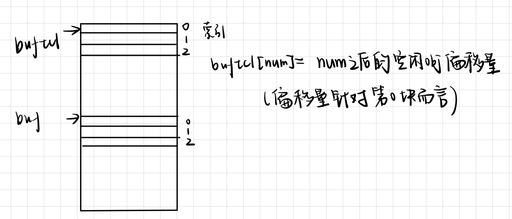
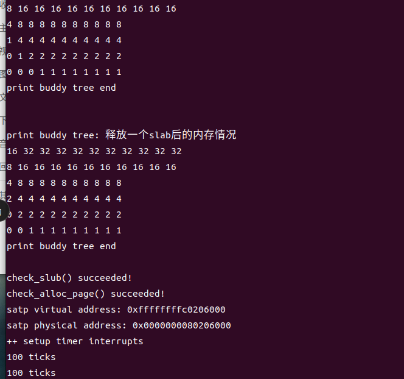

# Challenge：任意大小的内存单元slub分配算法

## 1.设计要求

​		设计slub算法，实现两层架构的高效内存单元分配，第一层是基于页大小的内存分配，第二层是在第一层基础上实现基于任意大小的内存分配。可简化实现，能够体现其主体思想即可。

​		在这里，我们的初步思路是在buddy_system的基础上实现第一层，而第二层实现比页更小的内存分配，这里第二层的主要思路是将一页进行划分，而每一种任意大小的内存分配，需要设计一个仓库，仓库里面会存多个页，页里面可以存的大小是固定的（小于1页）。

## 2.设计思路

### 2.1 数据结构定义

在这里我们需要实现第二次小于1页的任意大小的内存分配，那么首先需要定义一个仓库类型，其中有slab代表一个页，而在页中可以分配小于1页的空间给obj对象。具体思路可以参照下图。



```c
//仓库结构体
struct cache_t {
    list_entry_t slabs_full;	// 全满Slab链表
    list_entry_t slabs_partial;	// 部分空闲Slab链表
    list_entry_t slabs_free;	// 全空闲Slab链表
    uint16_t objsize;		// 对象大小
    uint16_t num;			// 每个Slab保存的对象数目，也就是slab最多可用的Obj数量
    list_entry_t cache_link;	// 仓库链表
};

//slab结构，将其与Page等价，复用page一系列函数
//Buddy System中，一个物理页被分配之后，Page结构中除了ref之外的成员没有其他用处了，所以只加一个ref
struct slab_t {
    int ref;                       
    struct cache_t *cachep;  //属于哪个仓库            
    uint16_t inuse; //一共多少obj被使用
    uint16_t free;//slab中下一个可用的obj的偏移量
    list_entry_t slab_link;
};

static list_entry_t cache_chain; //连接众多仓库的一个链表
static struct cache_t cache_cache;  //进行分配仓库的仓库

#define le2slab(le,link)    ((struct slab_t*)le2page((struct Page*)le,link))
#define slab2kva(slab)      (page2kva((struct Page*)slab))
```

- cache_cache是一个初始化的仓库，里面的obj类型为cache_t，也就是说会分配内存空间，储存仓库类型，在之后创建仓库会用到。
- cache_chain是仓库的一共链表，链接所有仓库方便查找。
- slab与page实际上大小相同，这里采取复用的一个措施，即储存在同一个位置，因为Buddy System中，一个物理页被分配之后，Page结构中除了ref之外的成员没有其他用处了，所以复用是可行的。
- 这里定义了转换的函数，le2slab：即通过slab的link取到slab的地址；slab2kva：将slab地址借助page转换到对应的虚拟空间地址。

### 2.2 cache_cache的初始化

```c
static void
system_init(void) {
     // Init cache for cache
     
    cache_cache.objsize = sizeof(struct cache_t);
    cache_cache.num = PGSIZE / (sizeof(int16_t) + sizeof(struct cache_t));

    list_init(&(cache_cache.slabs_full));
    list_init(&(cache_cache.slabs_partial));
    list_init(&(cache_cache.slabs_free));
    list_init(&(cache_chain));
    list_add(&(cache_chain), &(cache_cache.cache_link));
}
```

在这里初始化cache_cache，即方便后面我们创建仓库。cache_cache是用来储存仓库的，当然其结构与仓库也完全一致，由于仓库类型大小很明显比较小，一个页显然可以储存多个。


### 2.3 slab的申请与释放

```c
//申请一页内存
void *
cache_grow(struct cache_t *cachep);
//将内存页归还。
void
slab_destroy(struct cache_t *cachep, struct slab_t *slab);
```

1. cache_grow

   ```c
   //申请一页内存，初始化bufctl，将新的Slab加入到仓库的空闲Slab表中
   void *
   cache_grow(struct cache_t *cachep) {
       struct Page *page = alloc_page();
       void *kva = page2kva(page);//转为虚拟地址
       // Init slub meta data
       struct slab_t *slab = (struct slab_t *) page;
       slab->cachep = cachep;
       slab->inuse = slab->free = 0;
       list_add(&(cachep->slabs_free), &(slab->slab_link)); //仓库中链接此slab 一页
       // Init bufctl
       int16_t *bufctl = kva;
       for (int i = 1; i < cachep->num; i++)
           bufctl[i-1] = i;
       bufctl[cachep->num-1] = -1;
       // Init cache 
       //void *buf = bufctl + cachep->num;
       return slab;
   }
   ```

   

   - 首先调用buddy_system的alloc函数，申请一页的内存，通过page与slab的转换，用slab管理这一页。
   - 将申请的一页链接在仓库的slabs_free链表中
   - 初始化buftcl，这里buftcl与每个obj对象相对应，索引相同。初始时，第0块的下一个空闲obj是第1块....依次类推，可以初始化buftcl数组，作为一个隐式的链表（可以记录一个页的空闲的）

2. slab_destroy

   ```c
   
   //将内存页归还。
   void
   slab_destroy(struct cache_t *cachep, struct slab_t *slab) {
       struct Page *page = (struct Page *) slab;
       //  slab page 
       page->property = page->flags = 0;
       list_del(&(page->page_link));//把这个slab从仓库的链表中删除
       free_page(page);//释放，这里调用的是buddy里面的释放整页的函数
   }
   ```

   根据给定的slab，直接调用buddy_system的free_page即可，同时也要把slab从仓库链接的slab链表中删除。

### 2.4 obj对象的申请与释放

```c
//slab里面obj的分配
void *cache_alloc(struct cache_t *cachep);
//释放obj
void cache_free(struct cache_t *cachep, void *objp);
```

1. obj分配

   ```c
   //从当前仓库找一个slab分配一个obj
   void *
   cache_alloc(struct cache_t *cachep) {
       list_entry_t *le = NULL;
       // Find in partial list 
       if (!list_empty(&(cachep->slabs_partial)))
           le = list_next(&(cachep->slabs_partial));
       // Find in empty list 
       else {
           if (list_empty(&(cachep->slabs_free)) && cache_grow(cachep) == NULL)
               return NULL;
           le = list_next(&(cachep->slabs_free));
       }
       // Alloc 
       list_del(le);
       struct slab_t *slab = le2slab(le, page_link);
       void *kva = slab2kva(slab);
       int16_t *bufctl = kva;
       void *buf = bufctl + cachep->num;
       void *objp = buf + slab->free * cachep->objsize;
       // 更新 slab
       slab->inuse ++;
       slab->free = bufctl[slab->free];//free是当前可用第几个Obj对象
       if (slab->inuse == cachep->num)
           list_add(&(cachep->slabs_full), le);
       else 
           list_add(&(cachep->slabs_partial), le);
       return objp;
   }
   ```

   - 首先需要找到一个可用的slab。我们首先利用部分空的链表，如果没有部分空闲的slab，转向完全空闲的slab，如果没有完全空闲的slab，我们调用cache_grow进行申请一页的内存，申请一共slab。那么这个时候就得到了slab内部的List_entry值。
   - 将得到的le从list上删去，之后根据类型判断再重新链接到链表上。
   - le2slab，这里与page一样，从List_entry得到slab的地址。
   - 找到了slab的地址，开始分配obj。
   - 分配obj利用slab->free值，即空闲块的索引，根据一系列计算可以得出Objp，即分配对象的地址。
   - 最后将slab链接回仓库里面的链表。

2. obj释放

   ```c
   //从当前仓库里释放一个obj
   void 
   cache_free(struct cache_t *cachep, void *objp) {
       // Get slab of object 
       void *base = page2kva(pages);
       void *kva = ROUNDDOWN(objp, PGSIZE);//该objp属于哪一页
       struct slab_t *slab = (struct slab_t *) &pages[(kva-base)/PGSIZE];
       // Get offset in slab
       int16_t *bufctl = kva;
       void *buf = bufctl + cachep->num;
       int offset = (objp - buf) / cachep->objsize;
       // Update slab 
       list_del(&(slab->slab_link));
       bufctl[offset] = slab->free;
       slab->inuse --;
       slab->free = offset;
       if (slab->inuse == 0)
           list_add(&(cachep->slabs_free), &(slab->slab_link));
       else 
           list_add(&(cachep->slabs_partial), &(slab->slab_link));
   }
   ```

   给定了仓库与释放的objp地址，那么进行释放即可

   - 通过objp的地址，找到所属slab的地址。注意slab地址是Page的地址，而buf与bufctl是真实的虚拟地址。
   - 更新slab->free与bufctl[offset]即可，将slab->free置为当前要释放的那个块。
   - 最后更新此slab所属的链表。

### 2.5 仓库的创建与释放

```c
struct cache_t *cache_create( size_t size);

void cache_destroy(struct cache_t *cachep);
```

1. 仓库创建

   ```c
   //创建仓库，size为对象的size。
   // cache_create - create a cache
   struct cache_t *
   cache_create(size_t size) {
       assert(size <= (PGSIZE - 2));
       struct cache_t *cachep = cache_alloc(&(cache_cache));
       if (cachep != NULL) {
           cachep->objsize = size;
           cachep->num = PGSIZE / (sizeof(int16_t) + size);
           list_init(&(cachep->slabs_full));
           list_init(&(cachep->slabs_partial));
           list_init(&(cachep->slabs_free));
           list_add(&(cache_chain), &(cachep->cache_link));
       }
       return cachep;
   }
   ```

   由于一个slab对应的页中，需要储存Buftcl，所以实际cache->num计算，必须(sizeof(int16_t) + size)；

   - 调用obj对象的申请，即把仓库看作cache_cache的一个slab里面储存的obj，返回得obj的地址，也就是仓库的地址
   - 如果这个指针不为空，说明仓库创建成功。
   - 进行仓库类型一系列属性的初始化，并且初始化三条重要的链表。

2. 仓库释放

   ```c
   //销毁仓库
   void 
   cache_destroy(struct cache_t *cachep) {
       list_entry_t *head, *le;
       // 销毁full slabs
       head = &(cachep->slabs_full);
       le = list_next(head);
       while (le != head) {
           list_entry_t *temp = le;
           le = list_next(le);
           slab_destroy(cachep, le2slab(temp, page_link));
       }
       // 销毁partial slabs 
       head = &(cachep->slabs_partial);
       le = list_next(head);
       while (le != head) {
           list_entry_t *temp = le;
           le = list_next(le);
           slab_destroy(cachep, le2slab(temp, page_link));
       }
       // 销毁free slabs 
       head = &(cachep->slabs_free);
       le = list_next(head);
       while (le != head) {
           list_entry_t *temp = le;
           le = list_next(le);
           slab_destroy(cachep, le2slab(temp, page_link));
       }
       // Free cache 这个仓库对于cache_cache来说也是一个obj,调用即可
       cache_free(&(cache_cache), cachep);
   }   
   ```

   销毁思路大致是，针对三条链表，分别清除链表上slab对应的内存页。最后调用obj对象的释放函数，因为仓库对于cache_cache也是一个obj，调用即可。

   ### 2.6 验证函数

   1.测试的数据结构

   ```c
   
   struct test_object {
       char test_member[2046];
   };
   
   struct test2_object{
       char test2_member[1022];
   };
   
   ```

   用上面两个类型的大小进行测试。

   2.测试函数

   具体思路，分别创建两个可以储存2046字节与1022字节的仓库，由于一个页中每个obj要对应一个2字节索引的储存。

   所以一页正好可以储存2个test_object；可以储存4个test_object。

   那么下面的测试函数，主要是：

   - 测试创建仓库，销毁仓库；
   - 申请不足1页的内存空间分配；
   - 释放不足1页的内存空间分配；
   - slab的申请与释放

   最后打印内存的使用情况(借助buddy_system的完全二叉树)可验证更细节的部分。

   ```c
   
   void 
   check_slub() {
       //这里我们复用page,将slab等价于page
       assert(sizeof(struct Page) == sizeof(struct slab_t));
       print_buddy_tree(16,"原先的内存情况");
       //创建一个仓库，大小为2046个字节
       struct cache_t *cp0 = cache_create(sizeof(struct test_object));
       assert(cp0 != NULL);
       print_buddy_tree(16,"产生cp0仓库后的内存情况");//cache里面分配了一个slub，里面存了一个仓库类型
       // Allocate six objects
       struct test_object *p0, *p1, *p2, *p3, *p4,*p5;
   
       //在cp0仓库里分配一个Obj
       assert((p0 = cache_alloc(cp0)) != NULL);
       assert((p1 = cache_alloc(cp0)) != NULL);
       assert((p2 = cache_alloc(cp0)) != NULL);
       assert((p3 = cache_alloc(cp0)) != NULL);
       assert((p4 = cache_alloc(cp0)) != NULL);
       assert((p5 = cache_alloc(cp0)) != NULL);//申请3个页
       print_buddy_tree(16,"申请6个2046字节后的内存情况");
    
       assert(list_empty(&(cp0->slabs_free))); //没有全空的slab
       assert(list_empty(&(cp0->slabs_partial)));//没有部分空的slab
       assert(list_length(&(cp0->slabs_full)) == 3);//6个结构体大小，用3个slab
       // Free three objects 
       cache_free(cp0, p3);
       cache_free(cp0, p4);
       cache_free(cp0, p5);
       assert(list_length(&(cp0->slabs_free)) == 1);
       assert(list_length(&(cp0->slabs_partial)) == 1);
       assert(list_length(&(cp0->slabs_full)) == 1);
       slab_destroy(cp0,le2slab(list_next(&(cp0->slabs_free)), page_link));
       assert(list_length(&(cp0->slabs_free))==0);
       print_buddy_tree(16,"释放一个slab后的内存情况");
   
       cache_destroy(cp0);
       print_buddy_tree(16,"销毁仓库cp0后的内存情况");
   
   
       struct cache_t *cp1 = cache_create(sizeof(struct test2_object));
       print_buddy_tree(16,"产生cp1仓库后的内存情况");//内存页情况没有变化，因为仓库类型很小
       struct test2_object *t0, *t1, *t2, *t3, *t4,*t5,*t6,*t7;//使用两个页
       assert((t0 = cache_alloc(cp1)) != NULL);
       assert((t1 = cache_alloc(cp1)) != NULL);
       assert((t2 = cache_alloc(cp1)) != NULL);
       assert((t3 = cache_alloc(cp1)) != NULL);
       assert((t4 = cache_alloc(cp1)) != NULL);
       assert((t5 = cache_alloc(cp1)) != NULL);
       assert((t6 = cache_alloc(cp1)) != NULL);
       assert((t7 = cache_alloc(cp1)) != NULL);
   
       print_buddy_tree(16,"申请8个1022字节后的内存情况");
       assert(list_empty(&(cp1->slabs_free))); //没有全空的slab
       assert(list_empty(&(cp1->slabs_partial)));//没有部分空的slab
       assert(list_length(&(cp1->slabs_full)) == 2);//用2个slab
       // Free three objects 
       cache_free(cp1, t3);
       cache_free(cp1, t4);
       cache_free(cp1, t5);
       cache_free(cp1, t6);
       cache_free(cp1, t7);
       assert(list_length(&(cp1->slabs_free))==1); //有全空的slab，释放4个全空。
       assert(list_length(&(cp1->slabs_partial))==1);//有部分空的slab
       assert(list_empty(&(cp1->slabs_full))); //没有全满的
       //释放全空的slab
       slab_destroy(cp1,le2slab(list_next(&(cp1->slabs_free)), page_link));
       print_buddy_tree(16,"释放一个slab后的内存情况");
   
       cprintf("check_slub() succeeded!\n");
   
   }
   ```

   

## 3.正确性验证



```
print buddy tree: 原先的内存情况
32 32 32 32 32 32 32 32 32 32 32 
16 16 16 16 16 16 16 16 16 16 16 
8 8 8 8 8 8 8 8 8 8 8 
4 4 4 4 4 4 4 4 4 4 4 
2 2 2 2 2 2 2 2 2 2 2 
1 1 1 1 1 1 1 1 1 1 1 
print buddy tree end


print buddy tree: 产生cp0仓库后的内存情况
16 32 32 32 32 32 32 32 32 32 32 
8 16 16 16 16 16 16 16 16 16 16 
4 8 8 8 8 8 8 8 8 8 8 
2 4 4 4 4 4 4 4 4 4 4 
1 2 2 2 2 2 2 2 2 2 2 
0 1 1 1 1 1 1 1 1 1 1 
print buddy tree end


print buddy tree: 申请6个2046字节后的内存情况
16 32 32 32 32 32 32 32 32 32 32 
8 16 16 16 16 16 16 16 16 16 16 
4 8 8 8 8 8 8 8 8 8 8 
0 4 4 4 4 4 4 4 4 4 4 
0 0 2 2 2 2 2 2 2 2 2 
0 0 0 0 1 1 1 1 1 1 1 
print buddy tree end


print buddy tree: 释放一个slab后的内存情况
16 32 32 32 32 32 32 32 32 32 32 
8 16 16 16 16 16 16 16 16 16 16 
4 8 8 8 8 8 8 8 8 8 8 
1 4 4 4 4 4 4 4 4 4 4 
0 1 2 2 2 2 2 2 2 2 2 
0 0 0 1 1 1 1 1 1 1 1 
print buddy tree end


print buddy tree: 销毁仓库cp0后的内存情况
16 32 32 32 32 32 32 32 32 32 32 
8 16 16 16 16 16 16 16 16 16 16 
4 8 8 8 8 8 8 8 8 8 8 
2 4 4 4 4 4 4 4 4 4 4 
1 2 2 2 2 2 2 2 2 2 2 
0 1 1 1 1 1 1 1 1 1 1 
print buddy tree end


print buddy tree: 产生cp1仓库后的内存情况
16 32 32 32 32 32 32 32 32 32 32 
8 16 16 16 16 16 16 16 16 16 16 
4 8 8 8 8 8 8 8 8 8 8 
2 4 4 4 4 4 4 4 4 4 4 
1 2 2 2 2 2 2 2 2 2 2 
0 1 1 1 1 1 1 1 1 1 1 
print buddy tree end


print buddy tree: 申请8个1022字节后的内存情况
16 32 32 32 32 32 32 32 32 32 32 
8 16 16 16 16 16 16 16 16 16 16 
4 8 8 8 8 8 8 8 8 8 8 
1 4 4 4 4 4 4 4 4 4 4 
0 1 2 2 2 2 2 2 2 2 2 
0 0 0 1 1 1 1 1 1 1 1 
print buddy tree end


print buddy tree: 释放一个slab后的内存情况
16 32 32 32 32 32 32 32 32 32 32 
8 16 16 16 16 16 16 16 16 16 16 
4 8 8 8 8 8 8 8 8 8 8 
2 4 4 4 4 4 4 4 4 4 4 
0 2 2 2 2 2 2 2 2 2 2 
0 0 1 1 1 1 1 1 1 1 1 
print buddy tree end

check_slub() succeeded!
check_alloc_page() succeeded!
satp virtual address: 0xffffffffc0206000
satp physical address: 0x0000000080206000

```

