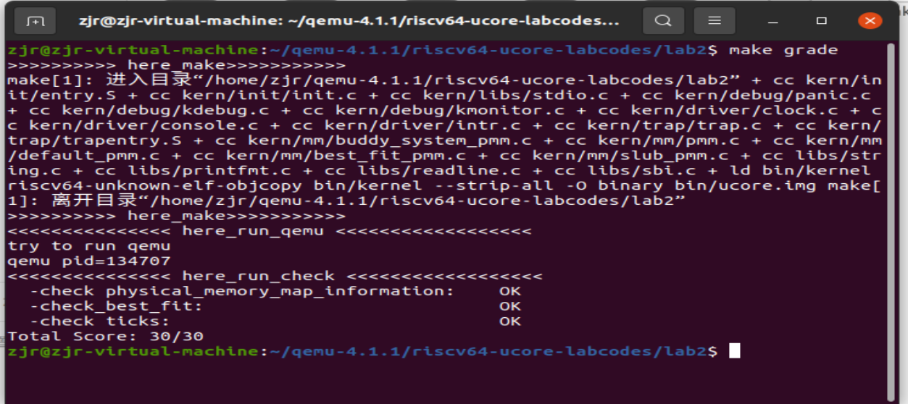
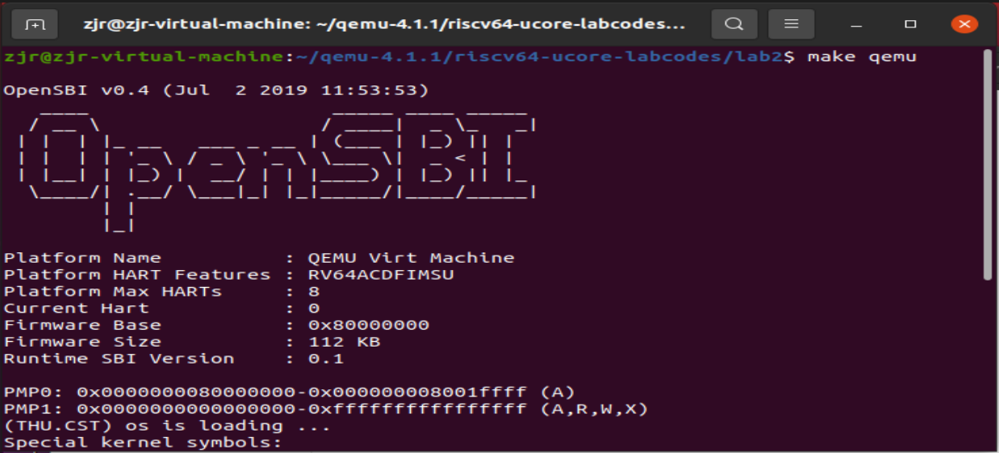
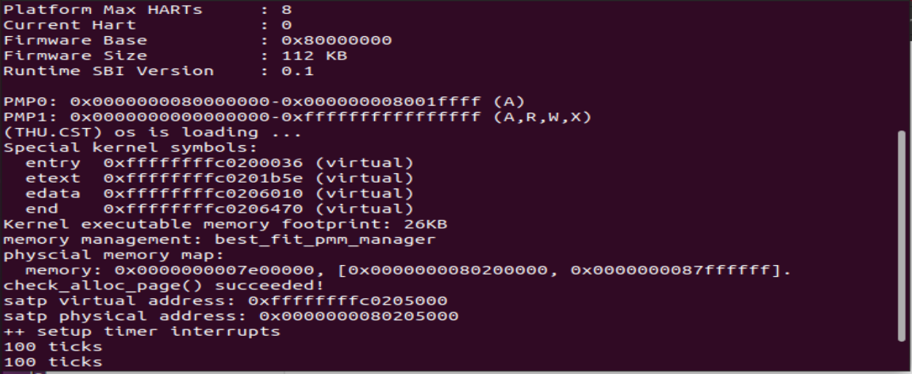

# lab2 report

## [练习1]

**练习1：理解first-fit 连续物理内存分配算法（思考题）**

> `first-fit` 连续物理内存分配算法作为物理内存分配一个很基础的方法，需要同学们理解它的实现过程。请大家仔细阅读实验手册的教程并结合`kern/mm/default_pmm.c`中的相关代码，认真分析`default_init`，`default_init_memmap`，`default_alloc_pages`， `default_free_pages`等相关函数，并描述程序在进行物理内存分配的过程以及各个函数的作用。 请在实验报告中简要说明你的设计实现过程。请回答如下问题：
>
> - **你的first fit算法是否有进一步的改进空间？**

---

### 1.数据结构与函数分析

#### 1.1 page，free_list与default_init

```c
struct Page {
    int ref;                        
    uint64_t flags;                 
    unsigned int property;          
    list_entry_t page_link;         
};
```

`Page`结构体相关分析：

1. `ref`用于记录该**页面帧的引用计数**，即有多少个指针指向该页面；
2. `flags`是一个无符号64位整数，用来表示页面帧的状态标志。它里面的两个`bit`分别是`PG_reserved`和`PG_property`：
   - **PG_reserved**位为***1***时，表示此Page结构体所对应的物理页是为内核所保留的，无法用于页面的分配和释放；
   - **PG_property**位为***1***时，代表其是空白页块的第一页，可以用于页面的分配；如果此位为0且此Page结构体所对应的物理页是空白页块的第一页，则此页块已经被分配；
3. `property`表示连续空闲页的数量：

   - 如果该页是空闲的，**并且不是空闲页块的第一页**，则`property`应设置为**0**；
   - 如果该页是空闲的，**并且是空闲块的第一页**，则`property`应设置为**页块中空闲页的总数**。
4. `page_link`主要用于将page结构体连接到空闲页块链表，每当我们需要分配空闲页时，便可以通过空闲页块链表找到对应的空闲物理页；

---


```c
typedef struct {
    list_entry_t free_list;         // the list header
    unsigned int nr_free;           // number of free pages in this free list
} free_area_t;
free_area_t free_area;

#define free_list (free_area.free_list)
#define nr_free (free_area.nr_free)
```

`free_area`中的`free_list`作为空闲页块链表的头，`nr_free`用于记录改空闲页块链表中共有多少空闲页。于是我们通过`free_area`便可以遍历链表，寻找空闲页，以此实现了分配空闲页的目的。

---


```c
static void
default_init(void) {
    list_init(&free_list);
    nr_free = 0;
}
```

`default_init`用于初始化空闲页块链表，并将空闲页块中空闲页的总数设置为0。这起到了对整个空闲页块链表和相关空闲页数量进行初始化的作用；

---

#### 1.2 default_init_memmap

```c
static void
default_init_memmap(struct Page *base, size_t n) {
    assert(n > 0);
    struct Page *p = base;
    for (; p != base + n; p ++) {
        assert(PageReserved(p));
        p->flags = p->property = 0;
        set_page_ref(p, 0);
    }
    base->property = n;
    SetPageProperty(base);
    nr_free += n;
    if (list_empty(&free_list)) {
        list_add(&free_list, &(base->page_link));
    } else {
        list_entry_t* le = &free_list;
        while ((le = list_next(le)) != &free_list) {
            struct Page* page = le2page(le, page_link);
            if (base < page) {
                list_add_before(le, &(base->page_link));
                break;
            } else if (list_next(le) == &free_list) {
                list_add(le, &(base->page_link));
            }
        }
    }
}
```

`default_init_memmap`用于初始化从`base`对应的物理页开始的连续n页内存，并把base的相关成员进行设置，最后把base加入到了空闲页块链表中。该函数具体的步骤为:

- 把`base`往后的连续n个`page`结构体中的`flags`和`property`置0，设置页面引用计数为0；
- 设置`base`的`property`为n，代表该以`base`所对应的物理页开头的页块有n个连续空闲页，设置base的`flags`中的`PG_property`为1表示base对应的物理页是该页块的第一页，然后将该空闲页块链表的空闲页总数加n表示新加入了n个空闲页；
- 将base->page_link按照对应物理页在内存中的顺序插入到空闲页块链表中，根据双向链表的插入函数即可实现；

#### 1.3 default_alloc_pages

```c
static struct Page *
default_alloc_pages(size_t n) {
    assert(n > 0);
    if (n > nr_free) {
        return NULL;
    }
    struct Page *page = NULL;
    list_entry_t *le = &free_list;
    while ((le = list_next(le)) != &free_list) {
        struct Page *p = le2page(le, page_link);
        if (p->property >= n) {
            page = p;
            break;
        }
    }
    if (page != NULL) {
        list_entry_t* prev = list_prev(&(page->page_link));
        list_del(&(page->page_link));
        if (page->property > n) {
            struct Page *p = page + n;
            p->property = page->property - n;
            SetPageProperty(p);
            list_add(prev, &(p->page_link));
        }
        nr_free -= n;
        ClearPageProperty(page);
    }
    return page;
}
```

`default_alloc_pages`用于分配n个空闲页。首先遍历空闲页块链表，寻找第一个拥有页的数目大于等于n的页块。此时我们获取指向其第一页对应的page结构体指针，接下来分为两种情况:

- 页块中的页数目为n，此时我们直接把设置此page结构体对应的物理页不是物理页块的第一页，并将其从空闲页块链表中清除；
- 页块中的页数目大于n，此时需要对页块进行拆分，我们把此page结构体指针向后移动n位，将得到的page结构体指针设为p。于是我们把p指向结构体的property设置为此页块分配n页后的剩余量，然后之前页块第一页所对应的page结构体离开链表，把它设为不是页块第一页。再把p指向结构体所对应的物理页设置为是页块第一页，将链表中的空闲页数量减去n，最后加入到链表之中。

#### 1.4 default_free_pages

```c
static void
default_free_pages(struct Page *base, size_t n) {
    assert(n > 0);
    struct Page *p = base;
    for (; p != base + n; p ++) {
        assert(!PageReserved(p) && !PageProperty(p));
        p->flags = 0;
        set_page_ref(p, 0);
    }
    base->property = n;
    SetPageProperty(base);
    nr_free += n;

    if (list_empty(&free_list)) {
        list_add(&free_list, &(base->page_link));
    } else {
        list_entry_t* le = &free_list;
        while ((le = list_next(le)) != &free_list) {
            struct Page* page = le2page(le, page_link);
            if (base < page) {
                list_add_before(le, &(base->page_link));
                break;
            } else if (list_next(le) == &free_list) {
                list_add(le, &(base->page_link));
            }
        }
    }

    list_entry_t* le = list_prev(&(base->page_link));
    if (le != &free_list) {
        p = le2page(le, page_link);
        if (p + p->property == base) {
            p->property += base->property;
            ClearPageProperty(base);
            list_del(&(base->page_link));
            base = p;
        }
    }

    le = list_next(&(base->page_link));
    if (le != &free_list) {
        p = le2page(le, page_link);
        if (base + base->property == p) {
            base->property += p->property;
            ClearPageProperty(p);
            list_del(&(p->page_link));
        }
    }
}
```

`default_free_pages`用于释放从base所对应的物理页开始的n个页。首先同样对base往后的n个结构体全部进行成员初始化，包括flags和页面引用计数置0。然后将base的property设为n，其对应的物理页设置为页块的第一页，并且将链表中空闲页总数加上n，加入到链表的相应位置。然后便涉及到链表中页块的合并：

- 获取`base->page_link`的前向指针，根据其获得page结构体指针p。检查**p + p->property == base**，如果成立就说明p对应的页块和base对应的页块可以进行合并，合并后链表中只保留`p->page_link`，把base指向p的位置；
- 获取`base->page_link`的后向指针，
- 根据其获得page结构体指针p。检查**base + base->property == p**，如果成立就说明p对应的页块和base对应的页块可以进行合并，合并后链表中只保留`base->page_link`。


### 2.**程序物理内存分配过程：**

1. 初始化空闲物理页块，并把它加入到空闲页块链表中进行管理；
2. 当需要分配n个物理页的内存时，调用`default_alloc_pages`函数进行n个物理页内存的分配，最后返回分配的页块的第一页对应的Page结构体指针；
3. 当需要释放某页块时，调用`default_free_pages`函数进行此页块的释放，释放完后将此页块的第一页对应的Page结构体的page_link加入到空闲页块链表，然后再完成页块的合并工作；


### 3.**first-fit算法的改进空间：**

1. 寻找第一个拥有页的数量大于或等于`n`的页块根据上述算法最终复杂度为**O(n)**，如果我们建立二叉搜索树结构可以将此复杂度减到**O(logn)**；
2. 较小的内存块及时合并到其它内存块中，提高空间的利用率，减少碎片产生；

---


## [练习2]

**练习2：实现 Best-Fit 连续物理内存分配算法（需要编程）**

> 在完成练习一后，参考`kern/mm/default_pmm.c`对`First Fit`算法的实现，编程实现`Best Fit`页面分配算法，算法的时空复杂度不做要求，能通过测试即可。 请在实验报告中简要说明你的设计实现过程，阐述代码是如何对物理内存进行分配和释放，并回答如下问题：
>
> - 你的 `Best-Fit` 算法是否有进一步的改进空间？

---

### 1.设计实现过程

best-fit算法中我们重点修改了`best_fit_alloc_pages`函数:

```c
static struct Page *
best_fit_alloc_pages(size_t n) {
    assert(n > 0);
    if (n > nr_free) {
        return NULL;
    }
    struct Page *page = NULL;
    list_entry_t *le = &free_list;
    size_t min_size = nr_free + 1;
     /*LAB2 EXERCISE 2: 2113665*/ 
    // 下面的代码是first-fit的部分代码，请修改下面的代码改为best-fit
    // 遍历空闲链表，查找满足需求的空闲页框
    // 如果找到满足需求的页面，记录该页面以及当前找到的最小连续空闲页框数量
    while ((le = list_next(le)) != &free_list) {
        struct Page *p = le2page(le, page_link);
        if (p->property >= n) {
            if(p->property<min_size){
                min_size=p->property;
                page=p;
            }
        }
    }
    if (page != NULL) {
        list_entry_t* prev = list_prev(&(page->page_link));
        list_del(&(page->page_link));
        if (page->property > n) {
            struct Page *p = page + n;
            p->property = page->property - n;
            SetPageProperty(p);
            list_add(prev, &(p->page_link));
        }
        nr_free -= n;
        ClearPageProperty(page);
    }
    return page;
}
```

我们相对于`default_alloc_pages`不再是寻找第一个页数量大于或等于n的页块，而是寻找页数量大于或等于n的最小页块。我们的实现思路是：

1. 设置一个临时变量`min_size`，用来记录最小页块的页数量。最开始我们将它令为nr_free+1，这样可以第一次的页数量肯定会小于min_size；
2. 继续遍历链表，如果页块的**property<minsize**，我们更改`page`，并将`minsize`的大小变为新的`property`；
3. 遍历完双向链表后，`page`此时的指向对应的物理页便是我们要寻找的物理页块的第一页；

其他要补充的地方我们沿用了first-fit算法的实现代码。

### 2.物理内存进行分配和释放过程

best-fit算法对物理内存的分配和first-fit释放类似，只是**best-fit**算法寻找到的是**满足要求的最小页块**，**first-fit**算法寻找到的是**满足要求的第一个页块**。当进行物理内存的分配时，best-fit算法寻找到满足要求的最小页块后，接下来的步骤和first-fit算法相同。当进行物理内存的释放时，best-fit算法与first-fit算法进行的操作完全一致。**两者重点就在于物理内存分配上的差别。**

- 首先调用此函数best_fit_init()初始化链表free_list，将nr_free置0。
- 调用best_fit_init_memmap，对给定的空闲空间进行链表的管理初始化。即将base->page_link加入free_list。
- 进行物理内存的分配。best_fit_alloc_pages(size_t n)，此函数具体作用是在free_list链表上，找到一个合适的内存空间，即找到第一个大小与要求相差最小的空闲分区。
- 进行物理内存的释放。best_fit_free_pages。首先对要释放的n个页对应的Page结构体的属性进行更改，置为空闲时的状态。然后将要释放的空间的首个页对应的page结构体的link，加入free_list。最后检查free_list链表base->page_link的前后节点，若可以进行合并，那么进行空闲内存空间的合并

### 3.测试结果

**测试结果如下：**



由上可以得出我们通过了测试。

---


**运行结果如下：**






### 4.**Best-fit算法的改进空间:**

1. **算法复杂度**：`Best-fit`算法中寻找满足要求的最小页块的复杂度为**O(n)**，如果可以使用堆的结构来对其进行堆排序，便可以把复杂度降至**O(logn)**；
2. **结合其他算法**：将不同的内存分配算法结合在一起，以根据情况选择最合适的算法。可以在进程需要大块内存时使用"best-fit"，而在需要小块内存时使用"first-fit"。
3. **内存紧凑**：定期进行内存紧凑操作，将碎片化的内存块合并为更大的块，以减少外部碎片的问题。`Best-fit`算法与`first-fit`算法一样，若较小的内存块及时合并到其它内存块中，便能提高空间的利用率，减少碎片产生

---

## **本实验重要的知识点：**

1. 本实验中我们探讨了虚拟内存的访问方式，最后得出要进入虚拟内存，需要进行以下步骤:
   - 分配页表所在内存空间并初始化页表；
   - 设置好页基址寄存器（指向页表起始地址)；
   - 刷新 TLB。
2. 在进行虚拟地址到物理地址的翻译过程中，我们需要利用到`satp`寄存器，它存储了新的MODE位以及页表基址的物理页号；
3. Qemu 规定的 DRAM 物理内存的起始物理地址为 `0x80000000`，在 Qemu 中，可以使用 `-m` 指定 RAM 的大小，默认是 `128MiB` 。默认的 DRAM 物理内存地址范围就是 `[0x80000000,0x88000000)`，本次实验我们重点关注的物理内存就是这个范围，并且还建立了对应于此物理内存的Page结构体；
4. 根据虚拟地址和物理地址的偏移量可以快速地实现物理地址和虚拟地址的转化，并且物理页号之间的偏移量也与虚拟页号之间的偏移量相同，在实验中对于虚拟地址和物理地址之间的转化以及物理页号和虚拟页号之间的转化都有函数实现；
5. 在 `kernel.ld` 中定义的 `end` 符号为内核代码结尾的**虚拟地址**；

---

**对应的os原理的知识点:**

1. 一个三级页表项映射**1GiB**的内存，一个二级页表项映射**2MiB**的内存，一个一级页表项映射**4KiB**的内存。在RISC-V64中一个页表项所占的大小为**8**个字节，所以一个页表可以存储**512**个页表项；这也就 解释了最后一个三级页表可以最多映射**512GiB**的内存；
2. 一个页表的大小为**4KiB**，所以这次三级页表分配了**4KiB**进行存储；

---

**OS原理中很重要，但在实验中没有对应上的知识点**：

1. 本次的Page结构体存储在**kernel_end**后面，并且其对应了从**0x80000000**到**0x88000000**之间的所有物理页，其Page结构体的数目等于物理页的个数；
2. 我们真正可以用的内存是*`Page`*结构体存储结束的第一页到**0x88000000**之间的物理内存，我们的其他程序都可以在这个区域分配内存进行；
3. **slub**分配算法主要是针对小于页的物理内存的分配，通过初始化不同对象大小的仓库，我们便可以利用它以及**slub**分配来实现对小于页的各种各样内存的分配和释放；
4. **Buddy System**算法把系统中的可用存储空间划分为存储块(Block)来进行管理，利用完全二叉树结构可以实现高效的内存的存储和分配。


