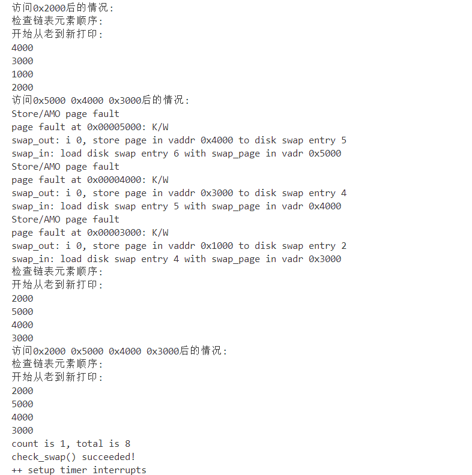

# 扩展练习 challenge

**扩展练习 Challenge：实现不考虑实现开销和效率的LRU页替换算法（需要编程）**

> challenge部分不是必做部分，不过在正确最后会酌情加分。需写出有详细的设计、分析和测试的实验报告。完成出色的可获得适当加分。

---

## 一 . 设计分析思路

### 1 . 背景

`LRU`算法要求我们利用局部性，通过过去的访问情况预测未来的访问情况，也就是我们需要比较当前内存里的页面最近一次被访问的时间，把上一次访问时间离现在最久的页面置换出去。所以我们要做的便是**如何把我们需要维护的这些可置换页的访问时间给知晓，并且以一定的顺序进行排列维护**。


### 2 . 思路分析

#### 数据结构

我们的思路是使用一个链表来维护我们的可置换页，将这些可置换页对应的**Page**结构体按照**从新到老**的顺序进行串联。即从链表头开始顺着其后向指针的顺序我们的可置换页是从新到老的。


#### 访问时间的获取

我们利用一个虚拟地址对应的页表项的**access**位和**dirty**位，如果有虚拟地址通过此页表项对其指向的物理页面进行了访问，这两个位便会被置为1。于是我们如果在每一次访存过后都对链表中的页面对应的页表项进行访问，观察页表项的**access**位或**dirty**位是否为1，便可以得知哪个页面进行了访问。但是这要求我们在每一次访存前一定要保证链表中的每个页面对应的页表项中的**access**位和**dirty**位都是0才行。


每一次访存前一定要保证链表中的每个页面对应的页表项中的**access**位和**dirty**位都是0。这其实也很容易办到，就是我们每一次访存后将页表项的**access**位或**dirty**位为1的页面加入到链表头后面之后，再将它的页表项的这两位置0。这样便可以保证我们每进行一次访存，不仅将页面的新老顺序进行了维护，还通过将页表项**access**位和**dirty**位置0的操作为下一次的访存做好了准备。


综上，我们对于访问时间的获取便是每一次访存过后寻找**access**位或者**dirty**位是1的页表项，将其对应的**Page**结构体加入到链表头的后面。然后我们将**access**位和**dirty**位都置为0。通过这个操作我们可以保证在之后的每一次访存之后，链表中的页面对应的页表项只有一个**access**位或者**dirty**位为0。通过这个操作我们便可以保证每一次访存过后的更新都是准确有效的。


#### 代码实现

##### 链表初始化

```c
static int
_lru_init_mm(struct mm_struct *mm)
{     
     list_init(&pra_list_head);
     mm->sm_priv = &pra_list_head;
     return 0;
}
```

我们以**pra_list_head**作为链表头，对其进行空链表初始化。然后我们把这个链表交给了`mm`的`sm_priv`进行管理。


##### 设置页面为可换出

```c
static int
_lru_map_swappable(struct mm_struct *mm, uintptr_t addr, struct Page *page, int swap_in)
{
    list_entry_t *head=(list_entry_t*) mm->sm_priv;
    list_entry_t *entry=&(page->pra_page_link);
 
    assert(entry != NULL && head != NULL);
    list_add(head, entry);
    return 0;
}
```

我们在**page fault**异常过后会把新分配的页面加入到此链表中进行管理。因为它此时就是最新访问的，所以根据我们维护的链表页面的顺序，我们把它直接添加到链表头的后面。以此便可以成功标志其是最新访问的页面。


##### 寻找可换出页面

```c
static int
_lru_swap_out_victim(struct mm_struct *mm, struct Page ** ptr_page, int in_tick)
{
    list_entry_t *head=(list_entry_t*) mm->sm_priv;
         assert(head != NULL);
     assert(in_tick==0);
    list_entry_t *entry = list_prev(head);
    struct Page *page = le2page(entry, pra_page_link);
    *ptr_page=page;
    list_del(entry);
    return 0;
}
```

根据我们链表中页面的维护顺序，链表中的页面自链表头开始按照后向指针的顺序是从新到老。于是最老的页面就是链表头前向指针所指向的页面。我们直接由链表头前向指针获取我们要提取的页面，把它存入到`ptr_page`中，然后把其从链表中删除即可。


##### 每次访存过后的时间中断事件

```c
static int
_lru_tick_event(struct mm_struct *mm)  //时间中断
{ 
    list_entry_t *head=(list_entry_t*) mm->sm_priv;
    assert(head != NULL);
    list_entry_t *entry = list_prev(head);
    while(entry != head) {
        struct Page *page = le2page(entry, pra_page_link);
        pte_t *ptep = get_pte(mm->pgdir, page->pra_vaddr, 0);
        if(*ptep & PTE_A||*ptep & PTE_D) {
            list_entry_t *temp = entry;
            entry = entry->prev;
            list_del(temp);
            list_add(head, temp);
            *ptep &= ~PTE_A;//清除访问位
            *ptep &= ~PTE_D;//清除修改位
            tlb_invalidate(mm->pgdir, page->pra_vaddr);
        }
        else{
            entry = entry->prev;
        }
    }
    //cprintf("_lru_tick_event is called!\n");
    return 0;
}
```

此函数便是我们在每次访存过后所调用的函数，我们在链表中寻找对应页表项的`access`位或者`dirty`位为1的页面。将此页面从链表中删除，然后加入到链表头的后面，以此作为是最新的访问页面。后面再将其`access`位或者`dirty`位置0即可。


##### 从新到老打印链表可替换页面

```c
static void print_now_list(struct mm_struct *mm){
    list_entry_t *head=(list_entry_t*) mm->sm_priv;
    list_entry_t *entry = list_prev(head);
    cprintf("检查链表元素顺序: \n");
    cprintf("开始从老到新打印: \n");
    while(entry != head) {
        struct Page *page = le2page(entry, pra_page_link);
        cprintf("%x\n",page->pra_vaddr);
        entry = entry->prev;
    }
}
```

我们从链表头开始，一直按照前向指针的顺序获取页面，最终获取的页面便是从新到老的页面。每次获取之后便打印与它映射的虚拟地址。

## 二 . 测试

### 1 . 测试代码编写

```c
static int
_lru_check_swap(void) {
    //初始时需要时钟中断下
    _lru_tick_event(check_mm_struct);
    cprintf("初始时钟中断!\n");
    print_now_list(check_mm_struct);

    cprintf("访问0x3000后的情况: \n");
    *(unsigned char *)0x3000 = 0x0c;
    _lru_tick_event(check_mm_struct);
    assert(pgfault_num==4);
    print_now_list(check_mm_struct);

    cprintf("访问0x4000后的情况: \n");
    *(unsigned char *)0x4000 = 0x0d;
    _lru_tick_event(check_mm_struct);
    assert(pgfault_num==4);
    print_now_list(check_mm_struct);

    cprintf("访问0x5000后的情况: \n");
    *(unsigned char *)0x5000 = 0x0e;
    _lru_tick_event(check_mm_struct);
    assert(pgfault_num==5);
    print_now_list(check_mm_struct);

    cprintf("连续访问0x2000 0x4000 0x3000后的情况: \n");
    *(unsigned char *)0x2000 = 0x0b;
    _lru_tick_event(check_mm_struct);
    assert(pgfault_num==5);
    *(unsigned char *)0x4000 = 0x0d;
    _lru_tick_event(check_mm_struct);
    assert(pgfault_num==5);
    *(unsigned char *)0x3000 = 0x0c;
    _lru_tick_event(check_mm_struct);
    assert(pgfault_num==5);
    print_now_list(check_mm_struct);

    cprintf("访问0x1000后的情况: \n");
    *(unsigned char *)0x1000 = 0x0a;
    _lru_tick_event(check_mm_struct);
    assert(pgfault_num==6);
    print_now_list(check_mm_struct);

    cprintf("访问0x1000后的情况: \n");
    *(unsigned char *)0x1000 = 0x0a;
    _lru_tick_event(check_mm_struct);
    assert(pgfault_num==6);
    print_now_list(check_mm_struct);

    cprintf("访问0x2000后的情况: \n");
    *(unsigned char *)0x2000 = 0x0b;
    _lru_tick_event(check_mm_struct);
    assert(pgfault_num==6);
    print_now_list(check_mm_struct);

    cprintf("访问0x5000 0x4000 0x3000后的情况: \n");
    *(unsigned char *)0x5000 = 0x0e;
    _lru_tick_event(check_mm_struct);
    assert(pgfault_num==7);
    *(unsigned char *)0x4000 = 0x0d;
    _lru_tick_event(check_mm_struct);
    assert(pgfault_num==8);
    *(unsigned char *)0x3000 = 0x0c;
    _lru_tick_event(check_mm_struct);
    assert(pgfault_num==9);
    print_now_list(check_mm_struct);
    
    cprintf("访问0x2000 0x5000 0x4000 0x3000后的情况: \n");
    *(unsigned char *)0x2000 = 0x0b;
    _lru_tick_event(check_mm_struct);
    assert(pgfault_num==9);
    *(unsigned char *)0x5000 = 0x0e;
    _lru_tick_event(check_mm_struct);
    assert(pgfault_num==9);
    *(unsigned char *)0x4000 = 0x0d;
    _lru_tick_event(check_mm_struct);
    assert(pgfault_num==9);
    *(unsigned char *)0x3000 = 0x0c;
    _lru_tick_event(check_mm_struct);
    assert(pgfault_num==9);
    print_now_list(check_mm_struct);
    return 0;
}
```

我们在进行测试时，最开始调用了一下时间中断处理函数。这是因为在进入本测试前链表中已经有了四个页面，其都被访问过，但是它们的**access**位和**dirty**位都没有被置0。所以我们调用此函数的主要目的是将这两位置0。后面我们每次进行测试时都打印了相关信息，下一个访存我们可以通过前一个访存打印的链表信息加以比对分析，最后来验证我们的代码编写是否正确。


### 2 . 测试结果




由上述测试结果以及打印信息可以看出，我们的代码编写正确。在每一次访存之后，我们的链表中页面的从新到老的顺序确实发生了改变。结合每次**page fault**异常的发生，我们置换出的页面确实是最老的页面。

综上，我们的代码编写测试成功，**LRU**算法编写完成。