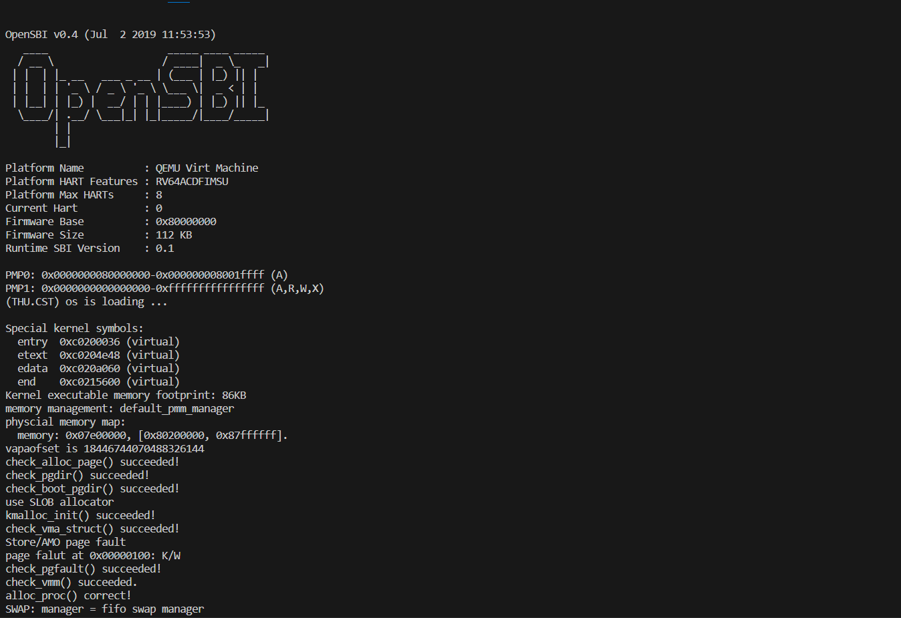
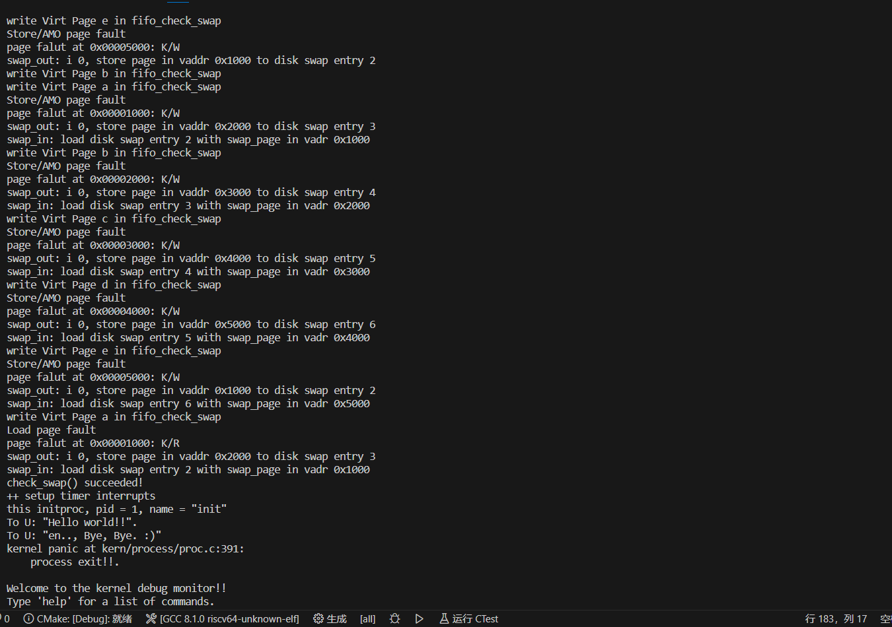
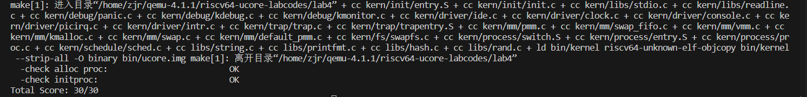

# lab4

## [练习0]

**练习0：填写已有实验**

> 本实验依赖实验2/3。请把你做的实验2/3的代码填入本实验中代码中有“LAB2”,“LAB3”的注释相应部分。

---

本次实验所依赖的`lab2`的代码内容已经自动补充完毕，我们所补充的代码内容与`lab3`相关。具体补充的是`kern/mm/vmm.c`中的`do_pgfault`函数内容。对应如下：

```c
if (*ptep == 0) { // if the phy addr isn't exist, then alloc a page & map the phy addr with logical addr
        if (pgdir_alloc_page(mm->pgdir, addr, perm) == NULL) {
            cprintf("pgdir_alloc_page in do_pgfault failed\n");
            goto failed;
        }
    } else {
        /*LAB3 EXERCISE 3: 2113665
        * 请你根据以下信息提示，补充函数
        * 现在我们认为pte是一个交换条目，那我们应该从磁盘加载数据并放到带有phy addr的页面，
        * 并将phy addr与逻辑addr映射，触发交换管理器记录该页面的访问情况
        *
        *  一些有用的宏和定义，可能会对你接下来代码的编写产生帮助(显然是有帮助的)
        *  宏或函数:
        *    swap_in(mm, addr, &page) : 分配一个内存页，然后根据
        *    PTE中的swap条目的addr，找到磁盘页的地址，将磁盘页的内容读入这个内存页
        *    page_insert ： 建立一个Page的phy addr与线性addr la的映射
        *    swap_map_swappable ： 设置页面可交换
        */
        if (swap_init_ok) {
            struct Page *page = NULL;
            // 你要编写的内容在这里，请基于上文说明以及下文的英文注释完成代码编写
            //(1）According to the mm AND addr, try
            //to load the content of right disk page
            //into the memory which page managed.
            swap_in(mm, addr, &page);
            //(2) According to the mm,
            //addr AND page, setup the
            //map of phy addr <--->
            //logical addr
            page_insert(mm->pgdir, page, addr, perm);
            //(3) make the page swappable.
            swap_map_swappable(mm, addr, page, 1);
            page->pra_vaddr = addr;
        } else {
            cprintf("no swap_init_ok but ptep is %x, failed\n", *ptep);
            goto failed;
        }
   }

```

我们补充的具体内容是当发生**缺页异常**时，某个虚拟地址对应的页表项是存在的，只是此时它对应的物理页面内容被换出到了磁盘中。我们首先使用`swap_in`函数将其磁盘中的内容换入到内存中的物理页，然后调用`page_insert`函数添加虚拟地址到此物理页的映射，最后把管理这个物理页的`Page`结构体串联到换入换出链表中，表明此物理页可以被换出。


## [练习1]

**练习1：分配并初始化一个进程控制块（需要编码）**

### 练习要求

`alloc_proc`函数（位于`kern/process/proc.c`中）负责分配并返回一个新的`struct proc_struct`结构，用于存储新建立的内核线程的管理信息。`ucore`需要对这个结构进行最基本的初始化，你需要完成这个初始化过程。

> 【提示】在alloc_proc函数的实现中，需要初始化的proc_struct结构中的成员变量至少包括：state/pid/runs/kstack/need_resched/parent/mm/context/tf/cr3/flags/name。

请在实验报告中简要说明你的设计实现过程。请回答如下问题：

- 请说明`proc_struct`中`struct context context`和`struct trapframe *tf`成员变量含义和在本实验中的作用是啥？（提示通过看代码和编程调试可以判断出来）


### 练习解答

#### 代码编写思路

`alloc_proc`函数的作用是负责分配并返回一个新的进程控制块结构，用于存储新建立的内核线程的管理信息。我们要编写的代码主要便是对分配的进程控制块结构进行简单的初始化。我们的初始化参考了`proc_init`函数中对`alloc_proc`正确性的检验代码。

如下是`proc_init`函数中对`alloc_proc`函数正确性的检验代码：

```c
// check the proc structure
    int *context_mem = (int*) kmalloc(sizeof(struct context));
    memset(context_mem, 0, sizeof(struct context));
    int context_init_flag = memcmp(&(idleproc->context), context_mem, sizeof(struct context));

    int *proc_name_mem = (int*) kmalloc(PROC_NAME_LEN);
    memset(proc_name_mem, 0, PROC_NAME_LEN);
    int proc_name_flag = memcmp(&(idleproc->name), proc_name_mem, PROC_NAME_LEN);

    if(idleproc->cr3 == boot_cr3 && idleproc->tf == NULL && !context_init_flag
        && idleproc->state == PROC_UNINIT && idleproc->pid == -1 && idleproc->runs == 0
        && idleproc->kstack == 0 && idleproc->need_resched == 0 && idleproc->parent == NULL
        && idleproc->mm == NULL && idleproc->flags == 0 && !proc_name_flag
    ){
        cprintf("alloc_proc() correct!\n");

    }
```

这段检查代码对`alloc_proc`函数初始化后的进程控制块进行了各种字段的检查。从上面的检查我们可以看出最后我们初始化后的进程控制块需要满足：

1. `context`结构全0填充。即进程切换时用到的上下文先全部置0；
2. `name`字符数组全0填充。即进程名先全部置0；
3. `cr3`字段赋值为`boot_cr3`。即此进程使用的页表先初始化为三级页表；
4. `tf`设置为`NULL`。即进程的中断帧初始化设置为空；
5. `state`设置为`PROC_UNINIT`。即进程的状态设置为**未初始化**；
6. `pid`设置为**-1**。即进程的唯一标识**ID**先初始化为**-1**；
7. `runs`设置为0。即进程的运行次数为0，这是因为进程才初始化，还没有运行过；
8. `kstack`设置为0。`kstack`在进程控制块里面的含义为该进程内核栈的起始地址，由检查代码可知它应在`alloc_proc`函数中被初始化为0；
9. `need_resched`置0。`need_resched`字段的含义为是否需要cpu执行调度来停止此进程执行，在这里被置0表示希望这个进程今后被执行；
10. `parent`设置为`NULL`。即设置此进程的父进程为空；
11. `mm`设置为`NULL`。即设置页面换入换出管理器为空，其主要与用户态情况有关；
12. `flags`置0。即设置此进程的标志位为0。


#### 代码编写内容

我们根据上述代码编写思路可以编写如下代码：

```c
static struct proc_struct *
alloc_proc(void) {
    // 分配一块内存来存储进程控制块
    struct proc_struct *proc = kmalloc(sizeof(struct proc_struct));
    if (proc != NULL) {
    //LAB4:EXERCISE1 2113665
    /*
     * below fields in proc_struct need to be initialized
     *       enum proc_state state;                      // Process state
     *       int pid;                                    // Process ID
     *       int runs;                                   // the running times of Proces
     *       uintptr_t kstack;                           // Process kernel stack
     *       volatile bool need_resched;                 // bool value: need to be rescheduled to release CPU?
     *       struct proc_struct *parent;                 // the parent process
     *       struct mm_struct *mm;                       // Process's memory management field
     *       struct context context;                     // Switch here to run process
     *       struct trapframe *tf;                       // Trap frame for current interrupt
     *       uintptr_t cr3;                              // CR3 register: the base addr of Page Directroy Table(PDT)
     *       uint32_t flags;                             // Process flag
     *       char name[PROC_NAME_LEN + 1];               // Process name
     */
        proc->state = PROC_UNINIT;
        proc->pid = -1;
        proc->runs = 0;
        proc->kstack = 0;
        proc->need_resched = 0;
        proc->parent = NULL;
        proc->mm = NULL;
        memset(&(proc->context),0,sizeof(struct context));
        proc->tf = NULL;
        proc->cr3 = boot_cr3;
        proc->flags = 0;
        memset(proc->name,0,PROC_NAME_LEN);
    }
    return proc;
}
```

我们编写的代码均按照上述代码编写思路所编写，最终满足了后续对`alloc_proc`函数检查的要求。


#### proc_struct中的context和tf成员变量的含义及作用

##### context成员变量的含义及作用

`context`成员变量的含义：`context`中保存了进程执行的上下文，对应的是几个关键的寄存器的值。

`context`对应的结构体内容如下：

```c
struct context {//关键寄存器的值的存储
    uintptr_t ra;
    uintptr_t sp;
    uintptr_t s0;
    uintptr_t s1;
    uintptr_t s2;
    uintptr_t s3;
    uintptr_t s4;
    uintptr_t s5;
    uintptr_t s6;
    uintptr_t s7;
    uintptr_t s8;
    uintptr_t s9;
    uintptr_t s10;
    uintptr_t s11;
};
```

可见`context`中最终保存的是一些关键寄存器的值，分别最后保存的是对应字段名的寄存器的内容，其中包含了`ra`，`sp`，`s0~s11`共14个寄存器。


`context`成员变量在本实验的作用：本实验中此成员变量的作用是在进程切换中还原进程之前的状态。主要体现是要换出的进程现在的执行现场保存在进程控制块的`context`中，而要换入的进程把自己的存储在`context`中的上下文加载到系统的寄存器中。具体实现在`kern/process/switch.S`：

```assembly
void switch_to(struct context *from, struct context *to);

switch_to:
    # save from's registers
    STORE ra, 0*REGBYTES(a0)
    STORE sp, 1*REGBYTES(a0)
    STORE s0, 2*REGBYTES(a0)
    STORE s1, 3*REGBYTES(a0)
    STORE s2, 4*REGBYTES(a0)
    STORE s3, 5*REGBYTES(a0)
    STORE s4, 6*REGBYTES(a0)
    STORE s5, 7*REGBYTES(a0)
    STORE s6, 8*REGBYTES(a0)
    STORE s7, 9*REGBYTES(a0)
    STORE s8, 10*REGBYTES(a0)
    STORE s9, 11*REGBYTES(a0)
    STORE s10, 12*REGBYTES(a0)
    STORE s11, 13*REGBYTES(a0)

    # restore to's registers
    LOAD ra, 0*REGBYTES(a1)
    LOAD sp, 1*REGBYTES(a1)
    LOAD s0, 2*REGBYTES(a1)
    LOAD s1, 3*REGBYTES(a1)
    LOAD s2, 4*REGBYTES(a1)
    LOAD s3, 5*REGBYTES(a1)
    LOAD s4, 6*REGBYTES(a1)
    LOAD s5, 7*REGBYTES(a1)
    LOAD s6, 8*REGBYTES(a1)
    LOAD s7, 9*REGBYTES(a1)
    LOAD s8, 10*REGBYTES(a1)
    LOAD s9, 11*REGBYTES(a1)
    LOAD s10, 12*REGBYTES(a1)
    LOAD s11, 13*REGBYTES(a1)

    ret
```

`switch_to`是我们在进程切换时调用的，可以看到`a0`存取的是要换出的进程的`context`，`a1`存取的是要换入的进程的`context`。最后，要换出进程的执行现场我们把它保存到了它的进程控制块的`context`中，而要换入的进程的context里面的上下文我们把它加载进来，保存到了系统的寄存器中。

如上这么做不仅保存了要换出进程的上下文，还加载了要换入执行的进程的上下文，为即将执行的进程布置好了执行现场和环境。


##### tf成员变量的含义及作用

`tf`成员变量的含义：`tf`里保存了进程的中断帧。中断帧主要用于进程从用户态跳进内核态执行中断、异常或者系统调用时对进程的执行状态进行保存和恢复。当执行中断、异常或者系统调用时可能会对某些寄存器的值进行改变，最后我们可以通过中断帧对所有的寄存器内容进行恢复和更新。


###### 与tf相关的代码执行分析

`tf`成员变量在本实验中主要是创建第一个内核线程`initproc`时起到了巨大作用，我们观察如下代码，当我们创建第一个内核线程时，tf中的某些字段进行了赋值：

```c
int
kernel_thread(int (*fn)(void *), void *arg, uint32_t clone_flags) {
    // 对程序上下文进行初始化
    struct trapframe tf;
    memset(&tf, 0, sizeof(struct trapframe));
    // s0寄存器保存函数指针
    tf.gpr.s0 = (uintptr_t)fn;   //保存在中断帧中的s0
    // s1寄存器保存函数参数
    tf.gpr.s1 = (uintptr_t)arg;  //保存在中断帧中的s1

    // 设置 trapframe 中的 status 寄存器（SSTATUS）
    // SSTATUS_SPP：Supervisor Previous Privilege（设置为 supervisor 模式，因为这是一个内核线程）
    // SSTATUS_SPIE：Supervisor Previous Interrupt Enable（设置为启用中断，因为这是一个内核线程）
    // SSTATUS_SIE：Supervisor Interrupt Enable（设置为禁用中断，因为我们不希望该线程被中断）
    tf.status = (read_csr(sstatus) | SSTATUS_SPP | SSTATUS_SPIE) & ~SSTATUS_SIE;
    // 将入口点（epc）设置为 kernel_thread_entry 函数，作用实际上是将pc指针指向它(*trapentry.S会用到)
    tf.epc = (uintptr_t)kernel_thread_entry;
    // 上述局部变量tf存放保存内核进程的临时中断帧
    return do_fork(clone_flags | CLONE_VM, 0, &tf);
}
```

如上，我们看到`tf`中的`gpr`结构体的`s0`字段保存了进程要执行的函数指针，`s1`字段保存了进程要执行的函数参数。同时`status`字段保存了之后想对`sstatus`寄存器设置的内容，`epc`字段保存了之后想对`sepc`寄存器设置的内容。


当进行进程切换时，我们注意到`switch_to`的结尾的`ret`指令。这个`ret`指令返回的应该是`ra`寄存器存储的地址。而ra寄存器目前存储的地址应该是我们换入的进程的`context`中的`ra`保存的内容。而其`ra`在创建此内核线程时在`copy_thread`中对其进行了赋值：

```c
static void
copy_thread(struct proc_struct *proc, uintptr_t esp, struct trapframe *tf) {
    proc->tf = (struct trapframe *)(proc->kstack + KSTACKSIZE - sizeof(struct trapframe));
    *(proc->tf) = *tf;

    // Set a0 to 0 so a child process knows it's just forked
    // a0 设置为0说明这个进程是一个子进程
    proc->tf->gpr.a0 = 0;
    proc->tf->gpr.sp = (esp == 0) ? (uintptr_t)proc->tf : esp;  //把中断帧给sp
    // forkret函数入口
    proc->context.ra = (uintptr_t)forkret;
    proc->context.sp = (uintptr_t)(proc->tf);
}
```

此函数的作用是设置进程的中断帧与上下文，我们可以看到`ra`被赋值为了`forkret`函数指针。如下是`forkret`函数的内容：

```assembly
__trapret:
    RESTORE_ALL
    # go back from supervisor call
    sret
 
    .globl forkrets
forkrets:
    # set stack to this new process's trapframe
    move sp, a0
    j __trapret
    
void forkrets(struct trapframe *tf);
    
```

可以看到`forkrets`函数的作用是传入新进程的中断帧，然后跳转到`RESTORE_ALL`中执行恢复上下文的操作。此操作的目的是想要借用中断与异常处理时用的恢复中断帧的操作来把中断帧`tf`中我们保存的上述进程函数指针(s0存储)、进程函数参数(s1存储)、`status`内容以及`epc`内容加载到指定的寄存器。于是到此我们加载完了完整的进程执行现场和环境。


然后`sret`会把`pc`赋值为`sepc`指向的地址，即`kernel_thread_entry`函数地址。


下面我们观察**kernel_thread_entry**函数：

```c
.text
.globl kernel_thread_entry
kernel_thread_entry:        # void kernel_thread(void)
	move a0, s1  
	jalr s0
	jal do_exit
```

明显此函数首先把我们上述`s1`保存的执行函数参数加载到了`a0`寄存器，然后跳转到`s0`保存的函数地址执行函数。从下面的调用我们可以得知`s0`保存的函数指针是`init_main`，`s1`保存的函数参数为"`Hello world!!`"

```c
int pid = kernel_thread(init_main, "Hello world!!", 0);
```

```c
static int
init_main(void *arg) {
    cprintf("this initproc, pid = %d, name = \"%s\"\n", current->pid, get_proc_name(current));
    cprintf("To U: \"%s\".\n", (const char *)arg);
    cprintf("To U: \"en.., Bye, Bye. :)\"\n");
    return 0;
}
```

```c
int
do_exit(int error_code) {
    panic("process exit!!.\n");
}
```

执行完`init_main`之后，便跳转执行`do_exit`函数。这个函数最后会抛出错误然后终止了进程的运行。


###### 与tf相关的代码执行分析结果

通过对于`tf`相关的代码分析，我们认为`tf`在本实验中的作业为存储进程要执行的函数和函数参数以及相关的`CSR`(比如`sepc`和`sstatus`)，其中`sepc`存储的函数地址为调用进程要执行函数的入口。所以`tf`成员变量在本实验中的initproc进程的现场加载与函数的运行和终止方面都有着重要作用。


## [练习2]

**练习2：为新创建的内核线程分配资源（需要编码）**

> 创建一个内核线程需要分配和设置好很多资源。kernel_thread函数通过调用**do_fork**函数完成具体内核线程的创建工作。do_kernel函数会调用alloc_proc函数来分配并初始化一个进程控制块，但alloc_proc只是找到了一小块内存用以记录进程的必要信息，并没有实际分配这些资源。ucore一般通过do_fork实际创建新的内核线程。do_fork的作用是，创建当前内核线程的一个副本，它们的执行上下文、代码、数据都一样，但是存储位置不同。因此，我们**实际需要"fork"的东西就是stack和trapframe**。在这个过程中，需要给新内核线程分配资源，并且复制原进程的状态。你需要完成在kern/process/proc.c中的do_fork函数中的处理过程。它的大致执行步骤包括：
>
> - 调用alloc_proc，首先获得一块用户信息块。
> - 为进程分配一个内核栈。
> - 复制原进程的内存管理信息到新进程（但内核线程不必做此事）
> - 复制原进程上下文到新进程
> - 将新进程添加到进程列表
> - 唤醒新进程
> - 返回新进程号
>
> 请在实验报告中简要说明你的设计实现过程。请回答如下问题：
>
> - 请说明ucore是否做到给每个新fork的线程一个唯一的id？请说明你的分析和理由。

---

### 设计思路

我们知道，`do_fork`函数的作用是实际创建新的内核线程，并且为此内核线程进行资源的分配和状态的设置，最后返回新进程的唯一标识`ID`。于是，我们的思路便是：

1. 创建进程控制块，用进程控制块来控制此内核线程。此过程可以调用`alloc_proc`函数来实现，`alloc_proc`函数内部动态分配了内存来创建进程控制块；
2. 分配内核栈，将内核栈的位置记录在进程控制块的`kstack`字段中。此过程可以调用`setup_kstack`函数来实现；
3. 设置进程的内存管理信息。目前在实验四中只能创建内核线程，`proc->mm`描述的是进程用户态空间的情况，所以目前`mm`还用不上。我们这里只是简单调用了什么都没干的`copy_mm`函数；
4. 设置新进程的中断帧和上下文。此过程通过调用`copy_thread`实现，在此函数中我们将创建的`trapframe`变量赋值给了进程控制块的`tf`成员变量，并且对其内部的相应寄存器内容进行了设置。同时对`context`变量的`ra`和`sp`也进行了设置，其中sp指向了我们的中断帧，即`proc->tf`；
5. 设置新进程的唯一标识`ID`。此过程调用`get_pid`函数来实现；
6. 根据我们获取的新进程唯一标识`ID`来把其加入到`hash`链表，并且还要加入到进程链表`proc_list`中；
7. 设置进程状态为就绪状态。进程创建完后表示其是可以等待运行的，所以我们把它设置为就绪状态，只需`proc->state = PROC_RUNNABLE`即可；
8. 设置返回结果与当前进程总个数。由上面得知，最后返回结果是新进程的唯一标识`ID`，所以我们设置`ret`为`pid`。同时由于我们新创建了一个新线程，所以标志当前进程总个数的`nr_process`需要加1。


### 具体实现代码

我们根据如上的设计思路编写了如下的实现代码：

```c
int
do_fork(uint32_t clone_flags, uintptr_t stack, struct trapframe *tf) {
    int ret = -E_NO_FREE_PROC;  //超个数?
    struct proc_struct *proc;
    // MAX_PROCESS 4096
    if (nr_process >= MAX_PROCESS) {
        goto fork_out;
    }
    ret = -E_NO_MEM;   //内存短缺
    //LAB4:EXERCISE2 2113663&2113665
    /*
     * Some Useful MACROs, Functions and DEFINEs, you can use them in below implementation.
     * MACROs or Functions:
     *   alloc_proc:   create a proc struct and init fields (lab4:exercise1)
     *   setup_kstack: alloc pages with size KSTACKPAGE as process kernel stack
     *   copy_mm:      process "proc" duplicate OR share process "current"'s mm according clone_flags
     *                 if clone_flags & CLONE_VM, then "share" ; else "duplicate"
     *   copy_thread:  setup the trapframe on the  process's kernel stack top and
     *                 setup the kernel entry point and stack of process
     *   hash_proc:    add proc into proc hash_list
     *   get_pid:      alloc a unique pid for process
     *   wakeup_proc:  set proc->state = PROC_RUNNABLE
     * VARIABLES:
     *   proc_list:    the process set's list
     *   nr_process:   the number of process set
     */
    //    1. call alloc_proc to allocate a proc_struct
    //    2. call setup_kstack to allocate a kernel stack for child process
    //    3. call copy_mm to dup OR share mm according clone_flag
    //    4. call copy_thread to setup tf & context in proc_struct
    //    5. insert proc_struct into hash_list && proc_list
    //    6. call wakeup_proc to make the new child process RUNNABLE
    //    7. set ret vaule using child proc's pid
    if((proc = alloc_proc())==NULL){
        goto fork_out;
    }
    if(setup_kstack(proc)!=0){
        // 此时内存短缺，没有分配成功
        // 但是proc分配成功了，需要把它释放
        goto bad_fork_cleanup_proc;
    }
    if(copy_mm(clone_flags, proc)!=0){
        // 分配好的东西全要释放
        goto bad_fork_cleanup_kstack;
    }

    // 设置进程中断帧与上下文
    copy_thread(proc, stack, tf);
    
    // 加入hash需要新的pid，加入proc_list
    proc->pid = get_pid();
    hash_proc(proc);
    nr_process++;
    list_add(&proc_list, &(proc->list_link));
    
    // 设置进程状态
    proc->state = PROC_RUNNABLE;
    // 把ret修改为pid
    ret = proc->pid;

fork_out:
    return ret;

bad_fork_cleanup_kstack:
    put_kstack(proc);
bad_fork_cleanup_proc:
    kfree(proc);
    goto fork_out;
}
```

在创建进程控制块和分配内核栈的时候，均涉及到内存的分配。如果当前内存不足而导致分配失败，我们需要停止内核线程的创建，并且还要释放掉已经分配掉的内存。同时`copy_mm`如果出错，我们也要释放掉之前为进程控制块和内核栈分配的内存。于是这也就导致了我们在编写前三条语句时用到了`if`判断，一旦发生错误和内存分配失败，便会直接释放已经分配的内存并且退出程序。


### 新fork的线程的分配ID唯一性

由上述分析得知，为新线程分配唯一标识`ID`是调用`get_pid`函数实现的。下面我们将说明调用`get_pid`函数来分配的`ID`是唯一的。

`get_pid`函数如下：

```c
// get_pid - alloc a unique pid for process
static int
get_pid(void) {
    static_assert(MAX_PID > MAX_PROCESS);
    struct proc_struct *proc;
    list_entry_t *list = &proc_list, *le;
    static int next_safe = MAX_PID, last_pid = MAX_PID;
    if (++ last_pid >= MAX_PID) {
        last_pid = 1;
        goto inside;
    }
    if (last_pid >= next_safe) {
    inside:
        next_safe = MAX_PID;
    repeat:
        le = list;
        while ((le = list_next(le)) != list) {
            proc = le2proc(le, list_link);
            if (proc->pid == last_pid) {
                if (++ last_pid >= next_safe) {
                    if (last_pid >= MAX_PID) {
                        last_pid = 1;
                    }
                    next_safe = MAX_PID;
                    goto repeat;
                }
            }
            else if (proc->pid > last_pid && next_safe > proc->pid) {
                next_safe = proc->pid;
            }
        }
    }
    return last_pid;
}
```

由上述代码我们可以看出其获取进程`ID`的思路：

`last_pid`表示最终分配的进程ID，其按照从小到大分配。`next_safe`表示在小于`next_safe`的`ID`区域有空闲`ID`没有分配。我们把`last_pid`初始化为1，将其遍历整个链表进行查重：

1. 遍历过程中如果遇到`proc->pid == last_pid`，表示此时ID重复。将`last_pid`加1之后与`next_safe`进行比较。如果其超过了最大的`ID`分配`MAX_PID`，则最终将`last_pid`置1，`next_safe`置为`MAX_PID`，重复遍历过程继续寻找；
2. 遍历过程中如果遇到`proc->pid > last_pid`，根据`next_safe`的含义，目前已经锁定**last_pid**和**next_safe**之间有**空闲ID**没有分配。如果**proc->pid<next_safe**，我们便可以进一步缩小范围为`last_pid`和`proc->pid`之间有空闲ID没有分配。此时将`proc->pid`赋值给`next_safe`。这保证了我们总是能够实时更新有空闲ID没有分配的范围；
3. 当链表所有元素都遍历完后，我们返回`last_pid`。只要我们最终跳出了循环，那么这个`pid`一定是唯一的。因为我们的分配思想就是寻找有空闲ID没有分配的空间和查重，跳出循环就表示我们寻找到了空闲ID并且其与链表中的`pid`不重复。


## [练习3]

**练习3：编写proc_run 函数（需要编码）**

> proc_run用于将指定的进程切换到CPU上运行。它的大致执行步骤包括：
>
> - 检查要切换的进程是否与当前正在运行的进程相同，如果相同则不需要切换。
> - 禁用中断。你可以使用`/kern/sync/sync.h`中定义好的宏`local_intr_save(x)`和`local_intr_restore(x)`来实现关、开中断。
> - 切换当前进程为要运行的进程。
> - 切换页表，以便使用新进程的地址空间。`/libs/riscv.h`中提供了`lcr3(unsigned int cr3)`函数，可实现修改CR3寄存器值的功能。
> - 实现上下文切换。`/kern/process`中已经预先编写好了`switch.S`，其中定义了`switch_to()`函数。可实现两个进程的context切换。
> - 允许中断。
>
> 请回答如下问题：
>
> - 在本实验的执行过程中，创建且运行了几个内核线程？
>
> 完成代码编写后，编译并运行代码：make qemu
>
> 如果可以得到如 附录A所示的显示内容（仅供参考，不是标准答案输出），则基本正确。

---

### 代码编写内容及分析

根据练习要求，我们编写的代码如下：

```c
void
proc_run(struct proc_struct *proc) {
    if (proc != current) {
        // LAB4:EXERCISE3 2113663
        /*
        * Some Useful MACROs, Functions and DEFINEs, you can use them in below implementation.
        * MACROs or Functions:
        *   local_intr_save():        Disable interrupts   禁用中断
        *   local_intr_restore():     Enable Interrupts    启用中断
        *   lcr3():                   Modify the value of CR3 register   更改cr3寄存器的值
        *   switch_to():              Context switching between two processes     在两个进程之间进行上下文切换
        */
        bool flag;
        local_intr_save(flag);
        {
            lcr3(proc->cr3);
            struct proc_struct *temp = current;
            current = proc;
            // 切换两个进程的上下文，原来的current的需要保存，现在的需要加载进来
            // void switch_to(struct proc_struct* from, struct proc_struct* to)
            switch_to(&(temp->context), &(proc->context));
            
        }
        local_intr_restore(flag);
    }
}
```

我们首先调用`local_intr_save(flag)`来禁用中断，然后再切换页表为新进程的页表，此过程通过调用`riscv.h`中的`lcr3`函数实现。我们再将当前的运行进程`current`设置为新进程，并且切换新老进程的上下文，加载新进程的执行现场。待这些工作完成后，我们调用`local_intr_restore(flag)`来开启中断。


### 创建并运行的内核线程个数

不难知道，我们在本实验中共创建了2个内核线程，分别是`idleproc`和`initproc`。但是`idleproc`内核线程仅仅是占用资源，无所事事，并没有执行相应的函数。它的`need_resched`字段被设置为了1，表示它时刻在等待着`cpu`调度将其换出。真正最终得到执行的内核线程只有`initproc`，它被换入之后，完整执行了其函数并且最终完成了退出。


## 执行结果

#### make qemu执行结果

我们运行`make qemu`，最后得到的结果如下：





由此可见我们成功创建了新进程，并且执行了进程函数，最后还完成了退出操作。


#### make grade执行结果



由此看出我们的代码编写正确，在`make grade`测试中获得了满分。


## 扩展练习Challenge

> 说明语句`local_intr_save(intr_flag);....local_intr_restore(intr_flag);`是如何实现开关中断的？

---

如下是`local_intr_save`函数和`local_intr_restore`函数的代码：

```c
static inline bool __intr_save(void) {
    if (read_csr(sstatus) & SSTATUS_SIE) {
        intr_disable();
        return 1;
    }
    return 0;
}
static inline void __intr_restore(bool flag) {
    if (flag) {
        intr_enable();
    }
}
#define local_intr_save(x)      do { x = __intr_save(); } while (0)
#define local_intr_restore(x)   __intr_restore(x);
```

可见，当我们调用`local_intr_save(intr_flag)`时，我们传入了一个`bool`类型变量`intr_flag`。在此函数内部如果此时`sstatus`寄存器标识的是允许系统中断的，那么会调用`intr_disable`函数来使此寄存器的`SSTATUS_SIE`字段为0，并且把1返回给`intr_flag`变量。之后当我们调用`local_intr_restore(intr_flag)`函数时，由于`intr_flag`为1，所以会调用`intr_enable`函数来把`SSTATUS_SIE`字段置1，此时代表允许中断。

综上，便实现了开关中断。
