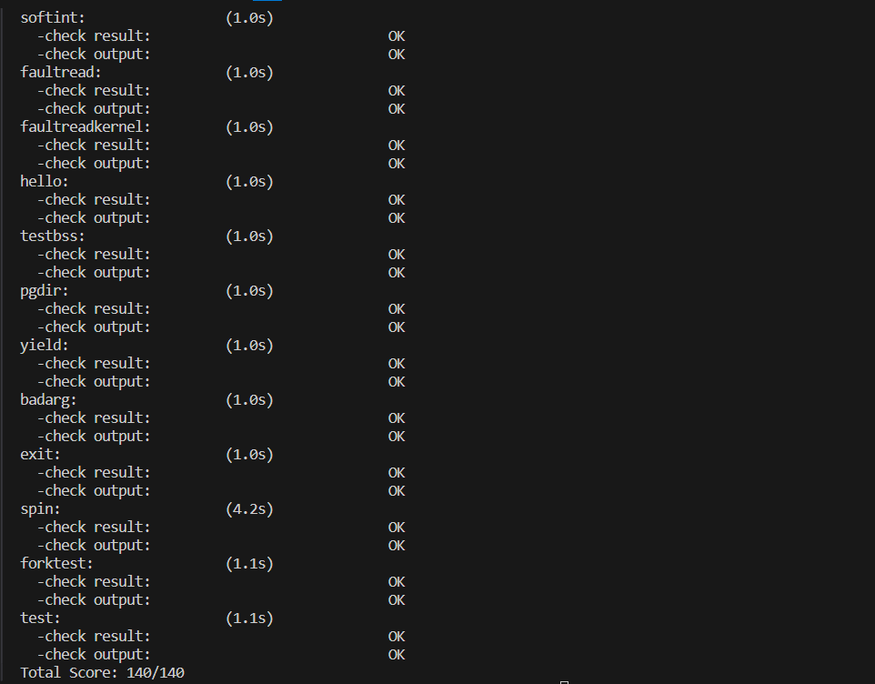
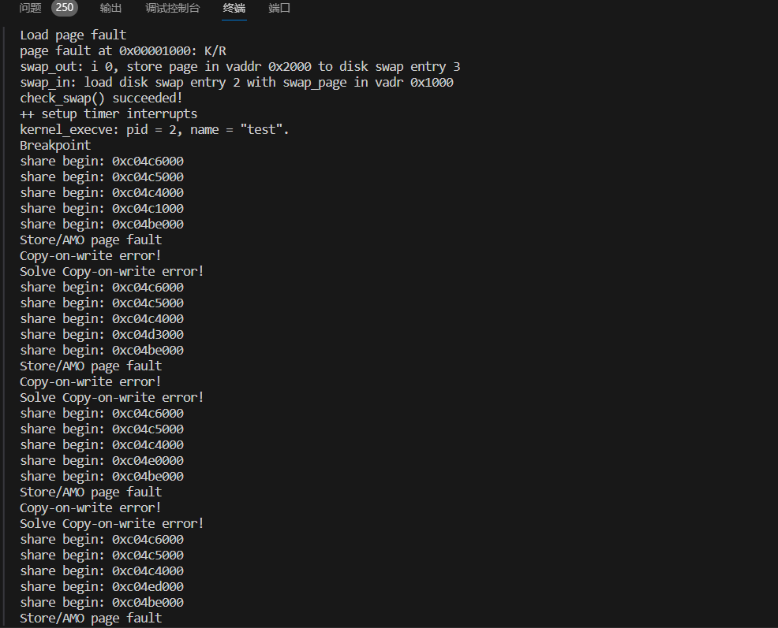
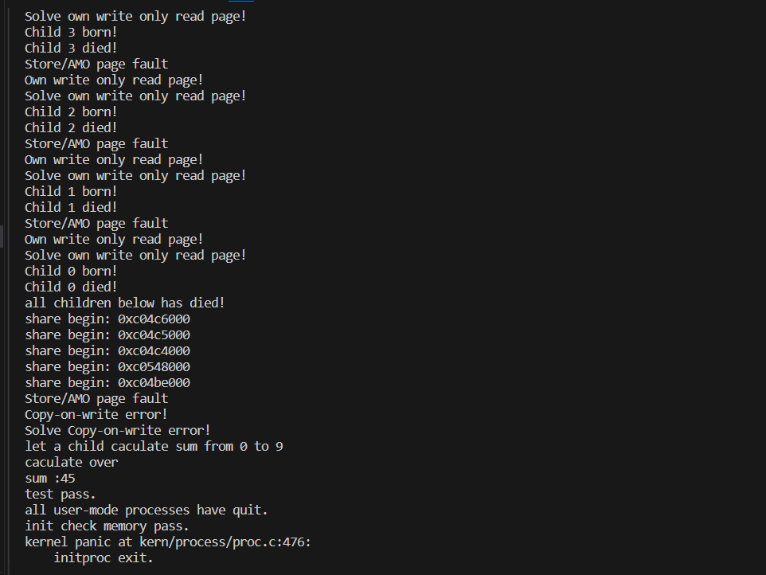

# 扩展练习 Challenge 1

> 1. 实现 Copy on Write  （COW）机制 
>
>  给出实现源码,测试用例和设计报告（包括在cow情况下的各种状态转换（类似有限状态自动机）的说明）。
>
>   这个扩展练习涉及到本实验和上一个实验“虚拟内存管理”。在ucore操作系统中，当一个用户父进程创建自己的子进程时，父进程会把其申请的用户空间设置为只读，子进程可共享父进程占用的用户内存空间中的页面（这就是一个共享的资源）。当其中任何一个进程修改此用户内存空间中的某页面时，ucore会通过page  fault异常获知该操作，并完成拷贝内存页面，使得两个进程都有各自的内存页面。这样一个进程所做的修改不会被另外一个进程可见了。请在ucore中实现这样的COW机制。
>
>  由于COW实现比较复杂，容易引入bug，请参考 https://dirtycow.ninja/  看看能否在ucore的COW实现中模拟这个错误和解决方案。需要有解释。
>
>  这是一个big challenge.


## 实现思路

我们的实现思路就是当共享用户内存空间中的页面时，父进程和子进程建立对同一个物理页面的映射，然后将页表项上该页面的访问设置为只读。当后续任意一个进程修改此用户内存空间中的某页面时，便会引发`page fault`异常，于是便在`do_pgfault`里面完成拷贝内存页面。于是这样，两个进程都有各自的内存页面，一个进程所做的修改不会被另外一个进程可见了。


## 源码补充

我们所做的修改如下：

首先修改`copy_range`函数，并且在`copy_mm`中设置传入的`share`为1：

```c
int copy_range(pde_t *to, pde_t *from, uintptr_t start, uintptr_t end,
               bool share) {
    assert(start % PGSIZE == 0 && end % PGSIZE == 0);
    assert(USER_ACCESS(start, end));
    // copy content by page unit.
    do {
        // call get_pte to find process A's pte according to the addr start
        // 找到进程A的页表项
        pte_t *ptep = get_pte(from, start, 0), *nptep;
        if (ptep == NULL) {
            start = ROUNDDOWN(start + PTSIZE, PTSIZE);   // 更新2Mib
            continue;
        }
        // call get_pte to find process B's pte according to the addr start. If
        // pte is NULL, just alloc a PT
        if (*ptep & PTE_V) {
            if ((nptep = get_pte(to, start, 1)) == NULL) {
                return -E_NO_MEM;
            }
            uint32_t perm = (*ptep & PTE_USER);  // 获取五个位的结果
            // get page from ptep
            // 从A的页表项得到物理页
            struct Page *page = pte2page(*ptep);
            // alloc a page for process B
            // 为B分配一个物理页
            struct Page *npage = alloc_page();
            assert(page != NULL);
            assert(npage != NULL);
            int ret = 0;
            /* LAB5:EXERCISE2 2113665
             * replicate content of page to npage, build the map of phy addr of
             * nage with the linear addr start
             *
             * Some Useful MACROs and DEFINEs, you can use them in below
             * implementation.
             * MACROs or Functions:
             *    page2kva(struct Page *page): return the kernel vritual addr of
             * memory which page managed (SEE pmm.h)
             *    page_insert: build the map of phy addr of an Page with the
             * linear addr la
             *    memcpy: typical memory copy function
             *
             * (1) find src_kvaddr: the kernel virtual address of page
             * (2) find dst_kvaddr: the kernel virtual address of npage
             * (3) memory copy from src_kvaddr to dst_kvaddr, size is PGSIZE
             * (4) build the map of phy addr of  nage with the linear addr start
             */
            if(share){
                // 如果共享的话，那么之前页表的页表项修改
                cprintf("share begin: 0x%x\n",page2kva(page));
                perm &= (~PTE_W);
                page_insert(from,page,start,perm);
                ret = page_insert(to,page,start, perm);
            }
            else{
                void *src_kvaddr = page2kva(page);
                void *dst_kvaddr = page2kva(npage);
                memcpy(dst_kvaddr,src_kvaddr,PGSIZE);
                ret = page_insert(to,npage,start,perm);
            }
            assert(ret == 0);
        }
        start += PGSIZE;  //按页来写
    } while (start != 0 && start < end);
    return 0;
}
```

如果共享的话，映射同一个物理页，并且页表项设置为只读。


接下来修改`do_pgfault`函数：

```c
int
do_pgfault(struct mm_struct *mm, uint_t error_code, uintptr_t addr) {
    int ret = -E_INVAL;
    //try to find a vma which include addr
    struct vma_struct *vma = find_vma(mm, addr);

    pgfault_num++;
    //If the addr is in the range of a mm's vma?
    if (vma == NULL || vma->vm_start > addr) {
        cprintf("not valid addr %x, and  can not find it in vma\n", addr);
        goto failed;
    }

    /* IF (write an existed addr ) OR
     *    (write an non_existed addr && addr is writable) OR
     *    (read  an non_existed addr && addr is readable)
     * THEN
     *    continue process
     */
    uint32_t perm = PTE_U;
    if (vma->vm_flags & VM_WRITE) {
        perm |= READ_WRITE;
    }
    addr = ROUNDDOWN(addr, PGSIZE);

    ret = -E_NO_MEM;

    pte_t *ptep=NULL;
  
    // try to find a pte, if pte's PT(Page Table) isn't existed, then create a PT.
    // (notice the 3th parameter '1')
    if ((ptep = get_pte(mm->pgdir, addr, 1)) == NULL) {
        cprintf("get_pte in do_pgfault failed\n");
        goto failed;
    }
    
    if (*ptep == 0) { // if the phy addr isn't exist, then alloc a page & map the phy addr with logical addr
        if (pgdir_alloc_page(mm->pgdir, addr, perm) == NULL) {
            cprintf("pgdir_alloc_page in do_pgfault failed\n");
            goto failed;
        }
    } 
    else {
        /*LAB3 EXERCISE 3: 2113663
        * 请你根据以下信息提示，补充函数
        * 现在我们认为pte是一个交换条目，那我们应该从磁盘加载数据并放到带有phy addr的页面，
        * 并将phy addr与逻辑addr映射，触发交换管理器记录该页面的访问情况
        *
        *  一些有用的宏和定义，可能会对你接下来代码的编写产生帮助(显然是有帮助的)
        *  宏或函数:
        *    swap_in(mm, addr, &page) : 分配一个内存页，然后根据
        *    PTE中的swap条目的addr，找到磁盘页的地址，将磁盘页的内容读入这个内存页
        *    page_insert ： 建立一个Page的phy addr与线性addr la的映射
        *    swap_map_swappable ： 设置页面可交换
        */
        if((*ptep & PTE_R)&&!(*ptep & PTE_W)){
            // 页表项可读，但是此时写了只读页面
            // 只有当前进程有页面，或者多个进程有这个页面
            struct Page *page = pte2page(*ptep);
            if(page_ref(page)>1){// 多个进程引用
                cprintf("Copy-on-write error!\n");
                struct Page *npage = alloc_page();
                void *src_kvaddr = page2kva(page);
                void *dst_kvaddr = page2kva(npage);
                memcpy(dst_kvaddr,src_kvaddr,PGSIZE);
                page_insert(mm->pgdir,npage,addr,perm|PTE_USER);
                page_ref_dec(page);
                cprintf("Solve Copy-on-write error!\n");
            }
            else{
                // 就自己引用
                cprintf("Own write only read page!\n");
                page_insert(mm->pgdir,page,addr,perm|PTE_W|PTE_R|PTE_V);
                cprintf("Solve own write only read page!\n");
            }
        }
        // 页表项存储的是磁盘
        else{
            if (swap_init_ok) {
                struct Page *page = NULL;
                // 你要编写的内容在这里，请基于上文说明以及下文的英文注释完成代码编写
                //(1）According to the mm AND addr, try
                //to load the content of right disk page
                //into the memory which page managed.
                swap_in(mm,addr,&page);
                //(2) According to the mm,
                //addr AND page, setup the
                //map of phy addr <--->
                //logical addr
                page_insert(mm->pgdir, page, addr, perm);
                //(3) make the page swappable.
                swap_map_swappable(mm, addr, page, 1);
                page->pra_vaddr = addr;
            } else {
                cprintf("no swap_init_ok but ptep is %x, failed\n", *ptep);
                goto failed;
                }
        }  
   }
   ret = 0;
failed:
    return ret;
}
```

根据页面引用来判断是否是多个进程共享此页面，如果是多个进程共享此页面，那么我们重设权限，拷贝物理页，并且将页面引用计数减1。如果只有一个进程共享此页面，那么重设权限即可。


## 测试用例

我们编写了一个c文件`test.c`，以它和`forktest.c`来作为测试用例，并且修改了`grade.sh`:

编写的`test.c`文件如下：

```c
#include <ulib.h>
#include <stdio.h>

const int max_child = 10;
int
main(void) {
    //0 - 9 
    int n,pid,code;
    int sum = 0, iscaculate = 0;
    for (n = 0; n < max_child; n ++) {
        if((pid = fork())==0){
            cprintf("Child %d born!\n",n);
            cprintf("Child %d died!\n",n);
            exit(0);
        }
    }

    for (; n > 0; n --) {
        if (wait() != 0) {
            panic("wait stopped early\n");
        }
    }
    cprintf("all children below has died!\n");
    if((pid = fork())==0){
        iscaculate = 1;
    }
    if(iscaculate){
        cprintf("let a child caculate sum from 0 to 9\n");
        for(int i=0;i<10;i++){
            sum+=i;
        }
        cprintf("caculate over\n");
        cprintf("sum :%d\n",sum);
        exit(0);
    }
    assert(waitpid(pid, &code) == 0);
    yield();
    cprintf("test pass.\n");
    return 0;
    
}
```


补充代码之后的`grade.sh`如下：

```sh
run_test -prog 'test'   -check default_check                                     \
        'kernel_execve: pid = 2, name = "test".'                \
        'share begin: 0xc04c6000'                               \
        'share begin: 0xc04c5000'                               \
        'share begin: 0xc04c4000'                               \
        'share begin: 0xc04c1000'                               \
        'share begin: 0xc04be000'                               \
        'Copy-on-write error!'                                  \
        'Solve Copy-on-write error!'                            \
        'Child 9 born!'                                         \
        'Child 9 died!'                                         \
        'Child 6 born!'                                         \
        'Child 6 died!'                                         \
        'Own write only read page!'                             \
        'Solve own write only read page!'                       \
        'Child 0 born!'                                         \
        'Child 0 died!'                                         \
        'sum :45'                                               \
        'test pass.'                                            \
        'all user-mode processes have quit.'                    \
        'init check memory pass.'                               \
    ! - 'fork claimed to work [0-9]+ times!'                    \
    !   'wait stopped early'                                    \
    !   'wait got too many'                                     \
    ! - 'user panic at .*'
```


## 测试结果




运行`test.c`如下：






可以看到我们通过了测试样例，其中对于`test.c`而言每次fork的时候，会把用户栈进行共享，每次fork调用结束主进程继续执行时会修改用户栈所以会引发`copy-on-write`导致共享被打破。后续子进程在退出时同样要对用户栈进行修改，但是此时共享被打破，所以只会导致`own write only read page`。


