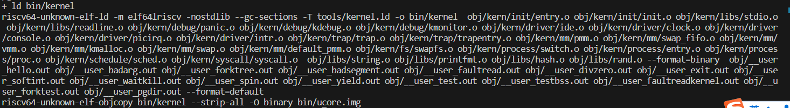
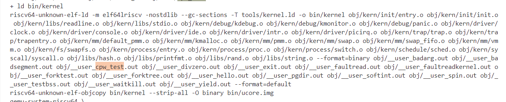

# 扩展练习 Challenge 2

> 说明该用户程序是何时被预先加载到内存中的？与我们常用操作系统的加载有何区别，原因是什么？


## 用户程序加载到内存的时机

用户程序是与内核一起被加载到内存中的，当内核被加载到内存中时，用户程序紧接着便被加载到内存中。我们可以观察在把makefile文件的第六行注释后，执行`make`的结果如下：



通过一个ld命令，会把所有应用程序的执行码全部连接在内核代码的末尾，并且会把此应用程序执行码的大小和位置用两个全局变量进行记录，这样所有应用程序便可以与内核一起被加载到内存中，并且根据两个全局变量很容易定位到其在内存中的起始位置和大小，从而方便我们的调用。

以`hello.c`为例，一个ld命令，把hello应用程序的执行码`obj/user_hello.out`连接在了`ucore kernel`的末尾。且ld命令在`kernel`中会把`user_hello.out`的位置和大小记录在全局变量_`binary_obj___user_hello_out_start`和_`binary_obj___user_hello_out_size`中，这样这个`hello`用户程序就**能够和ucore内核一起被 bootloader 加载到内存里中**，并且通过这两个全局变量定位hello用户程序执行码的起始位置和大小。

```c
static int
user_main(void *arg) {
#ifdef TEST
    KERNEL_EXECVE2(TEST, TESTSTART, TESTSIZE);
#else
    KERNEL_EXECVE(cpw_test);
#endif
    panic("user_main execve failed.\n");
}
```

可以看到`KERNEL_EXECVE()`的参数实际上对应我们在user/目录下的文件名。

```c++
#define KERNEL_EXECVE(x) ({                                             \
            extern unsigned char _binary_obj___user_##x##_out_start[],  \
                _binary_obj___user_##x##_out_size[];                    \
            __KERNEL_EXECVE(#x, _binary_obj___user_##x##_out_start,     \
                            _binary_obj___user_##x##_out_size);         \
        })
```



可以看到`user_main`的执行函数中，使用了`_binary_obj___user_##x##_out_start`,`_binary_obj___user_##x##_out_size`，实际上在ld的时候，我们已经记录了这两个全局变量，因此在执行应用程序可以直接知道用户程序的起始位置与大小，而x实际上是我们的应用程序名字。可以看到上图有user_cpw_test.out等，实际上是user/cpw_test.c的文件对应的应用程序执行码。

## 与常用操作系统的加载区别及原因

常用操作系统是用文件系统进行加载应用程序的，但是我们的`ucore`现在还没有自己的文件系统，所以只能采用`ld`命令的方式来将用户程序与内核一起加载到内存中。并且只能通过全局变量定位在内存中定位其位置，来达到我们后续定位执行码来执行程序的目的。