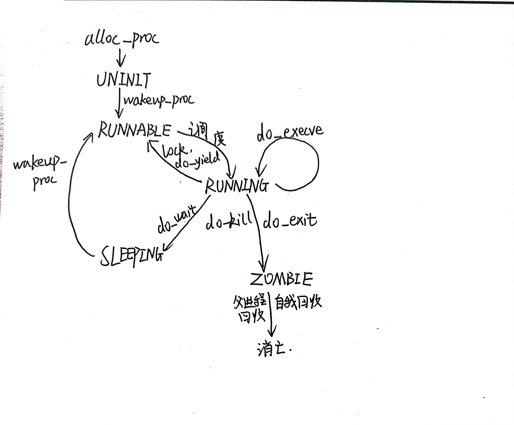

# lab5 report

## [练习0]

**练习0：填写已有实验**

> 本实验依赖实验2/3/4。请把你做的实验2/3/4的代码填入本实验中代码中有“LAB2”/“LAB3”/“LAB4”的注释相应部分。注意：为了能够正确执行lab5的测试应用程序，可能需对已完成的实验2/3/4的代码进行进一步改进。

本次对代码的加载和修改主要是如下部分：

1. `alloc_proc`。我们对proc进程控制块中的新增成员进行了初始化；
2. `proc_run`。继续使用lab4的代码；
3. `do_fork`。在lab4代码的基础上进行更新，我们在把进程控制块加入到管理链表的时候，还设置了其与其他进程的关系；
4. `do_pgfault`。继续使用lab3的代码。


如下是我们对要进行更新的代码的更新：

### alloc_proc

我们补充的代码如下：

```c
// alloc_proc - alloc a proc_struct and init all fields of proc_struct
static struct proc_struct *
alloc_proc(void) {
    struct proc_struct *proc = kmalloc(sizeof(struct proc_struct));
    if (proc != NULL) {
    //LAB4:EXERCISE1 2113665
    /*
     * below fields in proc_struct need to be initialized
     *       enum proc_state state;                      // Process state
     *       int pid;                                    // Process ID
     *       int runs;                                   // the running times of Proces
     *       uintptr_t kstack;                           // Process kernel stack
     *       volatile bool need_resched;                 // bool value: need to be rescheduled to release CPU?
     *       struct proc_struct *parent;                 // the parent process
     *       struct mm_struct *mm;                       // Process's memory management field
     *       struct context context;                     // Switch here to run process
     *       struct trapframe *tf;                       // Trap frame for current interrupt
     *       uintptr_t cr3;                              // CR3 register: the base addr of Page Directroy Table(PDT)
     *       uint32_t flags;                             // Process flag
     *       char name[PROC_NAME_LEN + 1];               // Process name
     */

     //LAB5 2113663 : (update LAB4 steps)
     /*
     * below fields(add in LAB5) in proc_struct need to be initialized  
     *       uint32_t wait_state;                        // waiting state
     *       struct proc_struct *cptr, *yptr, *optr;     // relations between processes
     */
        proc->state = PROC_UNINIT;
        proc->pid = -1;
        proc->runs = 0;
        proc->kstack = 0;
        proc->need_resched = 0;
        proc->parent = NULL;
        proc->mm = NULL;
        memset(&(proc->context),0,sizeof(struct context));
        proc->tf = NULL;
        proc->cr3 = boot_cr3;
        proc->flags = 0;
        memset(proc->name,0,PROC_NAME_LEN);
        proc->wait_state = 0;
        proc->cptr = proc->yptr = proc->optr = NULL;
    }
    return proc;
}

```

我们在lab4的基础上对进程控制块的等待状态进行了初始化，还对其与其他进程的关系指针进行了初始化。主要是两个方面：

1. wait_state代表的是等待状态。我们将其设置为0表示其没有在等待子进程执行；
2. cptr、yptr和optr是用于指明此进程和其他进程关系的。其中cptr是指此进程的子进程，也是最年轻的子进程。yptr是此进程的弟弟，它的父进程与此进程的父进程一致。optr是此进程的哥哥，它的父进程也与此进程的父进程一致。


### do_fork

我们补充的代码如下：

```c
int
do_fork(uint32_t clone_flags, uintptr_t stack, struct trapframe *tf) {// 这是用户栈，当前进程的中断帧
    int ret = -E_NO_FREE_PROC;
    struct proc_struct *proc;
    if (nr_process >= MAX_PROCESS) {
        goto fork_out;
    }
    ret = -E_NO_MEM;
    //LAB4:EXERCISE2 2113663
    /*
     * Some Useful MACROs, Functions and DEFINEs, you can use them in below implementation.
     * MACROs or Functions:
     *   alloc_proc:   create a proc struct and init fields (lab4:exercise1)
     *   setup_kstack: alloc pages with size KSTACKPAGE as process kernel stack
     *   copy_mm:      process "proc" duplicate OR share process "current"'s mm according clone_flags
     *                 if clone_flags & CLONE_VM, then "share" ; else "duplicate"
     *   copy_thread:  setup the trapframe on the  process's kernel stack top and
     *                 setup the kernel entry point and stack of process
     *   hash_proc:    add proc into proc hash_list
     *   get_pid:      alloc a unique pid for process
     *   wakeup_proc:  set proc->state = PROC_RUNNABLE
     * VARIABLES:
     *   proc_list:    the process set's list
     *   nr_process:   the number of process set
     */

    //    1. call alloc_proc to allocate a proc_struct
    //    2. call setup_kstack to allocate a kernel stack for child process
    //    3. call copy_mm to dup OR share mm according clone_flag
    //    4. call copy_thread to setup tf & context in proc_struct
    //    5. insert proc_struct into hash_list && proc_list
    //    6. call wakeup_proc to make the new child process RUNNABLE
    //    7. set ret vaule using child proc's pid

    //LAB5 2113663 : (update LAB4 steps)
    //TIPS: you should modify your written code in lab4(step1 and step5), not add more code.
   /* Some Functions
    *    set_links:  set the relation links of process.  ALSO SEE: remove_links:  lean the relation links of process 
    *    -------------------
    *    update step 1: set child proc's parent to current process, make sure current process's wait_state is 0
    *    update step 5: insert proc_struct into hash_list && proc_list, set the relation links of process
    */
    if((proc = alloc_proc())==NULL){
        goto fork_out;
    }
    if(current->wait_state==0){
        proc->parent = current;
    }
    if(setup_kstack(proc)!=0){
        goto bad_fork_cleanup_proc;
    }
    if(copy_mm(clone_flags,proc)!=0){
        goto bad_fork_cleanup_kstack;
    }
    copy_thread(proc,stack,tf);

    proc->pid = get_pid();
    hash_proc(proc);
    set_links(proc);  //加入管理链表，并且设置了关系

    wakeup_proc(proc);
    ret = proc->pid;
fork_out:
    return ret;

bad_fork_cleanup_kstack:
    put_kstack(proc);
bad_fork_cleanup_proc:
    kfree(proc);
    goto fork_out;
}


// set_links - set the relation links of process
static void
set_links(struct proc_struct *proc) {
    list_add(&proc_list, &(proc->list_link));
    proc->yptr = NULL;
    if ((proc->optr = proc->parent->cptr) != NULL) {
        proc->optr->yptr = proc;
    }
    proc->parent->cptr = proc;
    nr_process ++;
}
```

我们在其中对lab4代码的更新主要是以下部分：

1. 设置了进程的父进程。如果当前运行的进程的等待状态为0，便将当前创建的进程的父进程设置为当前进程；
2. 把当前进程加入到管理链表并且设置了关系。具体体现在`set_links`函数中。在此函数中，我们把创建的进程设置为了其父进程最年轻的孩子，并且将其弟弟和哥哥也进行了相应的设置。从而成功对父进程的子进程链表进行了设置。


## [练习1]

**练习1: 加载应用程序并执行（需要编码）**

> **do_execv**函数调用`load_icode`（位于kern/process/proc.c中）来加载并解析一个处于内存中的ELF执行文件格式的应用程序。你需要补充`load_icode`的第6步，建立相应的用户内存空间来放置应用程序的代码段、数据段等，且要设置好`proc_struct`结构中的成员变量trapframe中的内容，确保在执行此进程后，能够从应用程序设定的起始执行地址开始执行。需设置正确的trapframe内容。
>
> 请在实验报告中简要说明你的设计实现过程。
>
> - 请简要描述这个用户态进程被ucore选择占用CPU执行（RUNNING态）到具体执行应用程序第一条指令的整个经过。


### 设计实现思路

如下是我们补充的代码：

```c
//(6) setup trapframe for user environment
    struct trapframe *tf = current->tf;
    // Keep sstatus
    uintptr_t sstatus = tf->status;
    memset(tf, 0, sizeof(struct trapframe));  //清空中断帧
    /* LAB5:EXERCISE1 2113665
     * should set tf->gpr.sp, tf->epc, tf->status
     * NOTICE: If we set trapframe correctly, then the user level process can return to USER MODE from kernel. So
     *          tf->gpr.sp should be user stack top (the value of sp)
     *          tf->epc should be entry point of user program (the value of sepc)
     *          tf->status should be appropriate for user program (the value of sstatus)
     *          hint: check meaning of SPP, SPIE in SSTATUS, use them by SSTATUS_SPP, SSTATUS_SPIE(defined in risv.h)
     */
    tf->gpr.sp =  USTACKTOP;  //sp赋值为用户栈
    tf->epc = elf->e_entry;   //epc为程序入口
    tf->status = (read_csr(sstatus) & ~SSTATUS_SPP) | SSTATUS_SPIE;
    ret = 0;
```

我们对当前进程的中断帧中的sp、epc和status进行了设置。其中，主要是以下设置：

1. `sp`赋值为用户栈。这样可以在后续保存上下文的时候恢复sp寄存器为用户栈；
2. `epc`赋值为待执行程序的入口。这样可以在后续保存上下文时设置 `sepc`寄存器，同时`sret`后便可以直接进入程序入口执行；
3. `status`赋值为用户态。这样的话可以在保存上下文时恢复`sstatus`寄存器，同时`sret`时可以返回到U态。


### 执行应用程序的完整过程

#### init_main

我们首先从`init_proc`这个进程执行`init_main`开始叙述：

```c
// init_main - the second kernel thread used to create user_main kernel threads
static int
init_main(void *arg) {
    size_t nr_free_pages_store = nr_free_pages();
    size_t kernel_allocated_store = kallocated();

    int pid = kernel_thread(user_main, NULL, 0);
    if (pid <= 0) {
        panic("create user_main failed.\n");
    }

    while (do_wait(0, NULL) == 0) {
        schedule();
    }

    cprintf("all user-mode processes have quit.\n");
    assert(initproc->cptr == NULL && initproc->yptr == NULL && initproc->optr == NULL);
    assert(nr_process == 2);
    assert(list_next(&proc_list) == &(initproc->list_link));
    assert(list_prev(&proc_list) == &(initproc->list_link));

    cprintf("init check memory pass.\n");
    return 0;
}

```

当`init_proc`进程执行此函数时，它会首先创建一个内核进程。并将这个内核进程设置为自己的子进程，然后便会在while循环中通过do_wait函数来通过调度将自己的cpu交出。于是接下来cpu便交付给了新创建的这个内核进程，它通过类似的步骤最终执行`user_main`函数。


#### user_main

```c
// kernel_execve - do SYS_exec syscall to exec a user program called by user_main kernel_thread
static int
kernel_execve(const char *name, unsigned char *binary, size_t size) {
    int64_t ret=0, len = strlen(name);
 //   ret = do_execve(name, len, binary, size);
    asm volatile(
        "li a0, %1\n"
        "lw a1, %2\n"
        "lw a2, %3\n"
        "lw a3, %4\n"
        "lw a4, %5\n"
    	"li a7, 10\n"
        "ebreak\n"
        "sw a0, %0\n"
        : "=m"(ret)
        : "i"(SYS_exec), "m"(name), "m"(len), "m"(binary), "m"(size)
        : "memory");
    cprintf("ret = %d\n", ret);
    return ret;
}

#define __KERNEL_EXECVE(name, binary, size) ({                          \
            cprintf("kernel_execve: pid = %d, name = \"%s\".\n",        \
                    current->pid, name);                                \
            kernel_execve(name, binary, (size_t)(size));                \
        })

#define KERNEL_EXECVE(x) ({                                             \
            extern unsigned char _binary_obj___user_##x##_out_start[],  \
                _binary_obj___user_##x##_out_size[];                    \
            __KERNEL_EXECVE(#x, _binary_obj___user_##x##_out_start,     \
                            _binary_obj___user_##x##_out_size);         \
        })

#define __KERNEL_EXECVE2(x, xstart, xsize) ({                           \
            extern unsigned char xstart[], xsize[];                     \
            __KERNEL_EXECVE(#x, xstart, (size_t)xsize);                 \
        })

#define KERNEL_EXECVE2(x, xstart, xsize)        __KERNEL_EXECVE2(x, xstart, xsize)

// user_main - kernel thread used to exec a user program
static int
user_main(void *arg) {
#ifdef TEST
    KERNEL_EXECVE2(TEST, TESTSTART, TESTSIZE);
#else
    KERNEL_EXECVE(exit);
#endif
    panic("user_main execve failed.\n");
}
```

在此函数中，最终会执行`kernel_execve`函数，在此函数内部通过内嵌汇编的形式对参数寄存器进行了赋值。然后通过ebreak抛出了异常进入到异常处理。

#### ebreak异常处理

##### 1.保存上下文

首先与其他异常处理一样，会先进行上下文保存，这次的上下文保存相比于之前的上下文保存有了区别：

```c
.macro SAVE_ALL
    LOCAL _restore_kernel_sp
    LOCAL _save_context

    # 若在中断之前处于U mode,那么sscratch保存的是内核栈的地址
    # 否则中断之前处于S mode, 此时sscratch保存的是0
    csrrw sp, sscratch, sp
    bnez sp, _save_context   # 如果不为0，说明是用户态进入中断
#内核态多一段代码
_restore_kernel_sp:
    csrr sp, sscratch  #内核态继续使用当前栈,需要换回来
_save_context:
    addi sp, sp, -36 * REGBYTES
    # sp此时就是使用的内核栈
    # save x registers
    STORE x0, 0*REGBYTES(sp)
    STORE x1, 1*REGBYTES(sp)
    STORE x3, 3*REGBYTES(sp)
    STORE x4, 4*REGBYTES(sp)
    ......
    STORE x25, 25*REGBYTES(sp)
    STORE x26, 26*REGBYTES(sp)
    STORE x27, 27*REGBYTES(sp)
    STORE x28, 28*REGBYTES(sp)
    STORE x29, 29*REGBYTES(sp)
    STORE x30, 30*REGBYTES(sp)
    STORE x31, 31*REGBYTES(sp)

    # get sr, epc, tval, cause
    # Set sscratch register to 0, so that if a recursive exception
    # occurs, the exception vector knows it came from the kernel
    # 如果之前是用户态产生的中断，用户栈指针从sscratch加载到s0寄存器
    # sscratch同时清0
    csrrw s0, sscratch, x0  
    csrr s1, sstatus
    csrr s2, sepc
    csrr s3, 0x143
    csrr s4, scause

    STORE s0, 2*REGBYTES(sp)   #用户态的话，用户栈指针存入到了内存
    STORE s1, 32*REGBYTES(sp)
    STORE s2, 33*REGBYTES(sp)
    STORE s3, 34*REGBYTES(sp)
    STORE s4, 35*REGBYTES(sp)
    .endm
```

`sscratch`寄存器与用户态的中断异常处理有关，如果是从用户态进入到中断异常处理，那么`sscratch`存储的是此进程的内核栈的地址；如果是从内核态进入到中断异常处理，那么`sscratch`便存储0。

于是在程序开头便进行了对中断异常之前状态的判断，如果是内核态便会继续使用当前的栈来保存上下文；否则会使用内核栈来保存上下文。


##### 2.异常处理

保存完上下文后，我们进入到`trap`函数，其与之前的`trap`函数也有巨大的区别：

```c
void
trap(struct trapframe *tf) {
    // dispatch based on what type of trap occurred
//    cputs("some trap");
    if (current == NULL) {
        trap_dispatch(tf);
    } else {
        struct trapframe *otf = current->tf;   
        current->tf = tf;  

        bool in_kernel = trap_in_kernel(tf); 

        trap_dispatch(tf);

        current->tf = otf;  
        if (!in_kernel) {
            if (current->flags & PF_EXITING) {
                do_exit(-E_KILLED);
            }
            if (current->need_resched) {
                schedule();
            }
        }
    }
}
```

在这个`trap`函数中，首先对当前进程的中断帧用了一个局部变量进行了保存，然后把传入的`tf`给了当前进程的中断帧指针。这么做的目的是之后在进行系统调用的时候，可以通过操作当前进程的中断帧指针来达到对保存的上下文进行修改的目的。

然后再调用中断异常处理函数，处理完后我们把之前的中断帧进行恢复即可。


如下，是具体的异常处理：

```assembly
case CAUSE_BREAKPOINT:
            cprintf("Breakpoint\n");
            if(tf->gpr.a7 == 10){
                tf->epc += 4;
                syscall();
                kernel_execve_ret(tf,current->kstack+KSTACKSIZE);
            }
            break;
```

然后便调用`syscall`进行系统调用，

```c
void
syscall(void) {
    struct trapframe *tf = current->tf;
    uint64_t arg[5];
    int num = tf->gpr.a0;
    if (num >= 0 && num < NUM_SYSCALLS) {
        if (syscalls[num] != NULL) {
            arg[0] = tf->gpr.a1;
            arg[1] = tf->gpr.a2;
            arg[2] = tf->gpr.a3;
            arg[3] = tf->gpr.a4;
            arg[4] = tf->gpr.a5;    // 传参
            tf->gpr.a0 = syscalls[num](arg);  // 返回结果存入a0
            return ;
        }
    }
    // 调用失败
    print_trapframe(tf);
    panic("undefined syscall %d, pid = %d, name = %s.\n",
            num, current->pid, current->name);
}

static int
sys_exec(uint64_t arg[]) {
    // name len binary size
    const char *name = (const char *)arg[0];
    size_t len = (size_t)arg[1];
    unsigned char *binary = (unsigned char *)arg[2];
    size_t size = (size_t)arg[3];
    return do_execve(name, len, binary, size);
}
```

可以看到由于我们之前对`a0`进行了赋值，所以根据a0就可以找到系统调用的序列号。所以在`syscalls[num]`实际上是`sys_exec`函数，最终在其中调用了`do_execve`函数。

**这个函数的作用是：先回收自身所占用户空间，然后调用load_icode，用新的程序覆盖内存空间，形成一个执行新程序的新进程**

在执行过程中，结合我们之前补充的代码，可以发现：

```c
//(6) setup trapframe for user environment
    struct trapframe *tf = current->tf;
    // Keep sstatus
    uintptr_t sstatus = tf->status;
    memset(tf, 0, sizeof(struct trapframe));  //清空中断帧
    /* LAB5:EXERCISE1 2113665
     * should set tf->gpr.sp, tf->epc, tf->status
     * NOTICE: If we set trapframe correctly, then the user level process can return to USER MODE from kernel. So
     *          tf->gpr.sp should be user stack top (the value of sp)
     *          tf->epc should be entry point of user program (the value of sepc)
     *          tf->status should be appropriate for user program (the value of sstatus)
     *          hint: check meaning of SPP, SPIE in SSTATUS, use them by SSTATUS_SPP, SSTATUS_SPIE(defined in risv.h)
     */
    tf->gpr.sp =  USTACKTOP;  //sp赋值为用户栈
    tf->epc = elf->e_entry;   //epc为程序入口
    tf->status = (read_csr(sstatus) & ~SSTATUS_SPP) | SSTATUS_SPIE;
    ret = 0;
```

我们直接对当前进程的中断帧进行修改，最终我们把sp修改为了用户栈，把epc修改为了执行程序的入口，把status修改为了用户态。这对之后有着巨大作用。


##### 3.复制内容到内核栈，栈指针切换

完成`syscall`后，便会执行`kernel_execve_ret`函数，如下：

```c
void kernel_execve_ret(struct trapframe *tf,uintptr_t kstacktop); //tf kstacktop
```

```assembly
kernel_execve_ret:
    // adjust sp to beneath kstacktop of current process
    addi a1, a1, -36*REGBYTES

    // copy from previous trapframe to new trapframe
    LOAD s1, 35*REGBYTES(a0)
    STORE s1, 35*REGBYTES(a1)
    LOAD s1, 34*REGBYTES(a0)
    STORE s1, 34*REGBYTES(a1)
  	......
    LOAD s1, 4*REGBYTES(a0)
    STORE s1, 4*REGBYTES(a1)
    LOAD s1, 3*REGBYTES(a0)
    STORE s1, 3*REGBYTES(a1)
    LOAD s1, 2*REGBYTES(a0)
    STORE s1, 2*REGBYTES(a1)
    LOAD s1, 1*REGBYTES(a0)
    STORE s1, 1*REGBYTES(a1)
    LOAD s1, 0*REGBYTES(a0)
    STORE s1, 0*REGBYTES(a1)

    // acutually adjust sp
    move sp, a1
    j __trapret
```

可以看到，通过以上函数调用，将中断帧中的内容复制到了内核栈里面，并且将当前的栈指针赋值为了内核栈地址，实现了栈指针的切换。


##### 4.保存上下文

紧接着，我们还原当前进程的中断帧内容，并且保存上下文：

```assembly
.macro RESTORE_ALL
    LOCAL _save_kernel_sp
    LOCAL _restore_context

    LOAD s1, 32*REGBYTES(sp)
    LOAD s2, 33*REGBYTES(sp)

    andi s0, s1, SSTATUS_SPP
    # 不为0，则是内核态
    bnez s0, _restore_context

_save_kernel_sp:
    # Save unwound kernel stack pointer in sscratch
    # 用户态, 把之前的内核栈指针恢复, 重新放回sscratch寄存器
    addi s0, sp, 36 * REGBYTES
    csrw sscratch, s0
_restore_context:
    csrw sstatus, s1
    csrw sepc, s2

    # restore x registers
    LOAD x1, 1*REGBYTES(sp)
    LOAD x3, 3*REGBYTES(sp)
    LOAD x4, 4*REGBYTES(sp)
    LOAD x5, 5*REGBYTES(sp)
    LOAD x6, 6*REGBYTES(sp)
	......
    LOAD x30, 30*REGBYTES(sp)
    LOAD x31, 31*REGBYTES(sp)
    # restore sp last
    # 用户栈指针恢复
    LOAD x2, 2*REGBYTES(sp)  
    .endm
```

如上，同样我们要区分内核态和用户态，由于我们在刚刚执行`load_icode`函数的过程中，将status寄存器赋值为了用户态，所以代表了将进入中断异常处理之前的状态从内核态切换为了用户态。所以恢复上下文时我们执行的是用户态的上下文恢复。

这里首先要保存未展开的内核栈指针到sscratch中，其次代码通过 `csrw` 指令将寄存器 `s1` 的值写入 `sstatus` 寄存器中，将寄存器 `s2` 的值写入 `sepc` 寄存器中，以恢复中断或异常发生时的状态和程序计数器。

最后通过一系列load指令完成了上下文的恢复。

##### 5.sret重置pc，开始执行用户程序

于是在`sret`之后，pc便会被赋值为sepc寄存器的值，也就是马上即将执行用户程序的入口地址。最后，用户程序便开始了执行。


## [练习2]

**练习2: 父进程复制自己的内存空间给子进程（需要编码）**

> 创建子进程的函数`do_fork`在执行中将拷贝当前进程（即父进程）的用户内存地址空间中的合法内容到新进程中（子进程），完成内存资源的复制。具体是通过`copy_range`函数（位于kern/mm/pmm.c中）实现的，请补充`copy_range`的实现，确保能够正确执行。
>
> 请在实验报告中简要说明你的设计实现过程。

- 如何设计实现`Copy on Write`机制？给出概要设计，鼓励给出详细设计。

> Copy-on-write（简称COW）的基本概念是指如果有多个使用者对一个资源A（比如内存块）进行读操作，则每个使用者只需获得一个指向同一个资源A的指针，就可以该资源了。若某使用者需要对这个资源A进行写操作，系统会对该资源进行拷贝操作，从而使得该“写操作”使用者获得一个该资源A的“私有”拷贝—资源B，可对资源B进行写操作。该“写操作”使用者对资源B的改变对于其他的使用者而言是不可见的，因为其他使用者看到的还是资源A。

在这里，我们回答`copy_range`函数的具体实现过程，`Copy-on-write`我们设置为在扩展练习报告中进行回答。


### 设计实现过程

如下是我们补充的代码：

```c
int copy_range(pde_t *to, pde_t *from, uintptr_t start, uintptr_t end,
               bool share) {
    assert(start % PGSIZE == 0 && end % PGSIZE == 0);
    assert(USER_ACCESS(start, end));
    // copy content by page unit.
    do {
        // call get_pte to find process A's pte according to the addr start
        // 找到进程A的页表项
        pte_t *ptep = get_pte(from, start, 0), *nptep;
        if (ptep == NULL) {
            start = ROUNDDOWN(start + PTSIZE, PTSIZE);   // 更新2Mib
            continue;
        }
        // call get_pte to find process B's pte according to the addr start. If
        // pte is NULL, just alloc a PT
        if (*ptep & PTE_V) {
            if ((nptep = get_pte(to, start, 1)) == NULL) {
                return -E_NO_MEM;
            }
            uint32_t perm = (*ptep & PTE_USER);  // 获取五个位的结果
            // get page from ptep
            // 从A的页表项得到物理页
            struct Page *page = pte2page(*ptep);
            // alloc a page for process B
            // 为B分配一个物理页
            struct Page *npage = alloc_page();
            assert(page != NULL);
            assert(npage != NULL);
            int ret = 0;
            /* LAB5:EXERCISE2 2113665
             * replicate content of page to npage, build the map of phy addr of
             * nage with the linear addr start
             *
             * Some Useful MACROs and DEFINEs, you can use them in below
             * implementation.
             * MACROs or Functions:
             *    page2kva(struct Page *page): return the kernel vritual addr of
             * memory which page managed (SEE pmm.h)
             *    page_insert: build the map of phy addr of an Page with the
             * linear addr la
             *    memcpy: typical memory copy function
             *
             * (1) find src_kvaddr: the kernel virtual address of page
             * (2) find dst_kvaddr: the kernel virtual address of npage
             * (3) memory copy from src_kvaddr to dst_kvaddr, size is PGSIZE
             * (4) build the map of phy addr of  nage with the linear addr start
             */
            void *src_kvaddr = page2kva(page);
            void *dst_kvaddr = page2kva(npage);
            memcpy(dst_kvaddr,src_kvaddr,PGSIZE);
            ret = page_insert(to,npage,start,perm);
            assert(ret == 0);
        }
        start += PGSIZE;  //按页来写
    } while (start != 0 && start < end);
    return 0;
}
```

此函数的主要作用就是按页复制，将`start`到`end`之间页的整数倍个空间的内容进行复制，并且建立映射。于是我们编写的思路便是，首先申请一个空白的物理页，然后把当前进程页表中由该虚拟地址映射的物理页的内容拷贝到此空白物理页中，然后将该虚拟地址与我们拷贝的物理页在新创建进程的页表上建立映射。最终我们便实现了新进程与当前进程共享一套虚拟内存，并且内容完全一致，但是却映射到了不同的物理页上。


## [练习3]

**练习3: 阅读分析源代码，理解进程执行 fork/exec/wait/exit 的实现，以及系统调用的实现（不需要编码）**

> 请在实验报告中简要说明你对 fork/exec/wait/exit函数的分析。并回答如下问题：
>
> - 请分析fork/exec/wait/exit的执行流程。重点关注哪些操作是在用户态完成，哪些是在内核态完成？内核态与用户态程序是如何交错执行的？内核态执行结果是如何返回给用户程序的？
> - 请给出ucore中一个用户态进程的执行状态生命周期图（包执行状态，执行状态之间的变换关系，以及产生变换的事件或函数调用）。（字符方式画即可）
>
> 执行：make grade。如果所显示的应用程序检测都输出ok，则基本正确。（使用的是qemu-1.0.1）

#### 执行流程的分析

##### 1.fork

- 用户态完成如下操作:

```c
int
fork(void) {
    return sys_fork();
}
sys_fork(void) {
    return syscall(SYS_fork);
}
static inline int
syscall(int64_t num, ...) {
    va_list ap;
    //ap 初始化为指向 num 参数后面的第一个可变参数的位置
    va_start(ap, num);
    uint64_t a[MAX_ARGS];
    int i, ret;
    for (i = 0; i < MAX_ARGS; i ++) {
        a[i] = va_arg(ap, uint64_t);
    }
    va_end(ap);

    asm volatile (
        "ld a0, %1\n"
        "ld a1, %2\n"
        "ld a2, %3\n"
        "ld a3, %4\n"
        "ld a4, %5\n"
    	"ld a5, %6\n"
        "ecall\n"
        "sd a0, %0"
        : "=m" (ret)   //ret是第0个参数，是返回值
        : "m"(num), "m"(a[0]), "m"(a[1]), "m"(a[2]), "m"(a[3]), "m"(a[4])
        :"memory");
    //最终返回结果是ret，而前面把a0加载进ret，a0是中断帧恢复上下文设置的，而中断帧的a0是内核态系统调用的返回结果。
    return ret;
}

```

首先用户态调用fork函数，最终进入syscall函数，其中只有一个参数`SYS_fork`，代表系统调用号，在内核态要用到。在这里我们处于用户态，在`syscall`函数中，有一个固定参数num，可变参数。这里我们进入一段内联汇编代码。可以看到这里首先把num，以及可变参数分别导入`a0`,`a1`,.....,`a5`。然后`ecall`触发中断。这将进入中断处理的部分，也就是内核态操作。

- 内核态完成如下操作

ecall产生中断

```assembly
__alltraps:
    SAVE_ALL

    move  a0, sp
    jal trap
    # sp should be the same as before "jal trap"

    .globl __trapret
__trapret:
    RESTORE_ALL
    # return from supervisor call
    sret
```

我们进入中断处理的入口`alltraps`进行处理，要注意的是原来我们是用户态，sp最初是用户栈的栈顶位置，`SAVE_ALL`要经过处理设置为指向内核栈的指针。

其中`jal trap`，有如下处理过程

```c
//trap.c中
case CAUSE_USER_ECALL:
            //cprintf("Environment call from U-mode\n");
            tf->epc += 4;
            syscall();
            break;
void
syscall(void) {
    struct trapframe *tf = current->tf;
    uint64_t arg[5];
    //a0是sys_fork
    int num = tf->gpr.a0;
    if (num >= 0 && num < NUM_SYSCALLS) {
        if (syscalls[num] != NULL) {
            arg[0] = tf->gpr.a1;
            arg[1] = tf->gpr.a2;
            arg[2] = tf->gpr.a3;
            arg[3] = tf->gpr.a4;
            arg[4] = tf->gpr.a5;
            tf->gpr.a0 = syscalls[num](arg);
            return ;
        }
    }
    print_trapframe(tf);
    panic("undefined syscall %d, pid = %d, name = %s.\n",
            num, current->pid, current->name);
}
static int
sys_fork(uint64_t arg[]) {
    struct trapframe *tf = current->tf;
    uintptr_t stack = tf->gpr.sp;
    return do_fork(0, stack, tf);
}
```

在内核态触发中断，根据中断原因，我们进入`CAUSE_USER_ECALL`处理。首先更改epc的值，便于恢复时可以执行原来用户态程序的下一条指令。首先这里调用内核态的`syscall`，进行系统调用处理。由于用户态时我们将`a0`设置为`SYS_fork`，所以这里调用`sys_fork`。

由于我们这里`fork`是创建子线程，所以调用`do_fork`执行子线程的创建。子线程与父线程是共享一个用户地址空间`stack`，中断帧tf也是完全一致，其中ret在`do_fork`中被设置为子线程的`pid`。

**最后sret回到tf->epc设置的指令，即`sd a0, %0=m(ret)`，将寄存器 `a0` 的值存储到变量 `ret` 中，用户态return ret得到返回值。更细节的过程是，` tf->gpr.a0 = syscalls[num](arg)`，所以实际上返回值是`sys_fork`的返回值，就是子线程的pid。**

但是值得注意的是子线程本身的中断帧中`a0`被设置为0，所以子线程如果执行，返回值是0。

这里在父线程`wait`时，会进行`schedule`，可能将子线程换入。由于子线程与父线程中断帧一致，所以线程切换时，`tf->epc`也是一样的，与父线程后续的指令执行完全一致。

##### 2.exec

- 用户态

具体在用户态调用函数`exec`，然后利用系统调用的`ecall`进行中断，这里压入参数、中断的流程都与`fork`一样。

- 内核态

中断处理与恢复

```assembly
__alltraps:
    SAVE_ALL

    move  a0, sp
    jal trap
    # sp should be the same as before "jal trap"

    .globl __trapret
__trapret:
    RESTORE_ALL
    # return from supervisor call
    sret
```

进行trap.c中相关函数处理

```c
 case CAUSE_USER_ECALL:
            //cprintf("Environment call from U-mode\n");
            tf->epc += 4;
            syscall();
            break;
void
syscall(void) {
    struct trapframe *tf = current->tf;
    uint64_t arg[5];
    //a0是sys_exec
    int num = tf->gpr.a0;
    if (num >= 0 && num < NUM_SYSCALLS) {
        if (syscalls[num] != NULL) {
            arg[0] = tf->gpr.a1;
            arg[1] = tf->gpr.a2;
            arg[2] = tf->gpr.a3;
            arg[3] = tf->gpr.a4;
            arg[4] = tf->gpr.a5;
            tf->gpr.a0 = syscalls[num](arg);
            return ;
        }
    }
    print_trapframe(tf);
    panic("undefined syscall %d, pid = %d, name = %s.\n",
            num, current->pid, current->name);
}

```

进入`sys_exec`函数，执行`do_execve`

```c
static int
sys_exec(uint64_t arg[]) {
    const char *name = (const char *)arg[0];
    size_t len = (size_t)arg[1];
    unsigned char *binary = (unsigned char *)arg[2];
    size_t size = (size_t)arg[3];
    //进行应用程序加载
    return do_execve(name, len, binary, size);
}
```

在`do_execve`函数执行的过程中，导入了新的应用程序。首先将当前mm结构进行释放，如果没有任何一个线程共享此mm，释放mm以及相关页表所占空间。最后调用`load_icode`创建新的mm、页表，然后将`binary`的内容复制到页中，建立好虚拟空间与物理空间的映射。

```c
//load_icode一段程序节选 
//(6) setup trapframe for user environment
    struct trapframe *tf = current->tf;
    // Keep sstatus
    uintptr_t sstatus = tf->status;
    memset(tf, 0, sizeof(struct trapframe));
    /* LAB5:EXERCISE1 2113665
     */
    tf->gpr.sp = USTACKTOP;
    //sret指令会从sepc寄存器中读取地址，然后跳转到该地址处执行。
    tf->epc = elf->e_entry;
    //设置用户态的sstatus
     // 设置 trapframe 中的 status 寄存器（SSTATUS）
    // SSTATUS_SPP：Supervisor Previous Privilege（设置为用户态）
    // SSTATUS_SPIE：Supervisor Previous Interrupt Enable（设置为中断使能）
    tf->status = (read_csr(sstatus) & ~SSTATUS_SPP) | SSTATUS_SPIE;
	ret = 0;
```

最后，在`load_icode`中修改了当前进程中断帧里面的`sp`、`status`、`epc`的内容，然后便通过`sret`来使pc指向了新的执行程序的入口，以此来执行了新的应用程序。

**然后恢复上下文时，由于在`load_icode`已经设置`tf->epc`为程序入口，所以在`sret`时会直接跳到应用程序开始执行，而不会回到原来触发中断的下一条指令。**

##### 3.wait

- 用户态执行如下操作

```c
int
wait(void) {
    return sys_wait(0, NULL);
}

int
sys_wait(int64_t pid, int *store) {
    return syscall(SYS_wait, pid, store);
}

static inline int
syscall(int64_t num, ...) {
    va_list ap;
    //ap 初始化为指向 num 参数后面的第一个可变参数的位置
    va_start(ap, num);
    uint64_t a[MAX_ARGS];
    int i, ret;
    for (i = 0; i < MAX_ARGS; i ++) {
        a[i] = va_arg(ap, uint64_t);
    }
    va_end(ap);

    asm volatile (
        "ld a0, %1\n"
        "ld a1, %2\n"
        "ld a2, %3\n"
        "ld a3, %4\n"
        "ld a4, %5\n"
    	"ld a5, %6\n"
        "ecall\n"
        "sd a0, %0"
        : "=m" (ret)
        : "m"(num), "m"(a[0]), "m"(a[1]), "m"(a[2]), "m"(a[3]), "m"(a[4])
        :"memory");
    return ret;
}
```

主要是用户态函数调用的封装，然后调用用户态的`syscall`，最后中断进入内核态。

- 内核态

中断处理与恢复

```assembly
__alltraps:
    SAVE_ALL

    move  a0, sp
    jal trap
    # sp should be the same as before "jal trap"

    .globl __trapret
__trapret:
    RESTORE_ALL
    # return from supervisor call
    sret
```

具体trap函数的执行

```c

case CAUSE_USER_ECALL:
            //cprintf("Environment call from U-mode\n");
            tf->epc += 4;
            syscall();
            break;

void
syscall(void) {
    struct trapframe *tf = current->tf;
    uint64_t arg[5];
    //a0是sys_exec
    int num = tf->gpr.a0;
    if (num >= 0 && num < NUM_SYSCALLS) {
        if (syscalls[num] != NULL) {
            arg[0] = tf->gpr.a1;
            arg[1] = tf->gpr.a2;
            arg[2] = tf->gpr.a3;
            arg[3] = tf->gpr.a4;
            arg[4] = tf->gpr.a5;
            tf->gpr.a0 = syscalls[num](arg);
            return ;
        }
    }
    print_trapframe(tf);
    panic("undefined syscall %d, pid = %d, name = %s.\n",
            num, current->pid, current->name);
}
//执行内核态的sys_wait
static int
sys_wait(uint64_t arg[]) {
    int pid = (int)arg[0];
    int *store = (int *)arg[1];
    return do_wait(pid, store);
}
```

这里的流程与上述`fork`等系统调用完全一致。首先进入中断处理`trap`，进行内核态相关处理，即父线程回收子线程的资源。最后父线程恢复上下文，从中断恢复，继续执行。

其中do_wait函数的作用：父线程等待子线程，并在得到子线程的退出消息后，彻底回收子线程所占的资源（比如子线程的内核栈和线程的控制块），如果父线程过早的退出，而没有回收掉子线程说明错误，返回值不为0；如果父线程回收完一个子线程，返回0。注意这里一次`wait`只能回收一个子线程。

**所以最终ret的返回值在`do_wait`被设置。大致流程是：在`tf->gpr.a0 = syscalls[num](arg)`被设置为a0。最后，在恢复上下文时，a0被成功加载，内核处理的结果，通过`sd a0, %0=m(ret)`，成功加载进ret寄存器，也就是返回值。所以内核处理的结果返回给了用户态。**

我们进行`wait`调用的时候，最终在内核态执行系统调用函数是`do_wait`。并且此时传入的pid为0，所以在执行此函数时我们可以看到首先遍历当前进程的子进程链表，如果有孩子的话会将`haskid`置为1。同时只要其中有一个子进程已经执行完了程序，那么会立即跳转到`found`来执行回收子进程的操作(具体是将子进程的控制块从哈希链和进程控制块管理链表上删除，然后回收内核栈和进程控制块)。

如果所有子进程都不是`PROC_ZOMBIE`，那么会设置当前进程的状态为阻塞状态，同时等待状态设置为等待子进程执行完毕。最后，执行调度，让子进程有机会获取cpu来执行。只有有子进程已经执行完毕，才有可能最后`do_wait`函数返回。

##### 4.exit

- 用户态执行的操作

```c
void
exit(int error_code) {
    sys_exit(error_code);
    cprintf("BUG: exit failed.\n");
    while (1);
}
int
sys_exit(int64_t error_code) {
    return syscall(SYS_exit, error_code);
}
static inline int
syscall(int64_t num, ...) {
    va_list ap;
    //ap 初始化为指向 num 参数后面的第一个可变参数的位置
    va_start(ap, num);
    uint64_t a[MAX_ARGS];
    int i, ret;
    for (i = 0; i < MAX_ARGS; i ++) {
        a[i] = va_arg(ap, uint64_t);
    }
    va_end(ap);

    asm volatile (
        "ld a0, %1\n"
        "ld a1, %2\n"
        "ld a2, %3\n"
        "ld a3, %4\n"
        "ld a4, %5\n"
    	"ld a5, %6\n"
        "ecall\n"
        "sd a0, %0"
        : "=m" (ret)
        : "m"(num), "m"(a[0]), "m"(a[1]), "m"(a[2]), "m"(a[3]), "m"(a[4])
        :"memory");
    return ret;
}
```

主要是完成参数的传递，将`SYS_exit`系统调用号、以及`error_code`传递给a0,a1。然后触发`ecall`，进入内核态处理。

- 内核态操作

中断处理 保存现场，调用trap进行内核态的处理，最后恢复上下文，传递返回值给用户态。

```assembly
__alltraps:
    SAVE_ALL

    move  a0, sp
    jal trap
    # sp should be the same as before "jal trap"

    .globl __trapret
__trapret:
    RESTORE_ALL
    # return from supervisor call
    sret
```

trap.c函数以及具体内核态的处理

```
case CAUSE_USER_ECALL:
            //cprintf("Environment call from U-mode\n");
            tf->epc += 4;
            syscall();
            break;

void
syscall(void) {
    struct trapframe *tf = current->tf;
    uint64_t arg[5];
    //a0是sys_exec
    int num = tf->gpr.a0;
    if (num >= 0 && num < NUM_SYSCALLS) {
        if (syscalls[num] != NULL) {
            arg[0] = tf->gpr.a1;
            arg[1] = tf->gpr.a2;
            arg[2] = tf->gpr.a3;
            arg[3] = tf->gpr.a4;
            arg[4] = tf->gpr.a5;
            tf->gpr.a0 = syscalls[num](arg);
            return ;
        }
    }
    print_trapframe(tf);
    panic("undefined syscall %d, pid = %d, name = %s.\n",
            num, current->pid, current->name);
}

```

内核态调用`sys_exit`完成对当前进程的回收工作。主要是调用在`proc.c`中

```c
static int
sys_exit(uint64_t arg[]) {
    int error_code = (int)arg[0];
    return do_exit(error_code);
}
//释放进程自身所占内存空间和相关内存管理（如页表等）信息所占空间，唤醒父进程，好让父进程收了自己，让调度器切换到其他进程
int
do_exit(int error_code) {
    if (current == idleproc) {
        panic("idleproc exit.\n");
    }
    if (current == initproc) {
        panic("initproc exit.\n");
    }
    struct mm_struct *mm = current->mm;
    if (mm != NULL) {
        //切换页表的地址空间到内核的页表
        lcr3(boot_cr3);
        //如果没有任何一个进程在使用这个mm，那么就释放这个mm
        if (mm_count_dec(mm) == 0) {
            exit_mmap(mm);
            put_pgdir(mm);
            //释放mm所占空间
            mm_destroy(mm);
        }
        current->mm = NULL;
    }
    //设置当前进程状态为PROC_ZOMBIE
    current->state = PROC_ZOMBIE;
    current->exit_code = error_code;
    bool intr_flag;
    struct proc_struct *proc;
    local_intr_save(intr_flag);
    {
        //获取父进程
        proc = current->parent;
        //如果父进程的等待状态为 WT_CHILD，则唤醒父进程，以通知它子进程的状态变化。
        if (proc->wait_state == WT_CHILD) {
            wakeup_proc(proc);
        }
        while (current->cptr != NULL) {
            //proc为当前进程的子进程
            proc = current->cptr;
            //把proc的older pointer，赋值给current的child pointer
            current->cptr = proc->optr;
    		//把proc接到initproc的孩子节点上
            proc->yptr = NULL;
            if ((proc->optr = initproc->cptr) != NULL) {
                initproc->cptr->yptr = proc;
            }
            proc->parent = initproc;
            //cptr是最新的孩子
            initproc->cptr = proc;
            if (proc->state == PROC_ZOMBIE) {
                if (initproc->wait_state == WT_CHILD) {
                    wakeup_proc(initproc);
                }
            }
        }
    }
    local_intr_restore(intr_flag);
    schedule();
    panic("do_exit will not return!! %d.\n", current->pid);
}
```

在`do_exit`中，主要是先回收线程的mm结构，以及相关虚拟空间的映射，释放此线程的页表等。最后由于当前线程无法释放自己的`proc`结构，所以需要父线程回收，但是如果此线程还有子线程，就需要进行另外的操作。

总结来说:

1. 父进程如果是正在等待子进程执行完毕的状态的话，会唤醒父进程此时，让父进程来完成对它的回收工作。

2. 如果此进程此时还有子进程，会把这些子进程全部接在`init_proc`进程的孩子链表中。如果子进程执行完毕，后续`init_proc`便可以执行回收工作，即通过`do_wait`回收，do_wait：父线程或者`initproc`等待子线程，并在得到子线程的退出消息后，彻底回收子线程所占的资源。

   观察代码还可以发现，`initproc->cptr`是`initproc`孩子中最小的。可以通过`initproc->cptr->optr`找到较大的孩子节点。

值得注意的是，这里没有`return`返回值。因为我们使用了`schedule`直接进行线程的切换。所以此时会进行`switch`的相关操作，将上下文恢复成另一个线程的上下文，返回到用户态后，继续执行另一个用户线程。

#### 用户态进程的执行状态周期生命图


