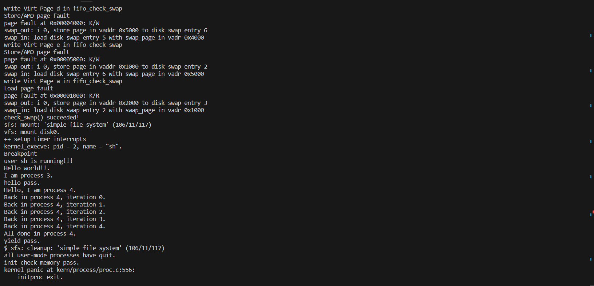
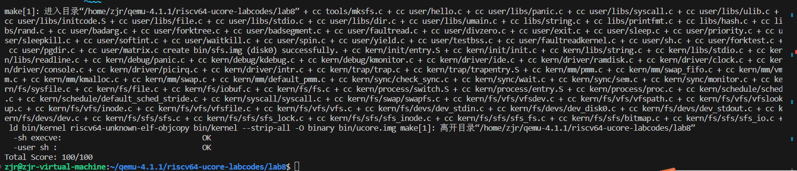
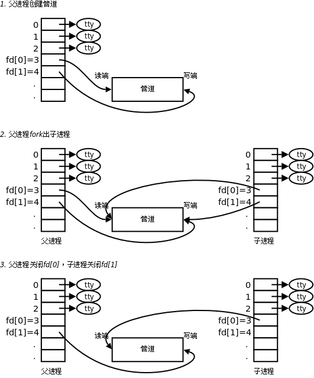
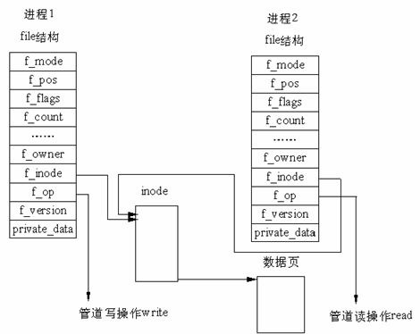

# lab8

## [练习1]：完成读文件操作的实现

>首先了解打开文件的处理流程，然后参考本实验后续的文件读写操作的过程分析，填写在 kern/fs/sfs/sfs_inode.c中 的sfs_io_nolock()函数，实现读文件中数据的代码。

### 1.打开文件的流程

- 首先用户态调用函数open

  如下是在user/libs封装的打开文件的函数，在其中调用了sys_open函数

  ```c
  
  int
  open(const char *path, uint32_t open_flags) {
      return sys_open(path, open_flags);
  }
  
  ```

- 调用sys_open函数

  在其中调用syscall然后ecall触发中断，进入内核态处理

  ```c
  int
  sys_open(const char *path, uint64_t open_flags) {
      return syscall(SYS_open, path, open_flags);
  }
  
  
  ```

  下面是syscall的具体函数，可以看到内联汇编代码`ecall`，进入中断处理

  ```c
  static inline int
  syscall(uint64_t num, ...) {
      va_list ap;
      va_start(ap, num);
      uint64_t a[MAX_ARGS];
      int i, ret;
      for (i = 0; i < MAX_ARGS; i ++) {
          a[i] = va_arg(ap, uint64_t);
      }
      va_end(ap);
  
      asm volatile (
          "lw a0, %1\n"
          "lw a1, %2\n"
          "lw a2, %3\n"
          "lw a3, %4\n"
          "lw a4, %5\n"
          "lw a5, %6\n"
          "ecall\n"
          "sw a0, %0"
          : "=m" (ret)
          : "m" (num),
            "m" (a[0]),
            "m" (a[1]),
            "m" (a[2]),
            "m" (a[3]),
            "m" (a[4])
          : "memory"
        );
      return ret;
  }
  ```

- 在trap.c中进入ecall对应的中断处理

  ```c
  case CAUSE_USER_ECALL:
              //cprintf("Environment call from U-mode\n");
              tf->epc += 4;
              syscall();
              break;
  ```

  syscall触发了内核态对应的相关函数

- 在syscall.c中进入sys_open的内核态处理函数，然后调用sysfile_open

  ```c
  static int
  sys_open(uint64_t arg[]) {
      const char *path = (const char *)arg[0];
      uint32_t open_flags = (uint32_t)arg[1];
      return sysfile_open(path, open_flags);
  }
  
  /* sysfile_open - open file */
  //用户态open_file最后调用的内核态函数
  int
  sysfile_open(const char *__path, uint32_t open_flags) {
      int ret;
      char *path;
      if ((ret = copy_path(&path, __path)) != 0) {
          return ret;
      }
      ret = file_open(path, open_flags);
      kfree(path);
      return ret;
  }
  ```

- file_open函数是内核态重要的处理文件打开的函数

  位于vfc/file.c中

  ```c
  
  // open file
  int
  file_open(char *path, uint32_t open_flags) {
      bool readable = 0, writable = 0;
      switch (open_flags & O_ACCMODE) {
      case O_RDONLY: readable = 1; break;
      case O_WRONLY: writable = 1; break;
      case O_RDWR:
          readable = writable = 1;
          break;
      default:
          return -E_INVAL;
      }
      int ret;
      struct file *file;
      //从当前进程的打开文件数组中分配一个空闲元素给当前file   这里仅仅给当前用户分配了一个file变量
      //还没有找到对应的文件索引节点
      if ((ret = fd_array_alloc(NO_FD, &file)) != 0) {
          return ret;
      }
      struct inode *node;
      //打开文件的工作在vfs_open中完成  找到这个文件对应的inode
      if ((ret = vfs_open(path, open_flags, &node)) != 0) {
          fd_array_free(file);
          return ret;
      }
      file->pos = 0;
      //如果是以追加的方式打开文件，那么将文件指针偏移到文件末尾
      if (open_flags & O_APPEND) {
          struct stat __stat, *stat = &__stat;
          if ((ret = vop_fstat(node, stat)) != 0) {
              vfs_close(node);
              fd_array_free(file);
              return ret;
          }
          //vop_fstat返回的是文件的大小,将文件指针偏移到文件末尾
          file->pos = stat->st_size;
      }
      file->node = node;
      file->readable = readable;
      file->writable = writable;
      fd_array_open(file);
      //注意这里fd在初始化进程的打开文件数组时已经分配好  而file是我们从当前进程的打开文件数组中分配的
      return file->fd;//返回文件描述符  也就是打开文件数组的偏移量
  }
  ```

  - 在当前进程的文件管理结构`filesp`中，获取一个空闲的`file`对象，具体是调用`fd_array_alloc`函数。
  - 调用`vfs_open`函数，并存储该函数返回的`inode`结构
  - 根据上一步返回的`inode`，设置`file`对象的属性。如果打开方式是`append`，则还会设置`file`的`pos`成员为当前文件的大小，即追加的方式打开。
  - 最后返回`file->fd`，对应的是进程的打开文件数组的索引。

- vfs_open函数

  - 首先调用`vfs_lookup`搜索给出的路径，判断是否存在该文件。如果存在，则`vfs_lookup`函数返回该文件所对应的`inode`节点至当前函数`vfs_open`中的局部变量`node`。
  - 然后如果给出的路径不存在此文件，判断是否需要创建新文件。选择调用`vop_create`创建新文件或者返回错误。
  - 执行到此步时，当前函数中的局部变量`node`一定非空，此时进一步调用`vop_open`函数打开文件。如果打开错误那么返回错误。
  - 如果文件打开正常，判断传入的`open_flags`是否需要将文件截断，如果需要，那么清空文件大小至0。
  - 最后将找到的文件对应`inode`赋值给`nod_store`即可。
    - `vfs_lookup`主要是调用`get_device`函数获取设备的`inode`结点，然后`vop_lookup`(实际是`sfs_lookup`)来获取目的结点，这里的`vop_lookup`是一个接口，具体会调用下层`sfs`中的相关`sfs_lookup`函数。

  ```c
  //可能创建新文件
  int
  vfs_open(char *path, uint32_t open_flags, struct inode **node_store) {
      bool can_write = 0;
      switch (open_flags & O_ACCMODE) {
      case O_RDONLY:
          break;
      case O_WRONLY:
      case O_RDWR:
          can_write = 1;
          break;
      default:
          return -E_INVAL;
      }
  
      if (open_flags & O_TRUNC) {
          if (!can_write) {
              return -E_INVAL;
          }
      }
  
      int ret; 
      struct inode *node;
      bool excl = (open_flags & O_EXCL) != 0;
      bool create = (open_flags & O_CREAT) != 0;
      // vfs_lookup  利用path找到对应的inode 如果找不到 且需要创建新文件 则创建新文件
      ret = vfs_lookup(path, &node);
  
      if (ret != 0) {
          //操作出现错误 可能需要创建新文件
          if (ret == -16 && (create)) {
              char *name;
              struct inode *dir;
              //获取路径的父目录和文件名
              if ((ret = vfs_lookup_parent(path, &dir, &name)) != 0) {
                  return ret;//获取父目录失败 返回错误
              }
              //创建新文件
              ret = vop_create(dir, name, excl, &node);
          } else return ret;
      } else if (excl && create) {
          //文件已经存在
          return -E_EXISTS;
      }
      assert(node != NULL);
      
      if ((ret = vop_open(node, open_flags)) != 0) {
          //打开文件失败
          vop_ref_dec(node);
          return ret;
      }
  
      vop_open_inc(node);
      //如果需要截断文件 则将文件大小置为0
      if (open_flags & O_TRUNC || create) {
          if ((ret = vop_truncate(node, 0)) != 0) {
              vop_open_dec(node);
              vop_ref_dec(node);
              return ret;
          }
      }
      //将inode存储到node_store中  return 0表示成功
      *node_store = node;
      return 0;
  }
  ```

- `vfs_lookup`

  ```c
  int
  vfs_lookup(char *path, struct inode **node_store) {
      int ret;
      struct inode *node;
      //获取路径名与设备信息
      //找到根目录"/"对应的inode
      if ((ret = get_device(path, &path, &node)) != 0) {
          return ret;
      }
      //获取的Path路径名不为空，那么查找文件
      if (*path != '\0') {
          //node_store就是查找到的文件的inode
          //调用vop_lookup找到SFS文件系统中目录下的文件
          ret = vop_lookup(node, path, node_store);
          vop_ref_dec(node);
          return ret;
      }
      //路径名为空，那么返回之前get_device查找到的node即可
      *node_store = node;
      return 0;
  }
  ```

  - 在`get_device`函数中，程序会分析传入的`path`结构并执行不同的函数。传入的`path`与对应的操作有以下三种，分别是

    - `directory/filename`： 相对路径。此时会进一步调用`vfs_get_curdir`，并最终获取到当前进程的工作路径并返回对应的`inode`。

    - `/directory/filename`或者`:directory/filename`：无设备指定的绝对路径。

      - 若路径为`/directory/filename`，此时返回`bootfs`根目录所对应的`inode`。

        > `bootfs`是内核启动盘所对应的文件系统。

      - 若路径为`:/directory/filename`，则获取当前进程工作目录所对应的文件系统根目录，并返回其`inode`数据。

    - `device:directory/filename`或者`device:/directory/filename`： 指定设备的绝对路径。返回所指定设备根目录的对应`inode`。

  - 在`vop_lookup`中，具体是调用了下层的`sfs_lookup`函数

    - 主要是调用`sfs_lookup_once`找到文件对应的inode，然后储存进node_store，最后记录下打开文件对应的inode即可。

- 最后在`file_open`中，我们设置了进程的打开文件数组分配的`file`的相关信息，设置了`file`对应的inode以及fd，然后设置信息为打开，以及可读可写的一些权限，完成了打开文件的操作。

### 2.文件读取操作的分析

与打开文件类似，都是在用户态触发中断，最后进行file.c中的相关函数处理，这里是调用`file_read`

- `sysfile_read`

  主要利用`file_read`读取内容至一个buffer，然后利用`copy_to_user`将`buffer`内容拷贝进用户空间`base`，最后循环读取，直至读取完毕，注意读取一次要调整`base`的缓冲区位置。

  ```c
  /* sysfile_read - read file */
  int
  sysfile_read(int fd, void *base, size_t len) {
      struct mm_struct *mm = current->mm;
      //检查长度是否为0，以及文件是否可读
      if (len == 0) {
          return 0;
      }
      if (!file_testfd(fd, 1, 0)) {
          return -E_INVAL;
      }
      //读文件过程中的缓冲区  4096个字节
      void *buffer;
      if ((buffer = kmalloc(IOBUF_SIZE)) == NULL) {
          return -E_NO_MEM;
      }
  
      int ret = 0;
      size_t copied = 0, alen;
      while (len != 0) {
          //如果剩余部分小于4096，那么只读取len个字节数
          //alen为实际大小
          if ((alen = IOBUF_SIZE) > len) {
              alen = len;
          }
          ret = file_read(fd, buffer, alen, &alen);
          //alen在执行后，获得了实际读取的长度
          if (alen != 0) {
              lock_mm(mm);
              {   //调用cpoy_to_user将读到的内容拷贝到用户的内存空间中
                  //调整各变量进行下一次循环读取
                  if (copy_to_user(mm, base, buffer, alen)) {
                      assert(len >= alen);
                      base += alen, len -= alen, copied += alen;
                  }
                  else if (ret == 0) {
                      ret = -E_INVAL;
                  }
              }
              unlock_mm(mm);
          }
          if (ret != 0 || alen == 0) {
              goto out;
          }
      }
  
  out:
      kfree(buffer);
      if (copied != 0) {
          return copied;
      }
      return ret;
  }
  ```

- `file_read`

  这里涉及到我们`io`请求的一个数据结构,`iobuf`

  ```c
  // 传递一个Io请求
  struct iobuf {
      // 缓冲区的基地址
      void *io_base;     // the base addr of buffer (used for Rd/Wr)
      // 下一个读写操作偏移量  实际上为磁盘的字节偏移量
      off_t io_offset;   // current Rd/Wr position in buffer, will have been incremented by the amount transferred
      // 缓冲区长度
      size_t io_len;     // the length of buffer  (used for Rd/Wr)
      //当前可以读写的长度
      size_t io_resid;   // current resident length need to Rd/Wr, will have been decremented by the amount transferred.
  };
  ```

  读取的主要过程是，利用传入的`fd`确定进程的打开文件数组中记录的`file`，然后对`file`进行读取，把内容读取至缓冲区`base`中。

  在这里主要是利用了一个函数`vop_read`，`vop`开头的都是虚拟文件系统的一个抽象函数，实际上作为一个接口会调用下层`sfs`中的具体的函数。

  在将inode相关索引，记录的文件对应磁盘内容读取至base中后，调整文件的指针，因为可能会有下一次读取。最后将实际这次读取的字节数储存进`copied_store`中。

  ```c
  int
  file_read(int fd, void *base, size_t len, size_t *copied_store) {
      int ret;
      struct file *file;
      *copied_store = 0;
      //找到对应的file结构体, 从当前进程的打开文件数组中找到对应的file结构体  fd是偏移量
      if ((ret = fd2file(fd, &file)) != 0) {
          return ret;
      }
      //检查是否可读
      if (!file->readable) {
          return -E_INVAL;
      }
      //使得打开文件计数+1
      fd_array_acquire(file);
  
      //封装一个io请求
      struct iobuf __iob, *iob = iobuf_init(&__iob, base, len, file->pos);
      //将文件内容读到iob中  实际上是调用了vfs_read  然后调用下层sfs_read
      ret = vop_read(file->node, iob);
  
      size_t copied = iobuf_used(iob);//实际读取的字节数
      //调整文件指针偏移量pos的值
      if (file->status == FD_OPENED) {
          file->pos += copied;
      }
      *copied_store = copied;
      //使得打开这个文件的计数-1
      //若打开计数0，释放文件
      fd_array_release(file);
      return ret;
  }
  ```

- `vop_read`会调用`sfs_read`，这里分析其主要流程。

  - 主要是调用`sfs_io`
    - 在`sfs_io`中，首先取得对应的sfs的索引节点，以及sfs_fs文件系统。然后进行读取文件操作，主要是调用`sfs_io_nolock`函数。这里`iob->io_offset`实际上是传入的`file->pos`。
    - `sfs_io_nolock`在之后会详细介绍。

  ```c
  static int
  sfs_read(struct inode *node, struct iobuf *iob) {
      return sfs_io(node, iob, 0);
  }
  static inline int
  sfs_io(struct inode *node, struct iobuf *iob, bool write) {
      //由inode取得sfs_fs  node->in_fs
      struct sfs_fs *sfs = fsop_info(vop_fs(node), sfs);
      //由inode取得sfs_inode  node->in_info   sfs_inode_info
      struct sfs_inode *sin = vop_info(node, sfs_inode);
      int ret;
      lock_sin(sin);
      {
          size_t alen = iob->io_resid;
          //读取文件操作
          ret = sfs_io_nolock(sfs, sin, iob->io_base, iob->io_offset, &alen, write);
          if (alen != 0) {
              //change the current position of io buffer
              iobuf_skip(iob, alen);//调整iobuf的指针  base  offset resid
          }
      }
      unlock_sin(sin);
      return ret;
  }
  ```

### 3.文件写入的分析

文件写入流程与文件读取一致。文件写入的执行流程是

```c
sysfile_write -> file_write -> vop_write -> sfs_io -> ...
```

但是在`sfs_io`给`sfs_io_nolock`传入了`write`标志。标志是写的处理，根据读写提炼不同的`sfs_buf_op`与`sfs_block_op`

### 4.填写sfs_io_nolock()函数

当进行文件读写都会使用此函数，用`bool write`区分读写。

大致的思路是：

- 首先根据读写，以及读写多个块，提取出两个函数指针，`sfs_buf_op`与`sfs_block_op`。
  - sfs_buf_op用于对单个块进行读/写。
  - sfs_block_op用于对多个块进行读/写。
- 将读写的起始位置offset与endpos进行块的对齐
  - 起始块可能与offset没有对齐
    - offset可能处于起始块的末尾的位置，那么需要读取这个块末尾的一部分数据
  - 末尾块可能与endpos没有对齐
    - endpos可能处于末尾块的起始的位置，需要读取末尾起始的部分数据

- 我们需要单独对这**第一**和**最后**这两个位置的基础块进行读写/写入，因为**这两个位置的基础块所涉及到的数据都是部分的**。而中间的数据由于已经对齐好基础块了，所以可以直接调用`sfs_block_op`来读取/写入数据

- 注意，如果第一个块与offset对齐，那么不用做任何处理；如果没有对齐，我们读取第一个块末尾的部分数据，并且需要更新`nblks`，其中，`nblks`不会包括最后一个块，如果最后一个块与endpos没有对齐，还需要读取最后一个块的起始处数据。

```c
static int
sfs_io_nolock(struct sfs_fs *sfs, struct sfs_inode *sin, void *buf, off_t offset, size_t *alenp, bool write) {
    struct sfs_disk_inode *din = sin->din;
    assert(din->type != SFS_TYPE_DIR);
    //offset是文件字节偏移量  alenp是缓冲区的大小   
    off_t endpos = offset + *alenp, blkoff;
    *alenp = 0;
	// calculate the Rd/Wr end position
    if (offset < 0 || offset >= SFS_MAX_FILE_SIZE || offset > endpos) {
        return -E_INVAL;
    }
    if (offset == endpos) {
        return 0;
    }
    if (endpos > SFS_MAX_FILE_SIZE) {
        endpos = SFS_MAX_FILE_SIZE;
    }
    if (!write) {
        if (offset >= din->size) {
            // Read out of file
            return 0;
        }
        if (endpos > din->size) {
            // Read to the end of file
            endpos = din->size;
        }
    }
    //定义两个指针，根据读写操作，指向不同的函数
    int (*sfs_buf_op)(struct sfs_fs *sfs, void *buf, size_t len, uint32_t blkno, off_t offset);
    int (*sfs_block_op)(struct sfs_fs *sfs, void *buf, uint32_t blkno, uint32_t nblks);
    if (write) {
        sfs_buf_op = sfs_wbuf, sfs_block_op = sfs_wblock;
    }
    else {
        sfs_buf_op = sfs_rbuf, sfs_block_op = sfs_rblock;
    }

    int ret = 0;
    size_t size, alen = 0;
    uint32_t ino;
    uint32_t blkno = offset / SFS_BLKSIZE;          // The NO. of Rd/Wr begin block
 
    uint32_t nblks = endpos / SFS_BLKSIZE - blkno;  // The size of Rd/Wr blocks

  //LAB8:EXERCISE1 2113665 HINT: call sfs_bmap_load_nolock, sfs_rbuf, sfs_rblock,etc. read different kind of blocks in file
	/*
	 * (1) If offset isn't aligned with the first block, Rd/Wr some content from offset to the end of the first block
	 *       NOTICE: useful function: sfs_bmap_load_nolock, sfs_buf_op
	 *               Rd/Wr size = (nblks != 0) ? (SFS_BLKSIZE - blkoff) : (endpos - offset)
	 * (2) Rd/Wr aligned blocks 
	 *       NOTICE: useful function: sfs_bmap_load_nolock, sfs_block_op
     * (3) If end position isn't aligned with the last block, Rd/Wr some content from begin to the (endpos % SFS_BLKSIZE) of the last block
	 *       NOTICE: useful function: sfs_bmap_load_nolock, sfs_buf_op	
	*/
    //第一块的偏移量
    blkoff = offset%SFS_BLKSIZE;
    if(blkoff != 0){
        //从偏移量到第一块的末尾读取
        //读取第一块的索引
        size = (nblks != 0) ? (SFS_BLKSIZE - blkoff) : (endpos - offset);
        if ((ret = sfs_bmap_load_nolock(sfs, sin, blkno, &ino)) != 0) {
            goto out;
        }
        //读取第一块内容
        if ((ret = sfs_buf_op(sfs, buf, size, ino, blkoff)) != 0) {
            goto out;
        }
        //更新alen
        alen += size;
        //更新buf
        buf += size;
        if (nblks == 0) {
            goto out;
        }
        //更新blkno
        blkno ++;
        //更新nblks
        nblks --;
    }
    //读取对齐的块
    if(nblks >0){
        //读取对齐的块
        size = nblks * SFS_BLKSIZE;
        if ((ret = sfs_bmap_load_nolock(sfs, sin, blkno, &ino)) != 0) {
            goto out;
        }
        if ((ret = sfs_block_op(sfs, buf, ino, nblks)) != 0) {
            goto out;
        }
        alen += size;
        buf += size;
        blkno += nblks;
        nblks = 0;
    }

    //最后一块是否有偏移
    blkoff = endpos % SFS_BLKSIZE;
    if(blkoff != 0){
        //最后一块存在偏移
        size = blkoff;
        if ((ret = sfs_bmap_load_nolock(sfs, sin, blkno, &ino)) != 0) {
            goto out;
        }
        if ((ret = sfs_buf_op(sfs, buf, size, ino, 0)) != 0) {
            goto out;
        }
        alen += size;
        buf += size;
    }
    

out:
    *alenp = alen;
    //写入的话，更新文件大小
    if (offset + alen > sin->din->size) {
        sin->din->size = offset + alen;
        sin->dirty = 1;
    }
    return ret;
}
```


## [练习2]：完成基于文件系统的执行程序机制的实现（需要编码）

> 改写proc.c中的load_icode函数和其他相关函数，实现基于文件系统的执行程序机制。执行：make  qemu。如果能看看到sh用户程序的执行界面，则基本成功了。如果在sh用户界面上可以执行”ls”,”hello”等其他放置在sfs文件系统中的其他执行程序，则可以认为本实验基本成功。


在`proc.c`中我们对load_icode，alloc_proc，proc_run和do_fork函数进行 了修改。

### 函数内容补充

#### alloc_proc

在`alloc_proc`中我们在lab5的基础上对lab6和lab8在`proc_struct`中补充的内容进行初始化，具体代码如下：

```c
static struct proc_struct *
alloc_proc(void) {
    struct proc_struct *proc = kmalloc(sizeof(struct proc_struct));
    if (proc != NULL) {
        proc->state = PROC_UNINIT;
        proc->pid = -1;
        proc->runs = 0;
        proc->kstack = 0;
        proc->need_resched = 0;
        proc->parent = NULL;
        proc->mm = NULL;
        memset(&(proc->context),0,sizeof(struct context));
        proc->tf = NULL;
        proc->cr3 = boot_cr3;
        proc->flags = 0;
        memset(proc->name,0,PROC_NAME_LEN);
        proc->wait_state = 0;
        proc->cptr = proc->yptr = proc->optr = NULL;

        proc->rq = NULL;
        proc->time_slice = 0;
        list_init(&(proc->run_link));
        proc->lab6_run_pool.left = proc->lab6_run_pool.right = proc->lab6_run_pool.parent = NULL;
        proc->lab6_stride = 0;
        proc->lab6_priority = 0;

        proc->filesp = NULL;
    }
    return proc;
}
```

如上，我们便在lab5的基础上完成了对`lab6`和`lab8`中`proc_struct`中补充字段的初始化。


#### proc_run

我们的`proc_run`函数在lab8中只是在lab5的基础上做了少量补充，即在切换上下文之前刷新TLB表。

具体代码如下：

```c
void
proc_run(struct proc_struct *proc) {
    if (proc != current) {
        bool flag;
        struct proc_struct *prev = current, *next = proc;
        local_intr_save(flag);
        {
            current = proc;
            // 切换两个进程的上下文，原来的current的需要保存，现在的需要加载进来
            // void switch_to(struct proc_struct* from, struct proc_struct* to)
            lcr3(next->cr3);
            flush_tlb();
            switch_to(&(prev->context), &(next->context));
        }
        local_intr_restore(flag);
    }
}
```


#### do_fork

`do_fork`函数我们相对于lab5的补充便是要进行将父进程的文件管理系统复制给子进程的操作，这个操作由`copy_files`来实现，所以我们编写的代码如下：

```c
int
do_fork(uint32_t clone_flags, uintptr_t stack, struct trapframe *tf) {
    int ret = -E_NO_FREE_PROC;
    struct proc_struct *proc;
    if (nr_process >= MAX_PROCESS) {
        goto fork_out;
    }
    ret = -E_NO_MEM;
    if((proc = alloc_proc())==NULL){
        goto fork_out;
    }
    proc->parent = current;
    assert(current->wait_state==0);
    if(setup_kstack(proc)!=0){
        goto bad_fork_cleanup_proc;
    }

    if (copy_files(clone_flags, proc) != 0) { //for LAB8
        goto bad_fork_cleanup_kstack;
    }

    if(copy_mm(clone_flags,proc)!=0){
        goto bad_fork_cleanup_fs;
    }
    copy_thread(proc,stack,tf);
    bool intr_flag;
    local_intr_save(intr_flag);
    {
        proc->pid = get_pid();
        hash_proc(proc);
        set_links(proc);  //加入管理链表，并且设置了关系
    }
    local_intr_restore(intr_flag);
    wakeup_proc(proc);
    ret = proc->pid;
fork_out:
    return ret;

bad_fork_cleanup_fs:  //for LAB8
    put_files(proc);
bad_fork_cleanup_kstack:
    put_kstack(proc);
bad_fork_cleanup_proc:
    kfree(proc);
    goto fork_out;
}
```

如上，我们相对于lab5的修改便是补充了拷贝父进程的文件管理系统的操作。


#### load_icode

`load_icode`的实现大体上与lab5相差不大，只是此时由于我们有了文件系统，所以对`elf`文件的加载变成了由文件系统加载到内存。具体的实现如下：

```c
static int
load_icode(int fd, int argc, char **kargv) {
    // argc是命令行参数数量，argv是个指向命令行参数数组，每个字符串代表一个命令行参数
    /* LAB8:EXERCISE2 2113663  HINT:how to load the file with handler fd  in to process's memory? how to setup argc/argv?
     * MACROs or Functions:
     *  mm_create        - create a mm
     *  setup_pgdir      - setup pgdir in mm
     *  load_icode_read  - read raw data content of program file
     *  mm_map           - build new vma
     *  pgdir_alloc_page - allocate new memory for  TEXT/DATA/BSS/stack parts
     *  lcr3             - update Page Directory Addr Register -- CR3
     */
  //You can Follow the code form LAB5 which you have completed  to complete 
 /* (1) create a new mm for current process 
     * (2) create a new PDT, and mm->pgdir= kernel virtual addr of PDT
     * (3) copy TEXT/DATA/BSS parts in binary to memory space of process
     *    (3.1) read raw data content in file and resolve elfhdr
     *    (3.2) read raw data content in file and resolve proghdr based on info in elfhdr
     *    (3.3) call mm_map to build vma related to TEXT/DATA
     *    (3.4) call pgdir_alloc_page to allocate page for TEXT/DATA, read contents in file
     *          and copy them into the new allocated pages
     *    (3.5) callpgdir_alloc_page to allocate pages for BSS, memset zero in these pages
     * (4) call mm_map to setup user stack, and put parameters into user stack
     * (5) setup current process's mm, cr3, reset pgidr (using lcr3 MARCO)
     * (6) setup uargc and uargv in user stacks
     * (7) setup trapframe for user environment
     * (8) if up steps failed, you should cleanup the env.
     */

    // assert(argc >= 0 && argc <= EXEC_MAX_ARG_NUM);
    if (current->mm != NULL) {
        panic("load_icode: current->mm must be empty.\n");
    }

    // 创建mm
    int ret = -E_NO_MEM;
    struct mm_struct *mm;
    if ((mm = mm_create()) == NULL) {
        goto bad_mm;
    }
    // 创建新的页目录表
    if (setup_pgdir(mm) != 0) {
        goto bad_pgdir_cleanup_mm;
    }

    struct Page *page;
    // 获取elf文件头
    struct elfhdr __elf, *elf = &__elf;
    if ((ret = load_icode_read(fd, elf, sizeof(struct elfhdr), 0)) != 0) {
        goto bad_elf_cleanup_pgdir;
    }

    if (elf->e_magic != ELF_MAGIC) {
        ret = -E_INVAL_ELF;
        goto bad_elf_cleanup_pgdir;
    }

    struct proghdr __ph, *ph = &__ph;
    uint32_t vm_flags, perm, phnum;
    for (phnum = 0; phnum < elf->e_phnum; phnum ++) {
        off_t phoff = elf->e_phoff + sizeof(struct proghdr) * phnum;
        if ((ret = load_icode_read(fd, ph, sizeof(struct proghdr), phoff)) != 0) {
            goto bad_cleanup_mmap;
        }
        if (ph->p_type != ELF_PT_LOAD) {
            continue ;
        }
        if (ph->p_filesz > ph->p_memsz) {
            ret = -E_INVAL_ELF;
            goto bad_cleanup_mmap;
        }
        if (ph->p_filesz == 0) {
            // continue ;
            // do nothing here since static variables may not occupy any space
        }
        vm_flags = 0, perm = PTE_U | PTE_V;
        if (ph->p_flags & ELF_PF_X) vm_flags |= VM_EXEC;
        if (ph->p_flags & ELF_PF_W) vm_flags |= VM_WRITE;
        if (ph->p_flags & ELF_PF_R) vm_flags |= VM_READ;
        // modify the perm bits here for RISC-V
        if (vm_flags & VM_READ) perm |= PTE_R;
        if (vm_flags & VM_WRITE) perm |= (PTE_W | PTE_R);
        if (vm_flags & VM_EXEC) perm |= PTE_X;
        if ((ret = mm_map(mm, ph->p_va, ph->p_memsz, vm_flags, NULL)) != 0) {
            goto bad_cleanup_mmap;
        }
        off_t offset = ph->p_offset;
        size_t off, size;
        uintptr_t start = ph->p_va, end, la = ROUNDDOWN(start, PGSIZE);

        ret = -E_NO_MEM;

        end = ph->p_va + ph->p_filesz;
        while (start < end) {
            if ((page = pgdir_alloc_page(mm->pgdir, la, perm)) == NULL) {
                ret = -E_NO_MEM;
                goto bad_cleanup_mmap;
            }
            off = start - la, size = PGSIZE - off, la += PGSIZE;
            if (end < la) {
                size -= la - end;
            }
            if ((ret = load_icode_read(fd, page2kva(page) + off, size, offset)) != 0) {
                goto bad_cleanup_mmap;
            }
            start += size, offset += size;
        }
        end = ph->p_va + ph->p_memsz;

        if (start < la) {
            /* ph->p_memsz == ph->p_filesz */
            if (start == end) {
                continue ;
            }
            off = start + PGSIZE - la, size = PGSIZE - off;
            if (end < la) {
                size -= la - end;
            }
            memset(page2kva(page) + off, 0, size);
            start += size;
            assert((end < la && start == end) || (end >= la && start == la));
        }
        while (start < end) {
            if ((page = pgdir_alloc_page(mm->pgdir, la, perm)) == NULL) {
                ret = -E_NO_MEM;
                goto bad_cleanup_mmap;
            }
            off = start - la, size = PGSIZE - off, la += PGSIZE;
            if (end < la) {
                size -= la - end;
            }
            memset(page2kva(page) + off, 0, size);
            start += size;
        }
    }
    sysfile_close(fd);

    vm_flags = VM_READ | VM_WRITE | VM_STACK;
    if ((ret = mm_map(mm, USTACKTOP - USTACKSIZE, USTACKSIZE, vm_flags, NULL)) != 0) {
        goto bad_cleanup_mmap;
    }
    assert(pgdir_alloc_page(mm->pgdir, USTACKTOP-PGSIZE , PTE_USER) != NULL);
    assert(pgdir_alloc_page(mm->pgdir, USTACKTOP-2*PGSIZE , PTE_USER) != NULL);
    assert(pgdir_alloc_page(mm->pgdir, USTACKTOP-3*PGSIZE , PTE_USER) != NULL);
    assert(pgdir_alloc_page(mm->pgdir, USTACKTOP-4*PGSIZE , PTE_USER) != NULL);
    
    mm_count_inc(mm);
    current->mm = mm;
    current->cr3 = PADDR(mm->pgdir);
    lcr3(PADDR(mm->pgdir));

    //setup argc, argv
    uint32_t argv_size=0, i;
    for (i = 0; i < argc; i ++) {
        argv_size += strnlen(kargv[i],EXEC_MAX_ARG_LEN + 1)+1;
    }

    uintptr_t stacktop = USTACKTOP - (argv_size/sizeof(long)+1)*sizeof(long);
    char** uargv=(char **)(stacktop  - argc * sizeof(char *));
    
    argv_size = 0;
    for (i = 0; i < argc; i ++) {
        uargv[i] = strcpy((char *)(stacktop + argv_size ), kargv[i]);
        argv_size +=  strnlen(kargv[i],EXEC_MAX_ARG_LEN + 1)+1;
    }
    
    stacktop = (uintptr_t)uargv - sizeof(int);
    *(int *)stacktop = argc;
    
    struct trapframe *tf = current->tf;
    // Keep sstatus
    uintptr_t sstatus = tf->status;
    memset(tf, 0, sizeof(struct trapframe));
    tf->gpr.sp = stacktop;
    tf->epc = elf->e_entry;
    tf->status = sstatus & ~(SSTATUS_SPP | SSTATUS_SPIE);
    ret = 0;
out:
    return ret;
bad_cleanup_mmap:
    exit_mmap(mm);
bad_elf_cleanup_pgdir:
    put_pgdir(mm);
bad_pgdir_cleanup_mm:
    mm_destroy(mm);
bad_mm:
    goto out;
}
```

此函数与`lab5`相差不大，只是我们实现了文件系统，此时便是由文件系统来加载`elf`文件。每次只要通过`load_icode_read`便能读取我们想要的内容。

同时我们还增加了设置`uargc`和`uargv`在用户栈的操作，这是为了便于后面程序执行时可以在用户栈访问这些参数。

具体实现对应如上：

```c
//setup argc, argv
    uint32_t argv_size=0, i;
    for (i = 0; i < argc; i ++) {
        argv_size += strnlen(kargv[i],EXEC_MAX_ARG_LEN + 1)+1;
    }

    uintptr_t stacktop = USTACKTOP - (argv_size/sizeof(long)+1)*sizeof(long);
    char** uargv=(char **)(stacktop  - argc * sizeof(char *));
    
    argv_size = 0;
    for (i = 0; i < argc; i ++) {
        uargv[i] = strcpy((char *)(stacktop + argv_size ), kargv[i]);
        argv_size +=  strnlen(kargv[i],EXEC_MAX_ARG_LEN + 1)+1;
    }
    
    stacktop = (uintptr_t)uargv - sizeof(int);
    *(int *)stacktop = argc;
```

如上，`argc`标识的是参数字符串的个数，`kargv`里面存储的是参数字符串。可以看到上述代码分为以下步骤：

1. 通过循环计算参数字符串的总大小，将其存入`argv_size`；
2. 计算用户栈的起始位置，其中USTACKTOP是用户栈的顶部，根据字符串的总大小来定位用户栈的起始位置，将其存入到了`stacktop`；
3. 为指向参数字符串的指针数组`uargv`分配空间，它以`stacktop`为最高位置；
4. 清空`argv_size`，通过`strcpy`函数我们把参数字符串拷贝到用户栈，并且把相应的目的位置指针存进`uargv`的对应位置处。每次累加拷贝的参数字符串长度到`argv_size`；
5. 重置`stacktop`，将其置为我们存储参数字符串指针的数组`uargv`前面一个int位置处，这是为了后面存储参数字符串个数做准备；
6. 存储参数字符串个数到`stacktop`处，即用户栈开头。


综上，此时用户栈结构便是开始为参数字符串个数，然后是参数字符串指针，最后是参数字符串。


### 测试结果

#### 执行程序结果

我们执行`make qemu`，最终结果如下：



可以看到我们的终端成功运行，并且成功执行了应用程序`hello.c`和`yield.c`。


#### make grade结果

我们执行`make grade`，最终结果如下：



可见我们成功通过了测试。


## challenge:完成基于“UNIX的PIPE机制”的设计方案

>如果要在ucore里加入UNIX的管道（Pipe)机制，至少需要定义哪些数据结构和接口？（接口给出语义即可，不必具体实现。数据结构的设计应当给出一个(或多个）具体的C语言struct定义。在网络上查找相关的Linux资料和实现，请在实验报告中给出设计实现”UNIX的PIPE机制“的概要设方案，你的设计应当体现出对可能出现的同步互斥问题的处理。）

- PIPE管道机制是进程间通信的较为重要的一种方式。在VFS中，最简单的做法就是在磁盘上建立一块pipe缓冲文件`pipe_tmp`。之后，当打开了`pipe_tmp`文件的某进程fork出子进程后，父子进程就可以通过读写同一文件来实现进程间通信。
- 但实际上，上述的进程间通信是十分低效的，因为需要调用多个函数来完成文件读写，同时硬盘的读写速率也远远小于内存。由于用户与实际的文件系统间由虚拟文件系统VFS调控，因此我们可以在内存中根据文件系统规范，建立虚拟pipe缓冲区域文件来代替磁盘上的缓冲文件，这样便可大大提高通信速率。

### UNIX管道

管道是进程间通信的一个基础设施，管道缓存了其输入端所接受的数据，以便在管道输出端读的进程能以一个先进先出的方式来接收数据。

管道是一种最基本的IPC机制，作用于有血缘关系的进程之间，完成数据传递。调用pipe系统函数即可创建一个管道。有如下特质：

1. 其本质是一个伪文件(实为内核缓冲区)

2. 由两个文件描述符引用，一个表示读端，一个表示写端。

3. **规定数据从管道的写端流入管道，从读端流出。**

**管道的原理: 管道实为内核使用环形队列机制，借助内核缓冲区(4k)实现。**

当管道中没有信息的话，从管道中读取的进程会等待，直到另一端的进程放入信息。当管道被放满信息的时候，尝试放入信息的进程会等待，直到另一端的进程取出信息。当两个进程都终结的时候，管道也自动消失。

当Process 1向PIPE中写入时，它利用标准的库函数`write`完成向指定内存空间的写操作。当满足如下条件时，实际的内存复制工作才被执行：

- 内存中有足够的空间可容纳所有要写入的数据；
- 内存没有被Process 2锁定。

如果同时满足上述条件，首先锁定内存，然后复制数据。否则，Process 1休眠。当内存中有足够的空间可以容纳写入数据，或内存被解锁时（即Process 2唤醒Process 1时），Process 1被唤醒。当数据写入内存之后，释放锁，唤醒等待中的Process 2（如果有的话）。


#### 设计的数据结构与接口

1. 创建管道

   ```c
    pipe* pipe_create(int pipefd[2]); 
   int pipefd[2]  //文件描述符，管道的写端/读端
   
   //创建pipe结构体
   struct pipe{
    
   pipe_buffer  //存储管道数据的缓冲区
   pipe_size   //管道的大小限制
   pipe_offset  //当前读写位置的偏移量
   pipe_lock   //用于管道操作的互斥锁
   }
   
   ```

   创建内核缓冲区，向管道读写实际上是向内核缓冲区读写

2. 父进程调用pipe函数创建管道，得到两个文件描述符fd[0]、fd[1]指向管道的读端和写端。

3. 父进程调用fork创建子进程，那么子进程也有两个文件描述符指向同一管道。

4. 父进程关闭管道读端，子进程关闭管道写端。父进程可以向管道中写入数据，子进程将管道中的数据读出。由于管道是利用环形队列实现的，数据从写端流入管道，从读端流出，这样就实现了进程间通信。

5. 一些必须实现的接口

  pipe_create()：创建一个管道，分配相关资源并初始化管道结构体。

  pipe_read()：从管道中读取数据：

  - 数据传输方式：按需读取或读取固定长度的数据

  pipe_write()：向管道中写入数据：

  - 数据传输方式：按需写入或写入固定长度的数据
  - 写入操作的同步互斥：保证写入操作的安全性，使用互斥锁

  pipe_close()：关闭管道并释放相关资源。

  ```c
  //相关接口
  pipe_close(pipefd[0])    //关闭读端
  pipe_close(pipefd[1])    //关闭写端   
  //设计两个函数确保是一端读，一端写
  
      
  //向管道写入数据    
  pipe_write(fd[1], pipe_buffer, pipe_bufsize);
   
  // 读端读取数据
  pipe_read(fd[0], pipe_buffer, pipe_bufsize);
  
  
  ```

6. 互斥操作：

  读写操作保证同一时间只有一个操作进行。

  通过管道结构体中的互斥锁来实现。当一个进程进行读取或写入操作时，需要获取管道的锁，以防止其他进程同时修改管道数据，确保数据的完整性和一致性。



### linux实现



在 Linux 中，管道的实现并没有使用专门的数据结构，而是借助了文件系统的file结构和VFS的索引节点inode。通过将两个 file 结构指向同一个临时的 VFS 索引节点，而这个 VFS索引节点又指向一个物理页面而实现的。


## 扩展练习 Challenge2

### 实验要求

**扩展练习 Challenge2：完成基于“UNIX的软连接和硬连接机制”的设计方案**

> 如果要在ucore里加入UNIX的软连接和硬连接机制，至少需要定义哪些数据结构和接口？（接口给出语义即可，不必具体实现。数据结构的设计应当给出一个(或多个）具体的C语言struct定义。在网络上查找相关的Linux资料和实现，请在实验报告中给出设计实现”UNIX的软连接和硬连接机制“的概要设方案，你的设计应当体现出对可能出现的同步互斥问题的处理。）


### 硬连接

#### 分析

UNIX中硬连接的定义为多个文件共享相同的数据块，实际上是同一个文件的多个文件名，只是增加了目录项。


综上，我们容易分析出UNIX硬连接具有以下特点：

1. 所有硬连接文件的inode和数据块都是相同的，由于只是同一个文件的多个文件名；
2. 存在索引的`inode`的`inode`号相同但是`name`不同的目录项，目录项的个数会增加；
3. 只有所有的硬连接文件都被删除时，相关的`inode`和数据块才会被释放。


#### 设计思路

首先我们观察磁盘上的磁盘索引节点的结构：

```c
struct sfs_disk_inode {
    uint32_t size;                        // 如果inode表示常规文件，则size是文件大小
    uint16_t type;                        // inode的文件类型
    uint16_t nlinks;                      // 此inode的硬链接数
    uint32_t blocks;                      //  此inode的数据块数的个数
    uint32_t direct[SFS_NDIRECT];        //   此inode的直接数据块索引值（有SFS_NDIRECT个）
    uint32_t indirect;                    //  此inode的一级间接数据块索引值
};
```


然后观察`inode`的结构：

```c
struct inode {
    union {                                 //包含不同文件系统特定inode信息的union成员变量
        struct device __device_info;          //设备文件系统内存inode信息
        struct sfs_inode __sfs_inode_info;    //SFS文件系统内存inode信息
    } in_info;   
    enum {
        inode_type_device_info = 0x1234,
        inode_type_sfs_inode_info,
    } in_type;                          //此inode所属文件系统类型
    atomic_t ref_count;                 //此inode的引用计数
    atomic_t open_count;                //打开此inode对应文件的个数
    struct fs *in_fs;                   //抽象的文件系统，包含访问文件系统的函数指针
    const struct inode_ops *in_ops;     //抽象的inode操作，包含访问inode的函数指针     
};
```

我们硬连接时由于还要共享`inode`，所以我们可以用`ref_count`(此inode的引用计数)标识现在在内存中创建的文件描述符已经引用了多少次这个inode。也就是在内存中已经创建的文件描述符有多少标识的文件是硬连接。


可以看到`nlinks`已经标识了这个`inode`的硬连接数，加上我们知道硬连接文件其实就是一个文件的多个文件名，所以我们便有以下思路：

1. 当创建硬连接时，首先为`new_path`创建对应的文件描述符`file`，将这个`file`中的`inode`指针指向`old_path`对应的`inode`，同时我们将inode的引用计数加1，表示我们成功创建了一个硬连接。然后我们需要在`new_path`的目录下新建一个目录项，建立文件名和`ino`编号的映射；
2. 当我们删除文件时，我们需要检查其指向的`inode`的引用计数，如果其引用计数为1表示只有这个文件使用此inode，此时可以直接释放inode和磁盘对应的数据块；如果不为1，那么我们只需将inode的引用计数减1即可；
3. 最后写回磁盘时，要更新磁盘索引节点的`nlinks`，这个更新是根据inode的引用计数来的，因为只有在创建硬连接时我们才会更新inode的引用计数。


#### 具体实现

创建一个硬链接时我们可以由系统调用实现，我们设为`sys_nlink`。

假设这个系统调用最后由`sysfile_nlink`实现。那么我们可以定义此函数为：

`int sys_nlink(struct files_struct* filesp, struct file* old_file, struct file* new_file)`;

我们传入的`old_file`是需要被创建硬连接的文件，`new_file`存储最终我们创建完成返回的文件描述符。

在此函数中我们可以从`filesp`中获取一个空闲的文件描述符，然后由`old_file`很容易获取`inode`，将获取的文件描述符进行初始化，然后将`inode`指向`old_file`的`inode`，将`inode` 引用计数加1即可。最后将这个文件描述符存在`new_file`即可，如果创建成功返回结果0。


删除文件时我们只要在删除文件函数中补充对`inode`引用计数的检查，如果`inode`引用计数不为1，那么最后就将`inode`引用计数减1即可；如果**引用计数为1**，那么**释放inode和数据块**。


### 软连接

##### 分析

UNIX中软连接的定义为是一个特殊的文件，它包含了指向另一个文件的路径，即指向文件的ino。

综上，我们容易分析出UNIX软连接具有以下特点：

1. 软连接是一个独立的文件，有自己的`inode`和数据块；
2. 软链接文件只包含指向另一个文件的路径。如果原始文件被删除，软链接仍然存在，但指向的文件将不可用。


#### 设计思路

由于软连接是一个独立的文件，其拥有独立的`inode`和数据块，并且其存储的是一个文件的路径，相当于快捷方式一样。


由于其特殊性，我们对`sfs_disk_inode`的type域中增加一个字段**link**，表示为这是一个特殊的软连接文件。同时最终的数据块内容便是指向的软连接文件的`inode`。

#### 具体实现

我们实现的步骤分为：

1. `sfs_disk_inode`的type域中增加一个字段**link**，表示这是一个特殊的软连接文件；
2. 后续如果对一个软连接文件进行读写，其实是对其连接的文件进行读写。所以得对read，write等系统调用的进行更新：
3. 在读写时判断这是否是一个软连接 ，如果是一个软连接，先获取其连接文件的inode，然后再进行读写；
4. 删除一个软连接文件时，直接释放inode和数据块。

